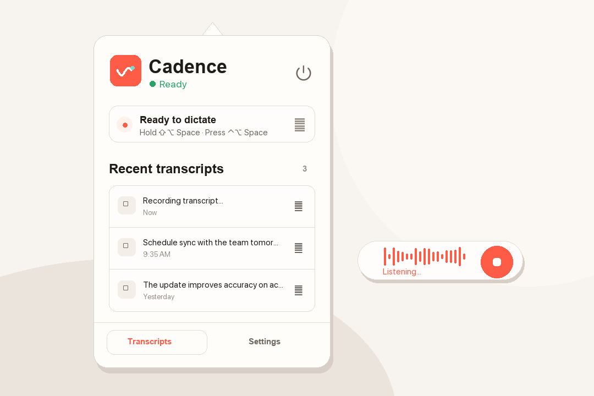

# Cadence

Fast local dictation for macOS.

Cadence is a small menu bar app for push-to-talk dictation. Hold a shortcut, speak, release, and Cadence inserts the text into the app you were already using.


## Design

Cadence is designed as a quiet menu bar utility: recent transcripts stay front and center, shortcut controls stay compact, and the recording pill appears only while dictation is active.



## Features

- Hold-to-talk and press-to-start dictation modes, enabled separately or together with different shortcuts.
- Local WhisperKit transcription.
- Direct text insertion into the focused Mac app.
- Guided setup for Microphone, Accessibility, and Input Monitoring permissions.
- Simple quality presets with advanced model/audio controls when needed.
- Optional privacy-safe analytics. Audio and transcript text are not sent to analytics.

## Download

Cadence will be distributed through GitHub Releases as a DMG:

[Download the latest Cadence release](https://github.com/darshshah981/Cadence/releases/latest)

The release artifact should always be the production DMG:

```text
Cadence.dmg
```

Do not distribute:

```text
Cadence Debug.app
Cadence Debug.dmg
```

Once the Developer ID certificate is available, create the GitHub release DMG with:

```zsh
scripts/package_release.sh
```

The script builds the Release configuration, creates a DMG, notarizes it, staples the notarization ticket, validates Gatekeeper acceptance, and writes:

```text
Build/Release/Cadence.dmg
```

## Setup

On first launch, Cadence asks for the permissions macOS requires for dictation:

- **Microphone** to record while you dictate.
- **Accessibility** to insert text into the focused app.
- **Input Monitoring** so global shortcuts work outside Cadence.

Cadence may ask you to restart the app after granting permissions because macOS sometimes requires a relaunch before new trust settings take effect.

## Privacy

Cadence processes dictation locally. Optional analytics are disabled by default and do not include audio, transcript text, vocabulary terms, exact shortcut keys, or dictated app names.

Read the privacy note: [docs/privacy.md](docs/privacy.md)

## Development

Install the debug app locally:

```zsh
scripts/install_dev_app.sh
```

Run tests:

```zsh
xcodebuild test -project Cadence.xcodeproj -scheme Cadence -configuration Debug -destination 'platform=macOS' -quiet
```

Regenerate the Xcode project after changing `project.yml`:

```zsh
xcodegen generate
```

## Release Checklist

Before publishing a GitHub Release:

- Build `Release`, not `Debug`.
- Confirm the app name is `Cadence.app`, not `Cadence Debug.app`.
- Sign with `Developer ID Application`.
- Notarize and staple.
- Verify with `spctl`.
- Upload `Build/Release/Cadence.dmg`.
