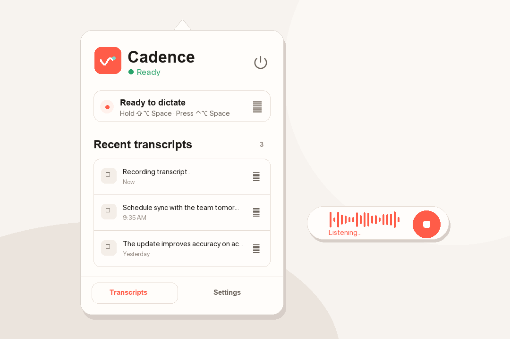

# Cadence

Fast local dictation for macOS.

Cadence is a small menu bar app for push-to-talk dictation. Hold a shortcut, speak, release, and Cadence inserts the text into the app you were already using. Optional Scribe mode can refine a transcript with a model provider you configure before you insert, copy, or discard it.

## Design

Cadence is designed as a quiet menu bar utility: recent transcripts stay front and center, shortcut controls stay compact, and the recording pill appears only while dictation is active.



## Features

- Hold-to-talk and press-to-start dictation modes, enabled separately or together with different shortcuts.
- Local WhisperKit transcription.
- Direct text insertion into the focused Mac app.
- Optional app-aware Scribe rewriting with user-configured model providers.
- Guided setup for Microphone, Accessibility, and Input Monitoring permissions.
- Simple quality presets with advanced model/audio controls when needed.
- Optional privacy-safe analytics. Audio and transcript text are not sent to analytics.

## Download

Cadence can be downloaded directly from this repository:

[Download Cadence.dmg](releases/Cadence.dmg)

Cadence will also be distributed through GitHub Releases as a DMG:

[Download the latest Cadence release](https://github.com/darshshah981/Cadence/releases/latest)

The release artifact should always be the production DMG:

```text
Cadence.dmg
```

Do not distribute:

```text
Cadence Debug.app
Cadence Debug.dmg
```

Create the GitHub release DMG with:

```zsh
scripts/package_release.sh
```

The script builds the Release configuration, creates a DMG, notarizes it, staples the notarization ticket, validates Gatekeeper acceptance, and writes:

```text
Build/Release/Cadence.dmg
```

## Setup

On first launch, Cadence asks for the permissions macOS requires for dictation:

- **Microphone** to record while you dictate.
- **Accessibility** to insert text into the focused app.
- **Input Monitoring** so global shortcuts work outside Cadence.

Cadence may ask you to restart the app after granting permissions because macOS sometimes requires a relaunch before new trust settings take effect.

Cadence uses [PermissionFlow](https://github.com/jaywcjlove/PermissionFlow) to open the correct System Settings pane and present a draggable Cadence app card when macOS requires the app to be added manually.

## Privacy

Cadence transcribes dictation locally. Scribe sends transcript text only to the model provider you explicitly configure. Optional analytics are disabled by default and do not include audio, transcript text, vocabulary terms, exact shortcut keys, or dictated app names.

Read the privacy note: [docs/privacy.md](docs/privacy.md)

## Development

Build and launch the debug app:

```zsh
./script/build_and_run.sh
```

### Google sign-in

Google Calendar sign-in uses a Google OAuth desktop client owned by the app.
Users only see `Continue with Google`; they should never enter OAuth developer
credentials or their Gmail password into Cadence.

For local development, create this ignored file:

```zsh
mkdir -p local
$EDITOR local/google-oauth.env
```

Add:

```sh
GOOGLE_OAUTH_CLIENT_ID=your-desktop-oauth-client-id.apps.googleusercontent.com
GOOGLE_OAUTH_CLIENT_SECRET=your-desktop-oauth-client-secret
```

Cadence uses Google's desktop-app loopback flow. The app starts a temporary
`127.0.0.1` callback listener only while sign-in is active, so no custom
redirect URI needs to be registered in Google Cloud.
The desktop OAuth client secret is app-owned local build configuration; users
never enter it, and they should never enter their Gmail password into Cadence.

Check the local Google config:

```zsh
./script/build_and_run.sh --google-config
```

Install the debug app locally:

```zsh
scripts/install_dev_app.sh
```

Run tests:

```zsh
xcodebuild test -project Cadence.xcodeproj -scheme Cadence -configuration Debug -destination 'platform=macOS' -quiet
```

Regenerate the Xcode project after changing `project.yml`:

```zsh
xcodegen generate
```

## Release Checklist

Before publishing a GitHub Release:

- Build `Release`, not `Debug`.
- Confirm the app name is `Cadence.app`, not `Cadence Debug.app`.
- Sign with `Developer ID Application`.
- Notarize and staple.
- Verify with `spctl`.
- Upload `Build/Release/Cadence.dmg`.
