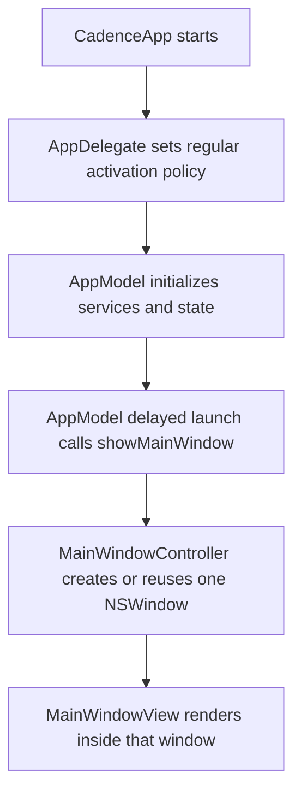
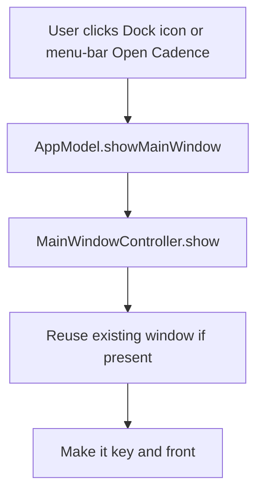
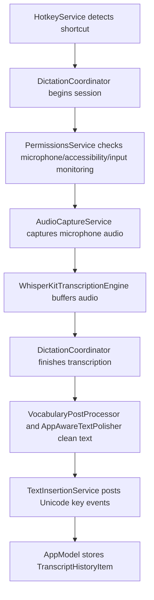
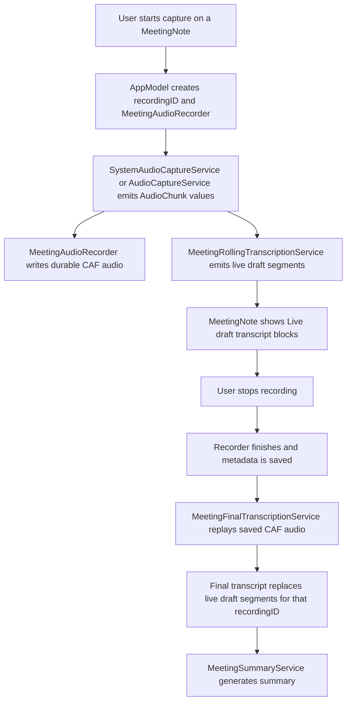
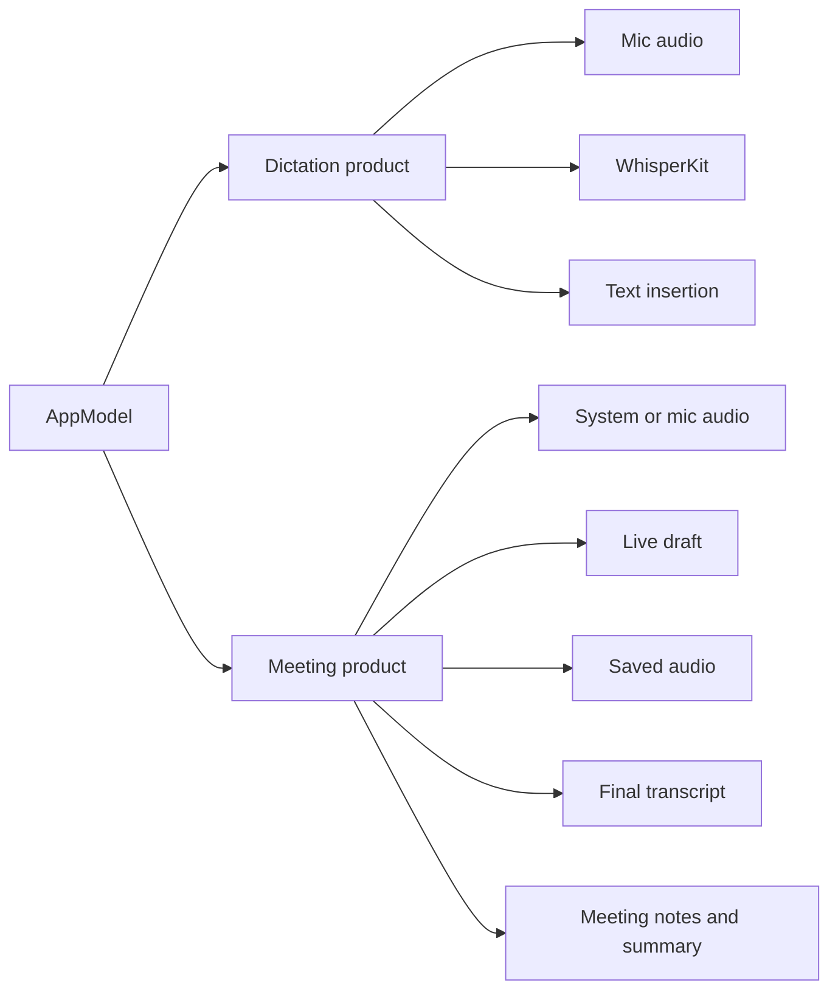

# Cadence Codebase Guide

Generated: July 2, 2026
Source-audited: July 3, 2026

This guide explains how the Cadence codebase is organized, how the major runtime flows work, and where to make changes safely.

## Product Shape

Cadence started as a local macOS dictation utility and contains two related product surfaces:

- Fast local dictation: press a shortcut, capture microphone audio, transcribe locally with WhisperKit, and insert text into the app the user was already using.
- Granola (disabled by default): calendar context, meeting notes, Ask Notes, system or microphone meeting capture, live transcript drafts, saved raw audio, final transcription, summaries, and Markdown export.

The app is a native macOS SwiftUI/AppKit hybrid. SwiftUI owns most views. AppKit is used where macOS requires lower-level control: windows, menu-bar behavior, hotkeys, accessibility insertion, ScreenCaptureKit, and HUD panels.

## Scribe Feature Flag

Scribe is compiled into the app and enabled by default. Explicitly disabling the flag omits Scribe from Settings and onboarding, disables its hotkey at runtime, blocks direct launch and provider setup, and stops its defaults monitor.

For a durable local opt-out, use the bundle identifier for the build you run:

```zsh
defaults write com.darshshah.Cadence Cadence.feature.scribe -bool false
defaults write com.darshshah.Cadence.debug Cadence.feature.scribe -bool false
```

Quit and relaunch Cadence after changing the value. Remove the override to return to the product default:

```zsh
defaults delete com.darshshah.Cadence Cadence.feature.scribe
defaults delete com.darshshah.Cadence.debug Cadence.feature.scribe
```

For one launch, pass `--enable-scribe` or `--disable-scribe`. Automation can set `CADENCE_SCRIBE_ENABLED=true` or `false`. Launch arguments take precedence over the environment, which takes precedence over the local preference. `--scribe-fixture` enables Scribe only for the existing Debug fixture path.

## Granola Feature Flag

The future calendar and meeting workspace is compiled into the app but disabled by default. While disabled, Cadence omits calendar UI, Meeting Notes, Ask Notes, meeting capture, Today notes, meeting settings, and calendar polling or detection. Existing OAuth tokens, notes, and recordings are preserved locally.

Enable it only for development:

```zsh
defaults write com.darshshah.Cadence Cadence.feature.granola -bool true
defaults write com.darshshah.Cadence.debug Cadence.feature.granola -bool true
```

Quit and relaunch Cadence after changing the value. Remove the override to restore the default:

```zsh
defaults delete com.darshshah.Cadence Cadence.feature.granola
defaults delete com.darshshah.Cadence.debug Cadence.feature.granola
```

For one launch, pass `--enable-granola` or `--disable-granola`. Automation can set `CADENCE_GRANOLA_ENABLED=true` or `false`. Launch arguments take precedence over the environment, which takes precedence over the local preference.

## Top-Level Layout

```text
Cadence/
  App/
    CadenceApp.swift
    AppDelegate.swift
    AppModel.swift
  Models/
    DictationModels.swift
    MeetingModels.swift
  Services/
    AudioCaptureService.swift
    SystemAudioCaptureService.swift
    DictationCoordinator.swift
    WhisperKitTranscriptionEngine.swift
    MeetingAudioStore.swift
    MeetingRollingTranscriptionService.swift
    MeetingFinalTranscriptionService.swift
    MeetingStore.swift
    MeetingSummaryService.swift
    GoogleCalendarService.swift
    ...
  UI/
    MainWindowView.swift
    MenuContentView.swift
    MeetingNotesWindow.swift
    SettingsView.swift
    HUDView.swift
    PermissionGuideWindow.swift
CadenceTests/
docs/
script/
scripts/
project.yml
```

## Launch And Window Ownership

The main app window is now owned by `MainWindowController` in `Cadence/UI/MainWindowView.swift`.

The app entry point is `Cadence/App/CadenceApp.swift`. It declares:

- `MenuBarExtra`, the menu-bar popover.
- `Settings`, the SwiftUI settings window.

It no longer declares a `WindowGroup` for the main window. That was causing duplicate windows because SwiftUI created one main window and then `AppModel.showMainWindow()` opened another AppKit window.

Launch flow after the fix:



Reopen flow:



Important files:

- `Cadence/App/CadenceApp.swift`: SwiftUI app scenes.
- `Cadence/App/AppDelegate.swift`: activation policy and Dock reopen behavior.
- `Cadence/UI/MainWindowView.swift`: `MainWindowController` and the primary app layout.
- `Cadence/App/AppModel.swift`: `showMainWindow()` route.

## AppModel: The Orchestrator

`AppModel` is the central observable object. Most UI reads state from it and calls methods on it.

It owns:

- Permissions state.
- Dictation state.
- Hotkey bindings and validation.
- Transcription configuration.
- Transcript history.
- Meeting notes.
- Meeting capture state.
- Google Calendar state.
- Window controllers.
- Service instances.

The biggest conceptual split inside `AppModel` is:

- Dictation flow: short, interactive, inserts text elsewhere.
- Meeting flow: longer recording, writes notes/transcripts inside Cadence.

Because `AppModel` is large, future changes should try to keep new behavior in services and let `AppModel` coordinate those services rather than growing more business logic inline.

## Dictation Flow

Dictation is the original push-to-talk workflow.



Key files:

- `Cadence/Services/HotkeyService.swift`: global Carbon hotkeys and key monitors.
- `Cadence/Services/DictationCoordinator.swift`: session state machine for press, hold, release, cancel, finish, preview, and insert.
- `Cadence/Services/AudioCaptureService.swift`: microphone capture using `AVAudioEngine`.
- `Cadence/Services/WhisperKitTranscriptionEngine.swift`: local WhisperKit model loading and final transcription.
- `Cadence/Services/TextInsertionService.swift`: posts text into the previously focused app using accessibility and CGEvents.
- `Cadence/Models/DictationModels.swift`: configuration, hotkeys, history, permissions, HUD state, vocabulary, and app-aware polishing.

Core invariant:

- Dictation should be short and responsive. It should not depend on meeting-note storage or meeting final-pass transcription.

## Meeting Capture Flow

Meeting capture is a separate pipeline optimized for longer sessions.



Key files:

- `Cadence/Models/MeetingModels.swift`: meeting notes, transcript segments, transcript states, recording metadata, summaries, and action items.
- `Cadence/Services/SystemAudioCaptureService.swift`: ScreenCaptureKit system audio capture.
- `Cadence/Services/AudioCaptureService.swift`: microphone capture reused for meeting microphone mode.
- `Cadence/Services/MeetingAudioStore.swift`: writes saved meeting audio to CAF files.
- `Cadence/Services/MeetingRollingTranscriptionService.swift`: chunks live transcription into bounded windows.
- `Cadence/Services/MeetingFinalTranscriptionService.swift`: reads saved audio and produces one final transcript segment.
- `Cadence/Services/MeetingStore.swift`: persists meeting notes as JSON files.
- `Cadence/Services/MeetingSummaryService.swift`: local heuristic summary and Markdown export.
- `Cadence/UI/MeetingNotesWindow.swift`: meeting notebook UI.
- `Cadence/UI/MainWindowView.swift`: embeds the meeting notebook inside the main app window.

Core invariants:

- Every recording has a `recordingID`.
- Live draft segments are tagged with `origin = .liveDraft` and that `recordingID`.
- Final segments are tagged with `origin = .final` and the same `recordingID`.
- The final pass only replaces live draft segments that match the same `recordingID`.
- Empty final pass output is treated as failure so live draft text is retained.

## System Audio Capture

System audio capture uses ScreenCaptureKit in `SystemAudioCaptureService`.

It:

- Requires Screen Recording permission.
- Creates `SCShareableContent`.
- Selects a display.
- Excludes Cadence's own process audio.
- Enables `capturesAudio`.
- Converts captured audio to 16 kHz mono float PCM chunks.

This service is intentionally separate from `AudioCaptureService` because microphone capture and system audio capture use different macOS APIs and permissions.

## Permissions Model

Cadence tracks four macOS permissions in `PermissionsSnapshot`:

- Microphone.
- Accessibility.
- Input Monitoring.
- Screen Recording.

`PermissionsSnapshot.allRequiredGranted` currently means the three permissions needed for core dictation readiness: Microphone, Accessibility, and Input Monitoring. It intentionally does not include Screen Recording, because Screen Recording is only required for meeting capture sources that include system audio.

The first-run permission wizard and Settings setup row currently cover the three dictation permissions. Meeting capture asks for Screen Recording contextually through `AppModel.requestMeetingCaptureSourcePermissions()` and the meeting-note capture bar shows a source-specific missing-permission message.

`PermissionsService` keeps ownership of the native permission checks and request APIs. When macOS System Settings is needed, it delegates navigation and visual guidance to `PermissionFlowGuidanceService`, which maps Cadence permissions to the typed panes provided by the PermissionFlow package. PermissionFlow opens the correct pane and, where supported, presents the draggable Cadence app card beside System Settings. The Cadence wizard intentionally hides while another app is active so the two guidance surfaces do not overlap.

## Transcription Engine Boundary

`TranscriptionEngine` is a protocol in `Cadence/Services/TranscriptionEngine.swift`.

It defines:

- `updateConfiguration`
- `prepare`
- `startSession`
- `appendAudio`
- `previewTranscript`
- `finishSession`
- `cancelSession`
- `statusSummary`

`WhisperKitTranscriptionEngine` is the production implementation. Tests use mock engines so rolling transcription, final pass, and failure behavior can be tested without loading WhisperKit.

Model files are stored under:

```text
~/Library/Application Support/Cadence/WhisperKit
```

Meeting notes and audio are stored separately:

```text
~/Library/Application Support/Cadence/MeetingNotes
~/Library/Application Support/Cadence/MeetingAudio
```

## Google Calendar And Meeting Detection

Calendar integration is split into:

- `GoogleCalendarService`: OAuth, Keychain token storage, Calendar API fetching.
- `MeetingDetectionService`: pure logic that picks eligible upcoming meeting prompts.
- `AppModel`: polling, connection state, prompt state, and starting capture from a detected event.
- `MeetingNotesWindow` and `SettingsView`: user-facing sign-in/configuration surfaces.

OAuth tokens are stored in Keychain by `KeychainGoogleCalendarTokenStore`.

Calendar detection considers events meeting candidates when they have a meeting URL or multiple attendees.

## UI Surfaces

Main app window:

- File: `Cadence/UI/MainWindowView.swift`
- Purpose: primary consumer-ready app surface.
- Structure: sidebar plus detail area.
- Destinations: Home, Meetings, individual note, Settings.

Menu-bar popover:

- File: `Cadence/UI/MenuContentView.swift`
- Purpose: compact status, recent transcripts, shortcuts, and quick actions.

Meeting notes UI:

- File: `Cadence/UI/MeetingNotesWindow.swift`
- Purpose: reusable meeting notebook UI.
- Can be embedded in `MainWindowView`.
- Still has a separate `MeetingNotesWindowController` for explicit standalone meeting-note windows.

Settings:

- File: `Cadence/UI/SettingsView.swift`
- Purpose: permissions, shortcuts, model quality, Google Calendar config, analytics, and advanced transcription controls.

HUD:

- Files: `Cadence/UI/HUDView.swift`, `Cadence/Services/HUDWindowController.swift`
- Purpose: floating recording pill and live dictation feedback.

Permissions wizard:

- Files: `Cadence/UI/PermissionGuideWindow.swift`, `Cadence/UI/PermissionsView.swift`, `Cadence/Services/PermissionFlowGuidanceService.swift`
- Purpose: compact permission status hub plus PermissionFlow-guided System Settings setup.

## Persistence And Local State

Cadence uses several persistence layers:

- `UserDefaults`: settings, hotkeys, transcription config, transcript history.
- JSON files: meeting notes through `MeetingStore`.
- CAF files: saved meeting audio through `MeetingAudioStore`.
- Keychain: Google Calendar OAuth tokens.
- Application Support: WhisperKit model files and meeting data.

Settings are loaded in `AppModel.init()` and mutated through explicit setter methods like `setWhisperModel`, `setShortcut`, `setAnalyticsEnabled`, and `setMeetingCaptureSource`.

## Analytics

Analytics lives in `Cadence/Services/AnalyticsService.swift`.

The service supports:

- no-op analytics when disabled,
- logging analytics,
- PostHog analytics when enabled.

The privacy boundary should stay strict: do not send audio, transcript text, vocabulary terms, exact shortcut keys, or dictated app names.

## Build, Test, And Install

Project generation:

```zsh
xcodegen generate
```

Primary local workflow:

```zsh
./script/build_and_run.sh
```

Useful flags:

```zsh
./script/build_and_run.sh --verify
./script/build_and_run.sh --test
./script/build_and_run.sh --audio-smoke
./script/build_and_run.sh --logs
./script/build_and_run.sh --telemetry
./script/build_and_run.sh --debug
```

Install debug app:

```zsh
scripts/install_dev_app.sh
```

Package release:

```zsh
scripts/package_release.sh
```

`scripts/package_release.sh` archives the Release configuration, exports a Developer ID app, creates a DMG, submits it to `notarytool`, staples the ticket, and runs Gatekeeper assessment. It also supports `--skip-notarization` for local packaging checks. A real release still requires a Developer ID Application certificate and a configured notarytool keychain profile.

The Xcode project is generated from `project.yml`, so update `project.yml` first when adding source roots, packages, build settings, or target-level configuration, then run `xcodegen generate`.

## Where To Make Common Changes

Change the main app layout:

- Start in `Cadence/UI/MainWindowView.swift`.

Change the menu-bar popover:

- Start in `Cadence/UI/MenuContentView.swift`.

Change meeting-note UX:

- Start in `Cadence/UI/MeetingNotesWindow.swift`.
- Check `Cadence/Models/MeetingModels.swift` before changing transcript or note behavior.

Change dictation behavior:

- Start in `Cadence/Services/DictationCoordinator.swift`.
- Check `Cadence/Services/AudioCaptureService.swift`, `Cadence/Services/WhisperKitTranscriptionEngine.swift`, and `Cadence/Services/TextInsertionService.swift`.

Change meeting capture reliability:

- Start in `Cadence/App/AppModel.swift`.
- Then inspect `SystemAudioCaptureService`, `MeetingAudioStore`, `MeetingRollingTranscriptionService`, and `MeetingFinalTranscriptionService`.

Change transcription model behavior:

- Start in `Cadence/Services/WhisperKitTranscriptionEngine.swift`.
- Check `TranscriptionAudioPreprocessor` and `TranscriptionConfiguration`.

Change Google Calendar:

- Start in `Cadence/Services/GoogleCalendarService.swift`.
- Then inspect `MeetingDetectionService` and the Calendar section in `SettingsView`.

Change storage:

- Meeting note JSON: `MeetingStore`.
- Meeting audio: `MeetingAudioStore`.
- User settings/history: `AppModel` UserDefaults helpers.
- OAuth credentials: `KeychainGoogleCalendarTokenStore`.

## Current Design Risks

These are not necessarily bugs, but they are the places most likely to become brittle:

- `AppModel` is too large. New feature work should prefer smaller services and thin AppModel coordination.
- There are two meeting-note presentation modes: embedded in the main window and standalone through `MeetingNotesWindowController`. Long term, choose one primary consumer flow and keep the other as a deliberate utility surface.
- Summary generation is heuristic and local. It is reliable and private, but not as strong as an LLM-based meeting summary.
- Speaker labels currently identify capture source, not true diarized speakers. Real speaker separation would need a diarization or speaker-attribution layer.
- Suggested meeting titles come from the first usable line of notes/transcript/summary. That can produce weak titles for short test recordings.
- System audio depends on Screen Recording permission and ScreenCaptureKit display availability. Keep audio smoke tests around any changes there.
- Saved meeting audio is durable while recording, but recording metadata is persisted to the note only after stop. Interrupted finalization can recover when recording metadata exists; true force-quit recovery during active recording still needs incremental metadata.
- Summary and Markdown export collapse adjacent duplicate transcript text without checking segment origin or recording ID. The main append/UI paths do check those fields, but export hardening should keep the same invariant.

## Debugging Playbook

For launch/window bugs:

1. Check `CadenceApp.swift`, `AppDelegate.swift`, `MainWindowController`, and `AppModel.showMainWindow()`.
2. Run `./script/build_and_run.sh --verify`.
3. Inspect the app window tree with Computer Use or Accessibility Inspector.

For dictation bugs:

1. Confirm permissions in `PermissionsService`.
2. Check `HotkeyService` logs for shortcut events.
3. Check `DictationCoordinator` state transitions.
4. Check WhisperKit timing logs.
5. Verify text insertion only after Accessibility permission is trusted.

For meeting transcription bugs:

1. Confirm capture source and permissions.
2. Verify frames are captured with `./script/build_and_run.sh --audio-smoke`.
3. Confirm CAF audio is written under `MeetingAudio`.
4. Check whether live draft segments have the right `recordingID`.
5. Check final pass state: `liveDraft`, `finalizing`, `final`, or `finalizationFailed`.

For persistence bugs:

1. Inspect `~/Library/Application Support/Cadence/MeetingNotes`.
2. Inspect `~/Library/Application Support/Cadence/MeetingAudio`.
3. Check `MeetingStore` and `MeetingAudioStore`.

## Mental Model

Think of Cadence as one app shell with two audio products:



The most important reliability principle in this codebase is to keep raw capture data durable before doing lossy processing. Dictation can be ephemeral because its job is immediate insertion. Meetings should be durable because users expect long recordings to survive final transcription errors.
