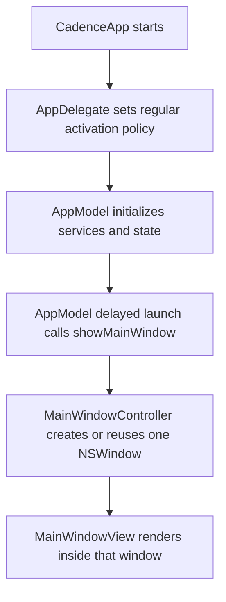
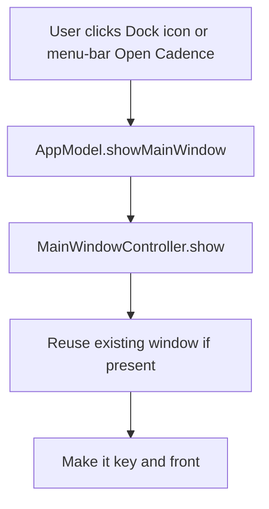
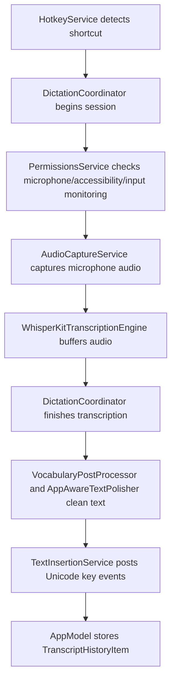
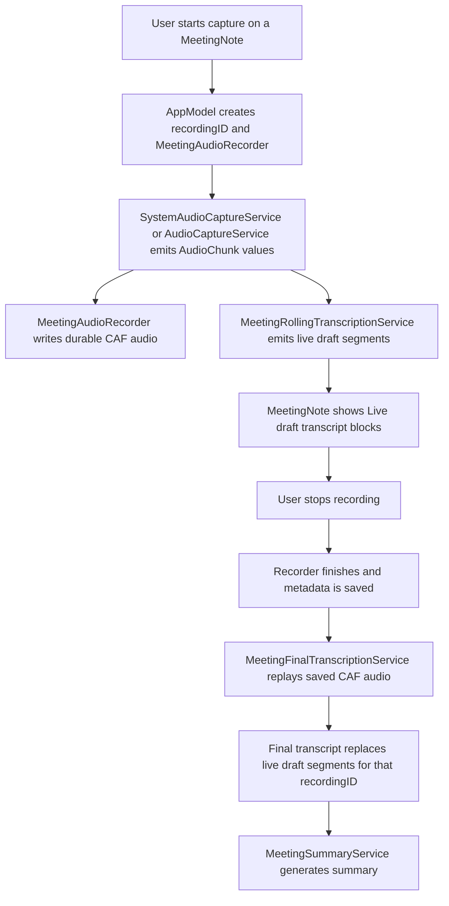
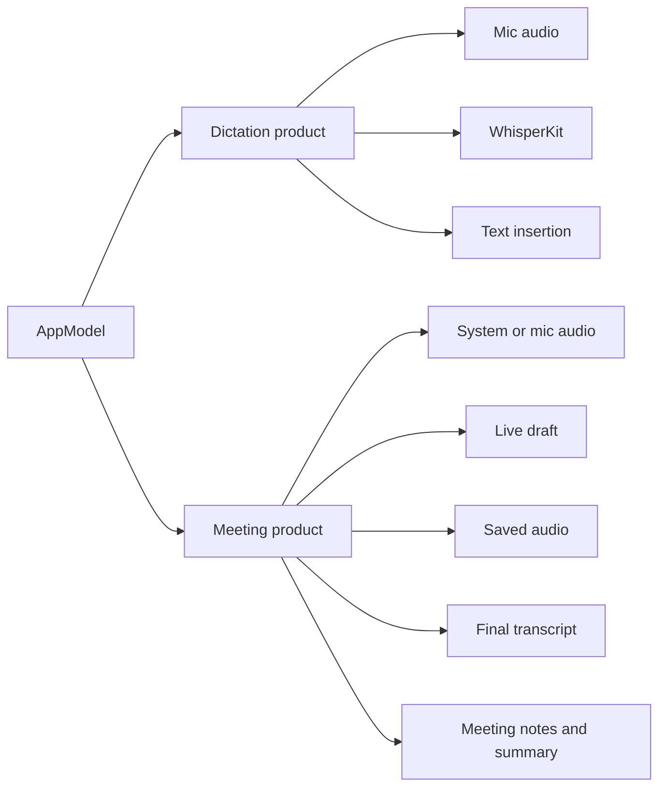

# Cadence Codebase Guide

Generated: July 2, 2026
Source-audited: July 3, 2026

This guide explains how the Cadence codebase is organized, how the major runtime flows work, and where to make changes safely.

## Product Shape

Cadence started as a local macOS dictation utility and contains two related product surfaces:

- Fast local dictation: press a shortcut, capture microphone audio, transcribe locally with WhisperKit, and insert text into the app the user was already using.
- Granola (disabled by default): calendar context, meeting notes, Ask Notes, system or microphone meeting capture, live transcript drafts, saved raw audio, final transcription, summaries, and Markdown export.

The app is a native macOS SwiftUI/AppKit hybrid. SwiftUI owns most views. AppKit is used where macOS requires lower-level control: windows, menu-bar behavior, hotkeys, accessibility insertion, ScreenCaptureKit, and HUD panels.

## Compose Feature Flag

Compose is compiled into the app and enabled by default. Explicitly disabling the flag omits Compose from Settings and onboarding, disables its hotkey at runtime, blocks direct launch and provider setup, and stops its defaults monitor.

For a durable local opt-out, use the bundle identifier for the build you run:

```zsh
defaults write com.darshshah.Cadence Cadence.feature.scribe -bool false
defaults write com.darshshah.Cadence.debug Cadence.feature.scribe -bool false
```

Quit and relaunch Cadence after changing the value. Remove the override to return to the product default:

```zsh
defaults delete com.darshshah.Cadence Cadence.feature.scribe
defaults delete com.darshshah.Cadence.debug Cadence.feature.scribe
```

For one launch, pass `--enable-scribe` or `--disable-scribe`. Automation can set `CADENCE_SCRIBE_ENABLED=true` or `false`. Launch arguments take precedence over the environment, which takes precedence over the local preference. `--scribe-fixture` enables Compose only for the existing Debug fixture path.

## Compose Subfeature Flags

Compose also has separate rollout switches for optional context, memory, and
surface adapters. `Cadence.feature.composeContext` defaults on so the existing
explicit selected-text preview remains available; `Cadence.feature.composeMemory`
and `Cadence.feature.composeAdapters` default off. Their corresponding environment
variables are `CADENCE_COMPOSE_CONTEXT_ENABLED`, `CADENCE_COMPOSE_MEMORY_ENABLED`,
and `CADENCE_COMPOSE_ADAPTERS_ENABLED`. Launch overrides use
`--enable-compose-context` / `--disable-compose-context`, with matching
`compose-memory` and `compose-adapters` forms. The Compose master switch takes
precedence, and memory/adapters cannot resolve enabled when context is off.
Disabling context preserves saved user preferences but prevents the selected-text
controller from receiving an active grant and hides that Settings section until
the next launch. Memory and adapter switches both default off; when both are
enabled, a separate development-preview disclosure can authorize TextEdit
document identity on an explicit Compose action. Neither flag itself grants
consent, retention, or provider transmission.

The separate `compose-persistent-memory` rollout switch also defaults off and
requires memory and adapters. AppModel constructs its encrypted-domain runtime
inertly. Settings can confirm creation of a local namespace and Keychain key
after displaying the 30-day retention and backup terms; launch only reopens a
previously confirmed domain. A second Settings confirmation deletes all current
encrypted records even after access is turned off. The exact voice command
“Cadence, remember for later that …” proposes one fact for the current verified
TextEdit document. Exact phrases also inspect current facts, propose an old-to-new
correction, or propose forgetting this document's facts. Save, correction, and
forget require confirmation on the review surface; the commands bypass the
writing provider and insertion. A forget review carries a durable revision, so
an intervening save prevents deletion. A separate default-off local-draft
control permits relevant saved facts from that verified document in Apple
Intelligence requests only. The coordinator pins and rechecks the fact set
before publishing a draft, Copy, or Insert; changed facts invalidate the draft.
Cloud destinations remain transcript-only for saved memory.

Screenshot context remains an unregistered, default-denied development path.
`ComposeScreenContextActionController` requires an eligible pinned Compose
action, a separate live screenshot grant, Screen Recording permission, and an
explicit single-window picker choice before invoking exact-window capture and
local Vision OCR. It rechecks authority across asynchronous boundaries and
does not create a grant or send extracted text to a provider. The picker can
expose the selected window ID only on macOS 15.2 or newer. No Settings or
Compose review control currently activates this path.
The original Accessibility-focused window frame is read from the pinned AX
window only after an explicit screen-context request; ordinary recording does
no geometry read. The picker choice must match that frame, so another window
in the same app cannot be substituted merely because its process ID matches.
A missing frame fails closed. Frame equality still needs signed live-app
certification.
`ComposeScreenContextConsentController` is the inert action-scoped grant owner:
local OCR and exact-provider text transmission need separate explicit approval
calls, and neither approval creates a retention grant. The owner is not yet
registered with AppModel; a future UI must only call approvals after showing
their distinct disclosure to the user.

The first native conversation identity adapter is
`ScribeTextEditDocumentIdentityAdapter`. It can identify a saved TextEdit file
from a live Accessibility document attribute and exact window/process binding.
It is registered only through the separately opted-in session-memory controller
when both rollout switches are enabled; the adapter flag alone cannot activate it.
Controlled AX checks cover synthetic saved files, A→B→A switching, process
restart, and replacement of a file at the same path; they do not certify all
TextEdit states or other apps. `ScribeConversationActionScope` is the
deny-by-default action owner. It requires current action/target authority and a
distinct session-memory capture grant before exposing a verified identity.
The coordinator schedules identity work after microphone startup and clears it
when the action ends. `ScribeSessionMemoryStore` separately requires current-action
authority and a retention grant for every write; it drops stale pending
operations. A separate default-off setting allows bounded explicit voice
commands to remember, inspect, or forget facts for a verified saved TextEdit
document during the current app session. These commands stay local and do not
create a draft or history entry. A third default-off control allows relevant
explicit facts from that verified document to enter only a local Apple
Intelligence draft. Relevance normally requires a shared specific word; a
small set of generic follow-up requests can use the sole explicit fact in the
verified document. Multiple facts require the user to name an issue before
provider dispatch. The coordinator
compares record IDs and text on retry so
a changed or revoked fact set cannot silently replace the pinned request or
publish a late model result. Review, Copy and Insert recheck the fact snapshot;
changed or revoked facts discard the memory-backed draft. A quiet review cue
identifies when session facts informed a draft. Changing only local draft use
leaves the saved session facts intact but invalidates the current memory-backed
action. Memory-backed drafts do not enter ordinary Compose history.
Cloud drafts remain transcript-only. Automatic fact extraction and persistent
memory use in provider requests are not connected.

## Granola Feature Flag

The future calendar and meeting workspace is compiled into the app but disabled by default. While disabled, Cadence omits calendar UI, Meeting Notes, Ask Notes, meeting capture, Today notes, meeting settings, and calendar polling or detection. Existing OAuth tokens, notes, and recordings are preserved locally.

Enable it only for development:

```zsh
defaults write com.darshshah.Cadence Cadence.feature.granola -bool true
defaults write com.darshshah.Cadence.debug Cadence.feature.granola -bool true
```

Quit and relaunch Cadence after changing the value. Remove the override to restore the default:

```zsh
defaults delete com.darshshah.Cadence Cadence.feature.granola
defaults delete com.darshshah.Cadence.debug Cadence.feature.granola
```

For one launch, pass `--enable-granola` or `--disable-granola`. Automation can set `CADENCE_GRANOLA_ENABLED=true` or `false`. Launch arguments take precedence over the environment, which takes precedence over the local preference.

## Top-Level Layout

```text
Cadence/
  App/
    CadenceApp.swift
    AppDelegate.swift
    AppModel.swift
  Models/
    DictationModels.swift
    MeetingModels.swift
  Services/
    AudioCaptureService.swift
    SystemAudioCaptureService.swift
    DictationCoordinator.swift
    WhisperKitTranscriptionEngine.swift
    MeetingAudioStore.swift
    MeetingRollingTranscriptionService.swift
    MeetingFinalTranscriptionService.swift
    MeetingStore.swift
    MeetingSummaryService.swift
    GoogleCalendarService.swift
    ...
  UI/
    MainWindowView.swift
    MenuContentView.swift
    MeetingNotesWindow.swift
    SettingsView.swift
    HUDView.swift
    PermissionGuideWindow.swift
CadenceTests/
docs/
script/
scripts/
project.yml
```

## Launch And Window Ownership

The main app window is now owned by `MainWindowController` in `Cadence/UI/MainWindowView.swift`.

The app entry point is `Cadence/App/CadenceApp.swift`. It declares:

- `MenuBarExtra`, the menu-bar popover.
- `Settings`, the SwiftUI settings window.

It no longer declares a `WindowGroup` for the main window. That was causing duplicate windows because SwiftUI created one main window and then `AppModel.showMainWindow()` opened another AppKit window.

Launch flow after the fix:


```mermaid
flowchart TD
    A["CadenceApp starts"] --> B["AppDelegate sets regular activation policy"]
    B --> C["AppModel initializes services and state"]
    C --> D["AppModel delayed launch calls showMainWindow"]
    D --> E["MainWindowController creates or reuses one NSWindow"]
    E --> F["MainWindowView renders inside that window"]
```

Reopen flow:


```mermaid
flowchart TD
    A["User clicks Dock icon or menu-bar Open Cadence"] --> B["AppModel.showMainWindow"]
    B --> C["MainWindowController.show"]
    C --> D["Reuse existing window if present"]
    D --> E["Make it key and front"]
```

Important files:

- `Cadence/App/CadenceApp.swift`: SwiftUI app scenes.
- `Cadence/App/AppDelegate.swift`: activation policy and Dock reopen behavior.
- `Cadence/UI/MainWindowView.swift`: `MainWindowController` and the primary app layout.
- `Cadence/App/AppModel.swift`: `showMainWindow()` route.

## AppModel: The Orchestrator

`AppModel` is the central observable object. Most UI reads state from it and calls methods on it.

It owns:

- Permissions state.
- Dictation state.
- Hotkey bindings and validation.
- Transcription configuration.
- Transcript history.
- Meeting notes.
- Meeting capture state.
- Google Calendar state.
- Window controllers.
- Service instances.

The biggest conceptual split inside `AppModel` is:

- Dictation flow: short, interactive, inserts text elsewhere.
- Meeting flow: longer recording, writes notes/transcripts inside Cadence.

Because `AppModel` is large, future changes should try to keep new behavior in services and let `AppModel` coordinate those services rather than growing more business logic inline.

## Dictation Flow

Dictation is the original push-to-talk workflow.


```mermaid
flowchart TD
    A["HotkeyService detects shortcut"] --> B["DictationCoordinator begins session"]
    B --> C["PermissionsService checks microphone/accessibility/input monitoring"]
    C --> D["AudioCaptureService captures microphone audio"]
    D --> E["WhisperKitTranscriptionEngine buffers audio"]
    E --> F["DictationCoordinator finishes transcription"]
    F --> G["VocabularyPostProcessor and AppAwareTextPolisher clean text"]
    G --> H["TextInsertionService posts Unicode key events"]
    H --> I["AppModel stores TranscriptHistoryItem"]
```

Key files:

- `Cadence/Services/HotkeyService.swift`: global Carbon hotkeys and key monitors.
- `Cadence/Services/DictationCoordinator.swift`: session state machine for press, hold, release, cancel, finish, preview, and insert.
- `Cadence/Services/AudioCaptureService.swift`: microphone capture using `AVAudioEngine`.
- `Cadence/Services/WhisperKitTranscriptionEngine.swift`: local WhisperKit model loading and final transcription.
- `Cadence/Services/TextInsertionService.swift`: posts text into the previously focused app using accessibility and CGEvents.
- `Cadence/Models/DictationModels.swift`: configuration, hotkeys, history, permissions, HUD state, vocabulary, and app-aware polishing.

Core invariant:

- Dictation should be short and responsive. It should not depend on meeting-note storage or meeting final-pass transcription.
- A successfully inserted or copied ordinary Compose result may reuse the local transcript-history store as one linked record containing final composed text plus the original dictation. Contextual and session-memory-backed drafts are excluded from this history. Failed, discarded, cancelled, and review-only Compose drafts remain memory-only.

Dictation verifies the captured app before assessing the focused control. Definite
non-text controls use copy-only delivery. Unknown custom editors receive keyboard
insertion with a clipboard backup and no automatic Return key. Some web composers,
including Muse, expose the focused editor as `AXButton` with a `cursor-text` DOM
class. `SystemDictationTargetCapabilityService` reads that non-content hint and
treats the role as unknown rather than definitely non-editable. It does not read
the field's text, bypass target verification, or grant confirmed editability.
Ordinary buttons without that hint and secure text fields remain copy-only.

Compose insertion rechecks the exact captured field after restoring focus.
Each capture permits at most one posting attempt. An overlapping or repeated
Insert is refused, including after a partial event failure; a failed check
before posting leaves the capture eligible while its action remains active.
If the system-wide AX focused-element query is unavailable, its reader queries
only the application that is frontmost at that moment; it never substitutes
the originally pinned application. Initial focus acquisition retries a
transient missing AX element for up to four attempts, then fails closed. The
controlled native/WebKit host exercises this path; see the U5 evidence in
[the Compose roadmap ledger](compose-roadmap-progress.md).
During insertion, a missing focused AX element is reported as a changed target
when the independently observed frontmost process differs from the captured
process. The original capture is never redirected to that new process.

## Compose Interaction Behavior

Compose interprets spoken writing directions (tone, length, format, wording)
while preserving instructions meant for the recipient. See
[the instruction-following contract](scribe-instruction-following.md) for
examples and the synthetic evaluation harness. Screen content and prior
conversations are not supplied to the provider.

Compose review exposes the complete current result and its actions immediately; decorative motion does not delay Copy or Insert. Actionable failures and failures with retained words remain visible until resolved or dismissed. Failure shortcuts belong to the focused review panel, so a passive failure does not take Copy from another app. Successful Copy still keeps the review open until the next outside click. Insertion continues to verify the pinned target and hide the review before restoring that target.

History copy feedback appears only after a successful clipboard commit, and another copy restarts its feedback interval. Compose entries offer separate Open and Copy controls on Home and in history; ordinary dictation rows copy directly. The detail view uses the same copy feedback state.

Per-app writing styles show static illustrative examples and identify customized instructions. Expanding Customize instructions only reveals the effective prompt. Changing a style or restoring its preset edits a pending draft; Save commits it and Cancel preserves the saved configuration. Compose Settings uses one provider readiness summary, with secondary connection and disclosure actions under Manage for configured providers.

Debug UI coverage can use `--scribe-fixture settings --scribe-fixture-profiles` to seed synthetic built-in and customized app profiles in isolated defaults. `--scribe-notch-presentation` exercises the real notch surface with synthetic review or failure content. These fixtures do not establish real-provider, microphone, insertion, or hardware verification.

## Meeting Capture Flow

Meeting capture is a separate pipeline optimized for longer sessions.


```mermaid
flowchart TD
    A["User starts capture on a MeetingNote"] --> B["AppModel creates recordingID and MeetingAudioRecorder"]
    B --> C["SystemAudioCaptureService or AudioCaptureService emits AudioChunk values"]
    C --> D["MeetingAudioRecorder writes durable CAF audio"]
    C --> E["MeetingRollingTranscriptionService emits live draft segments"]
    E --> F["MeetingNote shows Live draft transcript blocks"]
    F --> G["User stops recording"]
    G --> H["Recorder finishes and metadata is saved"]
    H --> I["MeetingFinalTranscriptionService replays saved CAF audio"]
    I --> J["Final transcript replaces live draft segments for that recordingID"]
    J --> K["MeetingSummaryService generates summary"]
```

Key files:

- `Cadence/Models/MeetingModels.swift`: meeting notes, transcript segments, transcript states, recording metadata, summaries, and action items.
- `Cadence/Services/SystemAudioCaptureService.swift`: ScreenCaptureKit system audio capture.
- `Cadence/Services/AudioCaptureService.swift`: microphone capture reused for meeting microphone mode.
- `Cadence/Services/MeetingAudioStore.swift`: writes saved meeting audio to CAF files.
- `Cadence/Services/MeetingRollingTranscriptionService.swift`: chunks live transcription into bounded windows.
- `Cadence/Services/MeetingFinalTranscriptionService.swift`: reads saved audio and produces one final transcript segment.
- `Cadence/Services/MeetingStore.swift`: persists meeting notes as JSON files.
- `Cadence/Services/MeetingSummaryService.swift`: local heuristic summary and Markdown export.
- `Cadence/UI/MeetingNotesWindow.swift`: meeting notebook UI.
- `Cadence/UI/MainWindowView.swift`: embeds the meeting notebook inside the main app window.

Core invariants:

- Every recording has a `recordingID`.
- Live draft segments are tagged with `origin = .liveDraft` and that `recordingID`.
- Final segments are tagged with `origin = .final` and the same `recordingID`.
- The final pass only replaces live draft segments that match the same `recordingID`.
- Empty final pass output is treated as failure so live draft text is retained.

## System Audio Capture

System audio capture uses ScreenCaptureKit in `SystemAudioCaptureService`.

It:

- Requires Screen Recording permission.
- Creates `SCShareableContent`.
- Selects a display.
- Excludes Cadence's own process audio.
- Enables `capturesAudio`.
- Converts captured audio to 16 kHz mono float PCM chunks.

This service is intentionally separate from `AudioCaptureService` because microphone capture and system audio capture use different macOS APIs and permissions.

## Permissions Model

Cadence tracks four macOS permissions in `PermissionsSnapshot`:

- Microphone.
- Accessibility.
- Input Monitoring.
- Screen Recording.

`PermissionsSnapshot.allRequiredGranted` currently means the three permissions needed for core dictation readiness: Microphone, Accessibility, and Input Monitoring. It intentionally does not include Screen Recording, because Screen Recording is only required for meeting capture sources that include system audio.

The shared inline setup card in onboarding, Dictation, and Settings guides the three dictation permissions one at a time. Meeting capture asks for Screen Recording contextually through `AppModel.requestMeetingCaptureSourcePermissions()` and the meeting-note capture bar shows a source-specific missing-permission message.

`PermissionsService` keeps ownership of native permission checks and requests. `PermissionFlowGuidanceService` opens typed Settings pane URLs without starting PermissionFlow's floating window or cross-process window tracker. `PermissionSetupProgress` owns the current step; `PermissionSetupMonitor` checks only during a user-initiated handoff and stops on grant or timeout. The inline card provides a native app-file drag for Accessibility and Input Monitoring, plus Finder and Settings “+” guidance. Dragging never grants access or advances progress by itself. Microphone uses the native dialog rather than an app-file drag. Onboarding remains scrollable and advances only when the user chooses Continue.

## Transcription Engine Boundary

`TranscriptionEngine` is a protocol in `Cadence/Services/TranscriptionEngine.swift`.

It defines:

- `updateConfiguration`
- `prepare`
- `startSession`
- `appendAudio`
- `previewTranscript`
- `finishSession`
- `cancelSession`
- `statusSummary`

`WhisperKitTranscriptionEngine` is the production implementation. Tests use mock engines so rolling transcription, final pass, and failure behavior can be tested without loading WhisperKit.

Model files are stored under:

```text
~/Library/Application Support/Cadence/WhisperKit
```

Meeting notes and audio are stored separately:

```text
~/Library/Application Support/Cadence/MeetingNotes
~/Library/Application Support/Cadence/MeetingAudio
```

## Google Calendar And Meeting Detection

Calendar integration is split into:

- `GoogleCalendarService`: OAuth, Keychain token storage, Calendar API fetching.
- `MeetingDetectionService`: pure logic that picks eligible upcoming meeting prompts.
- `AppModel`: polling, connection state, prompt state, and starting capture from a detected event.
- `MeetingNotesWindow` and `SettingsView`: user-facing sign-in/configuration surfaces.

OAuth tokens are stored in Keychain by `KeychainGoogleCalendarTokenStore`.

Calendar detection considers events meeting candidates when they have a meeting URL or multiple attendees.

## UI Surfaces

Main app window:

- File: `Cadence/UI/MainWindowView.swift`
- Purpose: primary consumer-ready app surface.
- Structure: sidebar plus detail area.
- Destinations: Home, Meetings, individual note, Settings.

Menu-bar popover:

- File: `Cadence/UI/MenuContentView.swift`
- Purpose: compact status, recent transcripts, shortcuts, and quick actions.

Meeting notes UI:

- File: `Cadence/UI/MeetingNotesWindow.swift`
- Purpose: reusable meeting notebook UI.
- Can be embedded in `MainWindowView`.
- Still has a separate `MeetingNotesWindowController` for explicit standalone meeting-note windows.

Settings:

- File: `Cadence/UI/SettingsView.swift`
- Purpose: permissions, shortcuts, model quality, Google Calendar config, analytics, and advanced transcription controls.

HUD:

- Files: `Cadence/UI/HUDView.swift`, `Cadence/Services/HUDWindowController.swift`
- Purpose: floating recording pill and live dictation feedback.

Permissions setup (inline):

- Files: `Cadence/UI/PermissionSetupCard.swift`, `Cadence/Services/PermissionsService.swift`, `Cadence/Services/PermissionFlowGuidanceService.swift`
- Purpose: grant-in-place setup card hosted inline in the onboarding sheet, the main window Dictation panel, and Settings. There is no separate wizard window. Each permission has exactly one prompt path: the native TCC dialog when available (microphone), otherwise a PermissionFlow-guided System Settings pane with the floating Cadence card. AppModel republishes permission snapshots only on actual change, and refresh bursts (300ms/1s/2.5s) are generation-coalesced so overlapping clicks supersede rather than stack.

## Persistence And Local State

Cadence uses several persistence layers:

- `UserDefaults`: settings, hotkeys, transcription config, transcript history.
- JSON files: meeting notes through `MeetingStore`.
- CAF files: saved meeting audio through `MeetingAudioStore`.
- Keychain: Google Calendar OAuth tokens.
- Application Support: WhisperKit model files and meeting data.

Settings are loaded in `AppModel.init()` and mutated through explicit setter methods like `setWhisperModel`, `setShortcut`, `setAnalyticsEnabled`, and `setMeetingCaptureSource`.

## Analytics

Analytics lives in `Cadence/Services/AnalyticsService.swift`.

The service supports:

- no-op analytics when disabled,
- logging analytics,
- PostHog analytics when enabled.

The privacy boundary should stay strict: do not send audio, transcript text, vocabulary terms, exact shortcut keys, or dictated app names.

## Build, Test, And Install

Project generation:

```zsh
xcodegen generate
```

Primary local workflow:

```zsh
./script/build_and_run.sh
```

Useful flags:

```zsh
./script/build_and_run.sh --verify
./script/build_and_run.sh --test
./script/build_and_run.sh --audio-smoke
./script/build_and_run.sh --logs
./script/build_and_run.sh --telemetry
./script/build_and_run.sh --debug
```

Install debug app:

```zsh
scripts/install_dev_app.sh
```

Package release:

```zsh
scripts/package_release.sh
```

`scripts/package_release.sh` archives the Release configuration, exports a Developer ID app, creates a DMG, submits it to `notarytool`, staples the ticket, and runs Gatekeeper assessment. It also supports `--skip-notarization` for local packaging checks. A real release still requires a Developer ID Application certificate and a configured notarytool keychain profile.

The Xcode project is generated from `project.yml`, so update `project.yml` first when adding source roots, packages, build settings, or target-level configuration, then run `xcodegen generate`.

## Where To Make Common Changes

Change the main app layout:

- Start in `Cadence/UI/MainWindowView.swift`.

Change the menu-bar popover:

- Start in `Cadence/UI/MenuContentView.swift`.

Change meeting-note UX:

- Start in `Cadence/UI/MeetingNotesWindow.swift`.
- Check `Cadence/Models/MeetingModels.swift` before changing transcript or note behavior.

Change dictation behavior:

- Start in `Cadence/Services/DictationCoordinator.swift`.
- Check `Cadence/Services/AudioCaptureService.swift`, `Cadence/Services/WhisperKitTranscriptionEngine.swift`, and `Cadence/Services/TextInsertionService.swift`.

Change meeting capture reliability:

- Start in `Cadence/App/AppModel.swift`.
- Then inspect `SystemAudioCaptureService`, `MeetingAudioStore`, `MeetingRollingTranscriptionService`, and `MeetingFinalTranscriptionService`.

Change transcription model behavior:

- Start in `Cadence/Services/WhisperKitTranscriptionEngine.swift`.
- Check `TranscriptionAudioPreprocessor` and `TranscriptionConfiguration`.

Change Google Calendar:

- Start in `Cadence/Services/GoogleCalendarService.swift`.
- Then inspect `MeetingDetectionService` and the Calendar section in `SettingsView`.

Change storage:

- Meeting note JSON: `MeetingStore`.
- Meeting audio: `MeetingAudioStore`.
- User settings/history: `AppModel` UserDefaults helpers.
- OAuth credentials: `KeychainGoogleCalendarTokenStore`.

## Current Design Risks

These are not necessarily bugs, but they are the places most likely to become brittle:

- `AppModel` is too large. New feature work should prefer smaller services and thin AppModel coordination.
- There are two meeting-note presentation modes: embedded in the main window and standalone through `MeetingNotesWindowController`. Long term, choose one primary consumer flow and keep the other as a deliberate utility surface.
- Summary generation is heuristic and local. It is reliable and private, but not as strong as an LLM-based meeting summary.
- Speaker labels currently identify capture source, not true diarized speakers. Real speaker separation would need a diarization or speaker-attribution layer.
- Suggested meeting titles come from the first usable line of notes/transcript/summary. That can produce weak titles for short test recordings.
- System audio depends on Screen Recording permission and ScreenCaptureKit display availability. Keep audio smoke tests around any changes there.
- Saved meeting audio is durable while recording, but recording metadata is persisted to the note only after stop. Interrupted finalization can recover when recording metadata exists; true force-quit recovery during active recording still needs incremental metadata.
- Summary and Markdown export collapse adjacent duplicate transcript text without checking segment origin or recording ID. The main append/UI paths do check those fields, but export hardening should keep the same invariant.

## Debugging Playbook

For launch/window bugs:

1. Check `CadenceApp.swift`, `AppDelegate.swift`, `MainWindowController`, and `AppModel.showMainWindow()`.
2. Run `./script/build_and_run.sh --verify`.
3. Inspect the app window tree with Computer Use or Accessibility Inspector.

For dictation bugs:

1. Confirm permissions in `PermissionsService`.
2. Check `HotkeyService` logs for shortcut events.
3. Check `DictationCoordinator` state transitions.
4. Check WhisperKit timing logs.
5. Verify text insertion only after Accessibility permission is trusted.

For meeting transcription bugs:

1. Confirm capture source and permissions.
2. Verify frames are captured with `./script/build_and_run.sh --audio-smoke`.
3. Confirm CAF audio is written under `MeetingAudio`.
4. Check whether live draft segments have the right `recordingID`.
5. Check final pass state: `liveDraft`, `finalizing`, `final`, or `finalizationFailed`.

For persistence bugs:

1. Inspect `~/Library/Application Support/Cadence/MeetingNotes`.
2. Inspect `~/Library/Application Support/Cadence/MeetingAudio`.
3. Check `MeetingStore` and `MeetingAudioStore`.

## Mental Model

Think of Cadence as one app shell with two audio products:


```mermaid
flowchart LR
    A["AppModel"] --> B["Dictation product"]
    A --> C["Meeting product"]
    B --> D["Mic audio"]
    B --> E["WhisperKit"]
    B --> F["Text insertion"]
    C --> G["System or mic audio"]
    C --> H["Live draft"]
    C --> I["Saved audio"]
    C --> J["Final transcript"]
    C --> K["Meeting notes and summary"]
```

The most important reliability principle in this codebase is to keep raw capture data durable before doing lossy processing. Dictation can be ephemeral because its job is immediate insertion. Meetings should be durable because users expect long recordings to survive final transcription errors.

## Key-free Compose default

Fresh provider-library migration installs an active `legacyLocal` configuration
(displayed as Apple Intelligence). The persisted kind remains unchanged for
compatibility. `FoundationModelsScribeProvider` uses the on-device system model;
`OnDeviceScribeService` supplies current availability and actionable UI copy.
Existing provider-library migration markers prevent a removed or disabled
provider being silently restored. Legacy cloud configurations are migrated as
before. The built-in provider requires macOS 26+ and Apple Intelligence; older
or ineligible Macs can choose a cloud provider explicitly.

Settings > Compose > Manage > Replace includes the built-in choice without
credential or remote-disclosure screens. The choice runs through the same
active-action guard as cloud setup and preserves other library entries. Local
availability is checked at readiness, acquisition, dispatch, and generation.
Normal Debug builds use the real local provider; only explicit UI fixtures and
test hosts use a mock. See [on-device verification](scribe-on-device.md).


## Grounded selected-text rewrite runtime

The opted-in TextEdit selection route runs through
`ComposeSelectedTextContextController.compileRewrite` and
`ComposeContextCompiler.compileSelectedRewrite`. The latter preserves the
existing `ComposeSelectedTextRewritePolicy` prompt while sharing full-source
provenance, byte budgets and output obligations with the grounded compiler.
`ScribeCoordinator` pins that compilation and checks live policy and expiry
before exposing a result or allowing insertion; the existing bounded selection
reader still verifies the actual selection immediately before replacement.

`ComposeGroundedFieldReference` represents either a verified conversation field
or an invocation-only capture. The latter grants no conversation key or memory
scope and cannot enter the reply path. General grounded replies remain unwired.
See [grounded context](scribe-grounded-context.md) for verification and remaining
gates. This wiring adds no capture permission, cloud egress or history retention.
