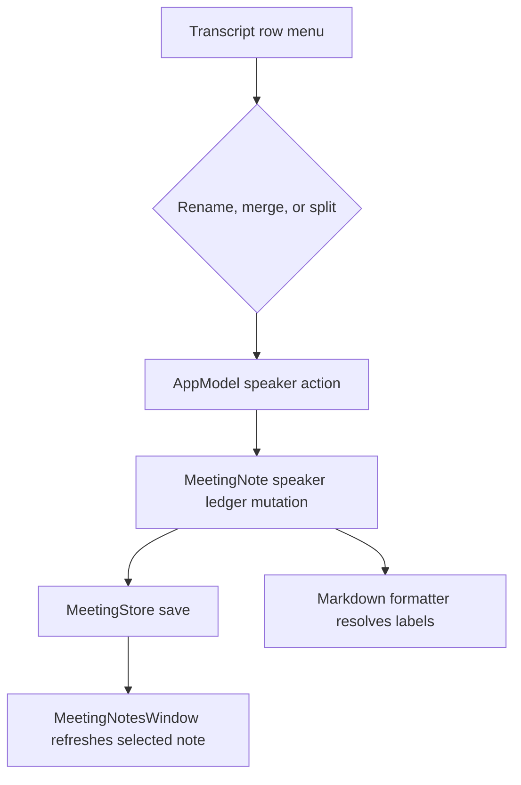

# M4 Note View UI - Plan

## Goal Capsule

| Field | Value |
|---|---|
| Objective | Finish the M4 note-view UI slice by making the note editor notes-first and exposing manual speaker rename, merge, and split controls over transcript turns. |
| Authority | `AGENTS.md`, `CONTEXT.md`, ADR 0001, ticket 09 speaker ledger contract, ticket 10 private AI notepad contract, then existing SwiftUI/AppModel patterns. |
| Execution profile | Code implementation in the Cadence macOS SwiftUI/AppKit repo with GUI verification after tests. |
| Stop conditions | Stop if implementing speaker edits requires diarization, voice fingerprints, cross-meeting identity, or moving capture-ledger persistence out of `MeetingNote`. |
| Tail ownership | The implementation must run unit tests, build/launch verification, and a visual note-view inspection before claiming done. |

---

## Product Contract

### Summary

Cadence already stores durable speaker identities and note-prioritized summaries.
This plan finishes the user-facing M4 layer: the note view starts with the working note, and transcript turns can be renamed, merged, or split without implying automatic diarization confidence.

### Problem Frame

The current note view can display transcript blocks, but the transcript remains a passive source artifact.
Users need a calm way to correct who said what after capture, while the main meeting note stays the primary workspace for thinking and summary generation.

### Requirements

**Notes-first meeting workspace**

- R1. The note detail defaults to the working note when a meeting opens, placing `userNotes` ahead of summary, action items, and transcript source material.
- R2. Summary and action items remain visible after notes, while the transcript stays below them as reviewable source material rather than the first editing surface.
- R3. Final-pass lineage controls remain available in the transcript area and do not interrupt the working-note editor.

**Manual speaker editing**

- R4. The note view exposes speaker rename, merge, and split controls over transcript turns.
- R5. Speaker labels resolve to user-assigned `MeetingSpeakerIdentity.displayName` when present, then fall back to capture-source proxy labels such as `You`, `System Audio`, or `Speaker`.
- R6. The UI must present capture-source proxy labels as inferred source labels, not certain human identities, and it must not show confidence scores in v1.
- R7. Speaker edits persist through the same `MeetingStore` path and note re-sort behavior as final-pass accept/revert actions.
- R8. Copy/export Markdown continues to use resolved speaker labels.

### Acceptance Examples

- AE1. Given a selected meeting with notes, a summary, and transcript segments, when the note opens, the user can type in the notes editor before interacting with summary or transcript sections.
- AE2. Given a transcript turn assigned to speaker `Alice`, when the user renames `Alice` to `Alicia`, every turn referencing that speaker shows `Alicia` and the note persists.
- AE3. Given speakers `Alice` and `Bob`, when the user merges `Bob` into `Alice`, Bob's turns display as `Alice`, Bob is removed from the speaker menu, and export Markdown uses `Alice`.
- AE4. Given multiple turns for `Host`, when the user splits one selected turn into `Guest`, that turn displays as `Guest` and the remaining turns stay `Host`.
- AE5. Given only capture-source proxies, when transcript rows render, they show inferred labels such as `System Audio` without presenting a human identity or confidence score.

### Scope Boundaries

In scope: note detail layout, speaker-edit controls, AppModel wrappers around existing model mutations, unit coverage for AppModel persistence behavior, and GUI verification of the note view.

Deferred to follow-up work: menu-bar Runway, surface split across menu/main/settings, trust-center UI, capture rehearsal, automatic diarization, cross-meeting speaker memory, and confidence scoring.

---

## Planning Contract

### Key Technical Decisions

- KTD1. Keep the speaker ledger on `MeetingNote`.
  ADR 0001 and ticket 09 already place per-meeting identity on the meeting note; this work only adds UI and AppModel coordination.
- KTD2. Add thin AppModel actions instead of mutating models from SwiftUI.
  Existing note mutations flow through `AppModel`, then persist and re-sort the updated note.
- KTD3. Extend `TranscriptRun` enough for UI editing.
  Rows need the run id, merged segment ids, effective speaker id, resolved display label, proxy label, and source label so controls can act on turns without exposing raw model details everywhere.
- KTD4. Prefer inline row menus and modal prompts over a separate speaker-management screen.
  The v1 user task is correcting a visible transcript turn, so the control should live where the correction is noticed.

### High-Level Technical Design

### Assumptions

- Existing model methods `renameSpeaker`, `mergeSpeakers`, `splitSpeaker`, and `resolvedSpeakerLabel` are the source of truth.
- A transcript run may represent several duplicate collapsed segments; split actions can operate on that run's segment ids.
- Newly named split speakers are meeting-local identities.
- GUI verification can launch the app and inspect the note detail window in the current desktop session.

### Risks & Dependencies

- SwiftUI `TextEditor` and nested transcript controls can create awkward scroll focus; visual verification must inspect the top, middle, and transcript area of the note view.
- Speaker editing touches persisted user data, so unit tests must prove selected-note mutation, persistence, and re-sort behavior.
- Existing dirty worktree changes are pre-existing and must not be reverted.

---

## Implementation Units

### U1. AppModel Speaker Edit Actions

- **Goal:** Add public AppModel methods that rename, merge, and split speakers for a meeting note while preserving existing persistence and note ordering behavior.
- **Requirements:** R4, R7, AE2, AE3, AE4.
- **Dependencies:** None.
- **Files:** `Cadence/App/AppModel.swift`, `CadenceTests/CadenceTests.swift`.
- **Approach:** Mirror the `revertFinalPass` and `acceptFinalPass` mutation path: find the note index, call the existing `MeetingNote` speaker method, update `updatedAt`, move the updated note to the top, preserve selected note when appropriate, and call `persistMeetingNote`.
- **Patterns to follow:** `AppModel.applyFinalTranscriptSegments`, `AppModel.generateSummary`, `MeetingNote` speaker ledger tests.
- **Test scenarios:** Rename a speaker through AppModel and expect the selected note to resolve the new label; merge two speakers and expect the source id removed and source turns pointed to the target; split one run's segment id into a new speaker and expect only that turn to resolve to the new name; invalid speaker ids leave the note unchanged and do not crash.
- **Verification:** Unit tests prove AppModel-level persistence behavior without loading WhisperKit.

### U2. Notes-First Note Detail Layout

- **Goal:** Reorder the note detail so the working note is the first content area, followed by summary/action content and then transcript source material.
- **Requirements:** R1, R2, R3, AE1.
- **Dependencies:** None.
- **Files:** `Cadence/UI/MeetingNotesWindow.swift`.
- **Approach:** Change the default workspace mode to Notes, keep pills for navigation, and make the summary section's action items and open questions remain adjacent to the overview. Keep final-pass lineage and search inside transcript.
- **Patterns to follow:** Existing `MeetingWorkspaceMode`, `notesSection`, `summarySection`, and transcript lineage banner styling.
- **Test scenarios:** Test expectation: none -- this is SwiftUI layout behavior and will be GUI-verified.
- **Verification:** Launch verification shows a selected note opens with the notes editor active before transcript content; switching tabs still reaches summary and transcript.

### U3. Editable Transcript Runs

- **Goal:** Add transcript row controls for rename, merge, and split actions without presenting automatic diarization certainty.
- **Requirements:** R4, R5, R6, AE2, AE3, AE4, AE5.
- **Dependencies:** U1.
- **Files:** `Cadence/UI/MeetingNotesWindow.swift`.
- **Approach:** Extend `TranscriptRun` creation to accept the owning note so each run carries `speakerID`, resolved speaker label, source/proxy label, and collapsed segment ids. Add a row-level menu with Rename, Merge Into, and Split Turn actions. Use small sheets/alerts for text entry where needed and only offer merge targets when another speaker exists.
- **Patterns to follow:** Existing `MeetingInlineButton`, `MeetingIconButton`, `TranscriptRunRow`, and native `Menu` controls used elsewhere in the window.
- **Test scenarios:** Test expectation: none -- row interaction is SwiftUI UI behavior and the underlying mutations are covered by U1.
- **Verification:** GUI inspection can rename a displayed speaker, merge into another available speaker, split a row into a new speaker, and see labels update in the transcript without duplicate headers or confidence text.

### U4. Resolved Export/Copy Check

- **Goal:** Ensure speaker edits are reflected in Markdown copy/export after UI mutation.
- **Requirements:** R8, AE3.
- **Dependencies:** U1, U3.
- **Files:** `CadenceTests/CadenceTests.swift`, `Cadence/UI/MeetingNotesWindow.swift`.
- **Approach:** Reuse existing `MeetingMarkdownFormatter` behavior; add only missing coverage if AppModel actions are not already proven to feed selected-note export state.
- **Patterns to follow:** `meetingMarkdownPrefersResolvedSpeakerIdentityOverProxy`.
- **Test scenarios:** After AppModel merge or rename, format the updated selected note and expect the resolved speaker label in Markdown.
- **Verification:** Tests prove the export source note carries updated labels; GUI copy/export buttons remain in the note header.

---

## Verification Contract

| Gate | Applies To | Done Signal |
|---|---|---|
| Unit tests | U1, U4 | `./script/build_and_run.sh --test` or equivalent `xcodebuild test` passes, ignoring only the pre-existing Google Calendar soft noise if it appears unchanged. |
| Build/install launch | U2, U3 | `./script/build_and_run.sh --verify` succeeds and the main window appears. |
| GUI inspection | U2, U3 | Screenshots or accessibility inspection confirm notes-first layout, transcript row speaker menu, rename/merge/split interaction surfaces, and no confidence score copy. |
| Privacy/data boundary | All units | No analytics or remote egress are added; transcript text and speaker names remain local persisted note data. |

---

## Definition of Done

- U1 is done when AppModel speaker actions mutate, persist, re-sort, and preserve selection consistently with existing note actions.
- U2 is done when the selected note opens on the working note surface and summary/transcript remain reachable without layout overlap.
- U3 is done when speaker row controls are visible, compact, keyboard/mouse reachable, and update the transcript labels after rename, merge, and split.
- U4 is done when Markdown output uses the updated resolved labels after UI-backed speaker edits.
- The whole plan is done when tests pass, the app launches, the note view is visually inspected, and abandoned experimental code is removed from the diff.

---

## Appendix

### Sources

- `AGENTS.md`
- `CONTEXT.md`
- `docs/adr/0001-capture-ledger-persistence.md`
- `.scratch/cadence-seven-feature-plan/issues/09-define-editable-speaker-ledger-contract.md`
- `.scratch/cadence-seven-feature-plan/issues/10-define-private-ai-notepad-as-core.md`
- `Cadence/Models/MeetingModels.swift`
- `Cadence/App/AppModel.swift`
- `Cadence/UI/MeetingNotesWindow.swift`
- `CadenceTests/CadenceTests.swift`
