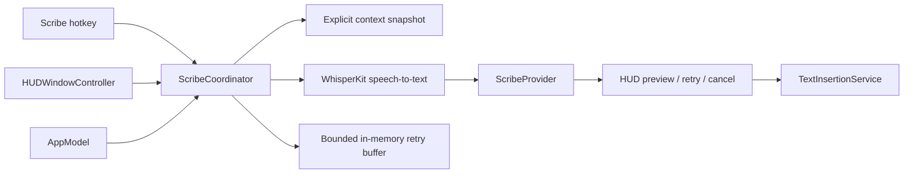
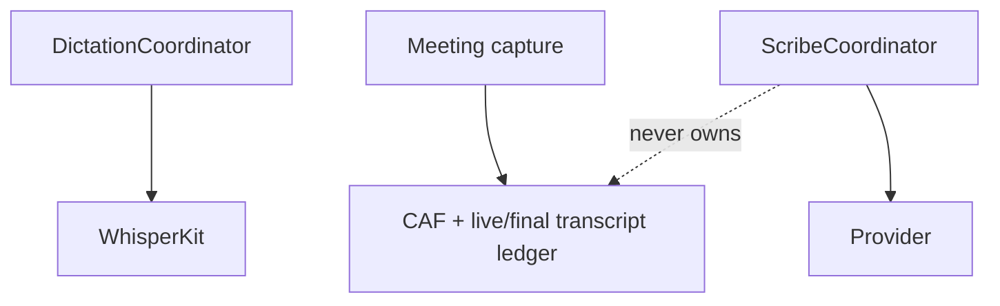

# Willow-inspired voice workflows - Plan

> **Historical status (2026-07-10):** This requirements-only artifact records the planning frontier when issue #15 and the prototype approvals were still blocking gates. Those gates and draft execution units have since been superseded by the implemented follow-on commits and plans, including `2026-07-10-004-fix-hud-runtime-correctness-release-readiness-plan.md`; retain this document as provenance rather than treating its original readiness language as current execution status.

## Goal Capsule

| Field | Value |
|---|---|
| Objective | Make Cadence a local-first voice workspace with reliable Dictation, an explicit Scribe writing mode, personal shortcuts and style profiles, a trustworthy HUD, and replayable first-run onboarding. |
| Authority | `AGENTS.md`, `CONTEXT.md`, `docs/codebase-guide.md`, `docs/privacy.md`, the current Cadence source, and—only after U0 approval—the durable Willow reference and prototype artifacts. |
| Execution profile | Incremental SwiftUI/AppKit implementation with unit coverage first and real-app verification after each user-facing slice. |
| Stop conditions | Stop before adding a cloud provider, ambient screen capture, or actual read-aloud TTS until the privacy/provider decision is explicit. Never change the meeting capture durability boundary. |
| Product contract preservation | No upstream Product Contract existed; this plan bootstraps the contract from the request, repo evidence, and observed Willow behavior. |

## Readiness gate

This artifact is deliberately **not implementation-ready**. The implementation units below are draft planning material and must not be handed to `ce-work` or another executor until all of these conditions are met:

1. [Capture and annotate the Willow experience reference bundle](https://github.com/darshshah981/Cadence/issues/15) is completed and the user approves the bundle.
2. The approved bundle is the input to [Prototype the Scribe intent-picker and review panel](https://github.com/darshshah981/Cadence/issues/10) and [Prototype Willow-informed Cadence surface and interaction language](https://github.com/darshshah981/Cadence/issues/14).
3. Both prototypes are approved, including their information architecture, screen/state maps, focus and accessibility behavior, motion contract, copy hierarchy, and Cadence/Willow adaptation boundaries.
4. The approved decisions and artifact links are incorporated into this plan, a fresh-context reviewer finds no material reconstruction gap, and only then is `artifact_readiness` restored to `implementation-ready`.

The raw Willow media stays in gitignored `local/willow-reference-bundle/`. The durable repo contract is a sanitized textual reference, an adaptation matrix, approved prototype artifacts, and fresh real-app Cadence baselines under `docs/design/`; no personal data or proprietary raw Willow assets are committed.

## Problem Frame

Cadence already has a fast, private Dictation pipeline and a separate durable meeting-capture pipeline. Willow's onboarding makes the distinction between literal dictation and an AI writing assistant obvious, then teaches shortcuts, privacy, permissions, language, a private microphone check, and a guided first use. Cadence currently has no Scribe contract, no personal shortcut/template model, no editable style profiles, and a HUD that only represents recording/transcribing/error states.

The product goal is behavioral parity with the useful interaction model—not a pixel or asset clone. Cadence must remain local-first and meeting reliability must remain independent of any writing-assistant generation.

### Scope assumption that must be confirmed before implementation

This plan interprets “text to speech” as Willow's voice-to-text Dictation plus Scribe. Actual text-to-speech read-aloud (speaking text back to the user) is a separate optional track, not part of the primary implementation units. If read-aloud is required, add a new audio-output provider, playback controls, voice selection, and accessibility/privacy review before implementation begins.

## Product Contract

### Requirements

**R1. Separate voice modes**

- Literal Dictation preserves the user's words, applies deterministic local cleanup, and inserts them into the previously focused app.
- Scribe captures a spoken intent and produces polished text before insertion.
- Scribe must be a separate service/state machine; it must not grow `DictationCoordinator` or depend on meeting storage/final-pass transcription.

**R2. Scribe intents and context**

- Support three explicit modes: from scratch, respond using selected/context text, and edit selected text.
- Context is opt-in per request, typed, size-limited, transient, and visibly disclosed in the HUD. There is no ambient screen recording or background context collection.
- If selection/context is unavailable, explain the limitation and offer literal Dictation or a retry.

**R3. Local-first generation boundary**

- WhisperKit remains the local speech-to-text engine.
- Add a `ScribeProvider` protocol and mock provider before selecting a real generation backend.
- Private/offline mode always works without a cloud provider by offering literal Dictation as the explicit fallback. Semantic Scribe requires an approved provider and must never pretend deterministic cleanup generated new prose.
- Any remote provider requires an explicit egress contract, consent, authentication/configuration, retention/deletion rules, and privacy-safe failure states.

**R4. Personal language tools**

- Keep the existing personal vocabulary alias model.
- Add versioned personal shortcuts/templates as a separate model with global and optional app/profile scope.
- Preserve deterministic behavior and local persistence; never send terms, shortcuts, or generated text to analytics.

**R5. Editable style matching**

- Replace the hard-coded app-aware polish ceiling with editable style profiles that can control tone, length, punctuation, formatting, and code literalness.
- Keep the current deterministic app-bundle fallback when a profile or provider is unavailable.

**R6. Native HUD**

- Extend the nonactivating HUD to represent arming, listening, transcribing, generating, preview/review, inserting, success, cancelled, error, offline, and recovery states.
- Controls must communicate their effect (cancel generation, stop recording, retry, use literal dictation) and must not steal focus from the target app.
- Preserve drag placement, Spaces/full-screen behavior, VoiceOver labels, reduced-motion behavior, and the current calm visual character.

**R7. Replayable onboarding and readiness**

- Add a first-run flow that teaches Dictation vs. Scribe, chooses independent shortcuts, explains data boundaries, checks permissions, verifies the microphone privately, configures language, and completes one safe example of each mode.
- Onboarding can be replayed/reset from Settings without deleting meeting notes, recordings, Keychain tokens, or remote account data.
- Permission prompts remain contextual: Screen Recording is requested only for meeting system-audio capture.

**R8. Reliability and privacy invariants**

- Dictation remains short and responsive; Scribe generation is cancellable, bounded by timeout, retryable, and idempotent at insertion.
- Meeting audio/transcript remain durable according to the existing meeting boundaries. Scribe keeps the spoken transcript and generated result in a bounded in-memory retry buffer only; it does not add dictation-audio durability or silently write failed Scribe requests to history.
- Analytics remain opt-in and coarse; never include audio, transcript text, vocabulary, shortcuts, exact keys, dictated app names, screen text, or raw provider errors.

**R9. Willow-informed, Cadence-native experience**

- Apply Willow's useful interaction patterns—clear mode distinction, progressive disclosure, guided first use, contextual readiness, personal language tools, style profiles, and a compact always-available HUD—without copying Willow's assets, exact layout, copy, or visual identity.
- Make the primary surfaces coherent: menu-bar popover, main workspace, onboarding, HUD/review panel, Settings, Dictionary, Style Profiles, permissions, and privacy/readiness.
- Every surface must have a single obvious next action, specific navigation terminology, appropriate destructive/secondary hierarchy, and understandable empty, populated, selected, recording, generating, finalizing, failed, recovered, scrolled, narrow, VoiceOver, and reduced-motion states.
- Preserve Cadence's calm restrained character and native macOS behavior: system typography and controls, focus preservation, keyboard navigation, Dynamic Type, high contrast, reduced transparency, and no decorative motion on frequent keyboard-triggered actions.

### Acceptance examples

- AE1. A user holds the existing Dictation shortcut in TextEdit; literal text is inserted exactly as before and the Scribe work does not change its latency path.
- AE2. A user invokes Scribe from scratch, speaks an intent, sees `Generating…`, reviews the result, and explicitly inserts or cancels it.
- AE3. A user selects an email and invokes “respond”; the HUD names the selected-text context, generated text is inserted only after success, and the selection is not persisted.
- AE4. A user invokes “edit selected text” with no selection; Cadence explains what is missing and offers retry or literal Dictation without crashing.
- AE5. A personal shortcut expands to a local template in the configured app profile; overlapping triggers, punctuation boundaries, and an empty expansion are deterministic.
- AE6. A remote/provider timeout, offline mode, or empty result retains the spoken transcript and offers retry or literal insertion; no duplicate text is inserted.
- AE7. Onboarding can be skipped, resumed, and replayed; clearing onboarding state leaves meeting data and OAuth/Keychain state untouched.
- AE8. Meeting capture, raw CAF durability, final-pass replacement, recovery, and privacy tests remain green after all Scribe/HUD changes.

### Explicit non-goals / deferred work

- Actual read-aloud text-to-speech.
- Automatic speaker diarization or cross-meeting speaker identity.
- Ambient always-on listening or automatic screen capture.
- Pixel-perfect copying of Willow's UI, copy, or proprietary artwork.
- Cloud generation before the provider/privacy contract is approved.
- Moving meeting capture into the Dictation or Scribe pipeline.

## Observed Willow inputs

This section is provisional context, not implementation authority. U0 must replace its conversational observations with stable frame/state IDs, annotated recordings, a complete textual fallback, and approved Cadence adaptations before any executor relies on it.

The fresh reinstall journey showed: role and acquisition source, privacy choice (Privacy Mode default), core permissions, microphone check, language selection, an explicit Dictation/Scribe explanation, independent shortcut checks, guided Scribe and Dictation demos with skip paths, power-user reminders, workspace naming, invitation upsell, and a first-use chooser. Willow describes Scribe as three modes (from scratch, respond with context, edit selected text), exposes personal terms/shortcuts and per-app style matching, and uses a separate Assistant/Scribe hotkey. These behaviors are interaction references, not implementation dependencies; Cadence will not collect Willow's role, acquisition, workspace, or invitation data.

Useful primary references: [Scribe modes](https://help.willowvoice.com/en/articles/15043797-introduction-to-scribe-in-willow), [voice commands and formatting](https://help.willowvoice.com/en/articles/13183983-voice-commands-and-automatic-formatting-guide), [hotkeys](https://help.willowvoice.com/en/articles/10876257-hotkey-settings), [Dictation behavior](https://help.willowvoice.com/en/articles/10876920-dictating-with-willow-voice), [personal dictionary and shortcuts](https://help.willowvoice.com/en/articles/13183918-using-personal-dictionary-and-shortcuts), [style matching](https://help.willowvoice.com/en/articles/12864746-personalization-and-style-matching), [privacy](https://help.willowvoice.com/en/articles/12854269-how-willow-protects-your-data-and-privacy), and [setup/onboarding](https://help.willowvoice.com/en/articles/10876111-install-and-setup-willow-voice-mac-windows).

## Key technical decisions

**KTD1. Add a separate Scribe domain seam.**

Create typed `ScribeIntent`, `ScribeContextSnapshot`, `ScribeRequest`, `ScribeResult`, `ScribeSessionState`, and `ScribePrivacyMode` models plus `ScribeProvider` and `ScribeContextService` protocols. `AppModel` coordinates; a new `ScribeCoordinator` owns lifecycle. This prevents the already-large `AppModel` and the reliability-sensitive `DictationCoordinator` from becoming generation-specific.

**KTD2. Capture context only at invocation.**

Use the existing frontmost-app detection as a privacy-safe label. Read only the selected range through an explicit Accessibility path after the user chooses a context mode; reject secure/password fields, avoid broad AX-tree reads, and preserve the clipboard if a fallback is unavoidable. Snapshot target PID/window/selection metadata, apply a documented normalized byte limit and fail-closed redaction policy, then clear the snapshot at terminal state. Do not persist snapshots or add Screen Recording permission.

**KTD3. Insert only after explicit success.**

Scribe follows `choose intent → snapshot target/context → listen → transcribe → generate → review/insert`. A result gets a request ID/idempotency key and insertion guard. Verify the target PID/window/selection immediately before insertion; on mismatch, retain the in-memory transcript/result and refuse to insert into a new app. Cancellation, timeout, empty output, provider failure, or uncertain partial insertion must not trigger an automatic duplicate retry.

**KTD4. Keep deterministic local fallbacks.**

Existing `AppAwareTextPolisher` and `VocabularyPostProcessor` remain the deterministic fallback. Offline/private mode presents literal insertion, not semantic Scribe. Editable profiles and shortcuts are local models first. A real provider is feature-flagged behind the contract and cannot silently weaken Private Mode.

**KTD5. Extend HUD state, not just styling.**

`HUDVisualState` becomes a real lifecycle projection for both Dictation and Scribe. `HUDWindowController` remains a nonactivating `NSPanel`; the target app keeps focus, controls are keyboard/VoiceOver reachable, and reduced motion removes waveform/spinner animation without removing state changes.

**KTD6. Onboarding reset is a supported state transition.**

Store versioned onboarding progress separately from Scribe privacy mode, provider consent, provider credentials, and pending requests. Expose explicit replay plus separate disconnect/revoke/delete actions. Test reset fixtures must not remove MeetingStore/MeetingAudioStore data, Keychain OAuth tokens, provider credentials, or macOS permission grants.

**KTD7. Borrow interaction grammar, not surface identity.**

Use Willow's observed information architecture as a heuristic: teach the two voice modes, let users configure personal language and style, keep a compact status HUD, and offer a guided first-use task. Re-express those ideas with Cadence's existing `FlowTheme`, navigation, menu-bar behavior, and meeting vocabulary. Favor system controls, direct labels, progressive disclosure, and state-derived feedback over decorative gradients, cloned artwork, or perpetual animation.

## High-level design

The meeting path stays separate:

## Implementation units

The units below are dependency sketches while the readiness gate is open. Their file lists, UI contracts, sequencing, and acceptance evidence may change when the approved reference bundle and prototypes are incorporated.

### U0. Willow reference bundle and prototype approval gate

- **Tracker:** [Capture and annotate the Willow experience reference bundle](https://github.com/darshshah981/Cadence/issues/15), then [Prototype the Scribe intent-picker and review panel](https://github.com/darshshah981/Cadence/issues/10) and [Prototype Willow-informed Cadence surface and interaction language](https://github.com/darshshah981/Cadence/issues/14).
- **Artifacts:** gitignored raw captures and manifest in `local/willow-reference-bundle/`; sanitized `docs/design/willow-experience-reference.md`; `docs/design/willow-to-cadence-adaptation-matrix.md`; fresh real-app baselines in `docs/design/cadence-baseline/`; canonical prototype records at `docs/design/prototypes/scribe-intent-review.md` and `docs/design/prototypes/cadence-surface-interaction.md`; and supporting exports under their matching `docs/design/prototypes/` directories.
- **Approach:** Capture first, prototype second, approve third, then revise this plan. The reference must cover onboarding, HUD, Scribe, product shell, personal language/style tools, settings/readiness, motion, focus, accessibility, recovery, narrow-window behavior, and every affected state. It must distinguish patterns Cadence will borrow, reinterpret, and avoid.
- **Review:** A separate fresh-context reviewer must be able to reconstruct the intended Willow-informed experience without this chat and must try to disprove that the evidence is sufficient. Resolve every material gap before approval.
- **Done when:** the bundle and both prototypes are user-approved; each resolution comment records the exact artifact commit/revision, reviewer and privacy verdicts, and explicit approval; their stable links and decisions are incorporated here; every downstream unit explicitly depends on U0; and this plan passes a fresh plan audit before its readiness metadata changes.

### U1. Domain contracts and mock provider

- **Depends on:** U0.
- **Files:** `Cadence/Models/DictationModels.swift` (or a new `Cadence/Models/ScribeModels.swift`), `Cadence/Services/ScribeProvider.swift`, `Cadence/Services/MockScribeProvider.swift`, `CadenceTests/CadenceTests.swift`.
- **Approach:** Define intents, a keyboard-accessible intent-picker contract, context scope, lifecycle states, `ScribePrivacyMode` (Private/local fallback by default), provider capabilities, request IDs/idempotency keys, and privacy policy decisions. Add a multilingual language model only if the onboarding language step is retained; wire model availability so `.en` models cannot claim arbitrary languages. Keep values `Codable` only where persistence is intentional.
- **Tests:** intent encoding/decoding; picker cancellation; context size/redaction; empty output; provider success, timeout, cancellation, retry, and offline capability; request IDs prevent duplicate completion; language/model compatibility.
- **Done when:** a mock can drive every Scribe state without UI or WhisperKit.

### U2. Explicit context and frontmost-target service

- **Depends on:** U0 and U1.
- **Files:** new `Cadence/Services/ScribeContextService.swift`, `Cadence/Services/TextInsertionService.swift` only if a read-selection seam is needed, `Cadence/App/AppModel.swift`, tests.
- **Approach:** Capture target app and selected text only after a Scribe intent requests it. Return typed unavailable/denied/secure-field/too-large outcomes, snapshot target identity, enforce a documented normalized 32 KiB context limit with fail-closed redaction, and clear the snapshot after success/failure/cancel/reset. Do not persist snapshots or add Screen Recording permission.
- **Tests:** selected text success, no selection, secure/password field, Accessibility denied, normalized byte limit/redaction, clipboard preservation, app/window switch between capture and insert, and no snapshot in UserDefaults/files/logs/analytics.
- **Done when:** Scribe can explain exactly what context it used without collecting ambient content.

### U3. ScribeCoordinator lifecycle and guarded insertion

- **Depends on:** U0, U1, and U2.
- **Files:** new `Cadence/Services/ScribeCoordinator.swift`, new `Cadence/Services/VoiceSessionArbiter.swift` (or an equivalent isolated session factory), `Cadence/App/AppModel.swift`, `Cadence/Services/TextInsertionService.swift`, `CadenceTests/CadenceTests.swift`.
- **Approach:** Add a session arbiter or isolated session factory so Scribe cannot share mutable Whisper/audio buffers concurrently with Dictation or Meeting capture. Sequence capture, transcription, provider generation, review, cancellation, timeout, retry, and one guarded insertion. Keep a bounded in-memory retry buffer; do not add raw dictation audio persistence. On target mismatch or uncertain character-by-character insertion, disable automatic retry and require explicit user action.
- **Tests:** happy path for all three intents; provider unavailable; timeout race; empty result; cancellation during recording and generation; focus/PID/selection loss; concurrent Dictation/Scribe/meeting start policy; retry after failure; duplicate callback/late response; uncertain partial insertion; literal Dictation regression; meeting services untouched.
- **Done when:** Scribe is independently cancellable and cannot block or corrupt Dictation or Meeting capture.

### U4. Personal shortcuts and editable style profiles

- **Depends on:** U0 and the approved Willow-informed surface/interaction prototype.
- **Files:** `Cadence/Models/DictationModels.swift` or new model files, `Cadence/App/AppModel.swift`, `Cadence/UI/SettingsView.swift`, `CadenceTests/CadenceTests.swift`.
- **Approach:** Add versioned local persistence for phrase-to-template shortcuts and app/profile-scoped style settings. Reuse existing vocabulary parsing where appropriate but do not overload aliases with templates. Preserve deterministic app-aware fallback when no Scribe provider is available.
- **Tests:** migration from empty/legacy state; overlapping phrases and boundaries; app-scoped vs global precedence; malformed/empty templates; style fallback for unknown apps and code apps; no sensitive analytics fields.
- **Done when:** users can add, edit, disable, and test a shortcut/profile locally.

### U5. Independent hotkey bindings and readiness model

- **Depends on:** U0, U1, and the approved Scribe intent-picker/review prototype.
- **Files:** `Cadence/Models/DictationModels.swift`, `Cadence/Services/HotkeyService.swift`, `Cadence/App/AppModel.swift`, `Cadence/UI/SettingsView.swift`, tests.
- **Approach:** Add a separate Scribe/Assistant action through a mode-aware hotkey event router (the current service has single callbacks and only two exhaustive actions). Add new preference keys/IDs/defaults and migration. Add hands-free only as a finite user-started session with timeout and explicit cancel—not ambient listening. Surface readiness for permissions, provider availability, privacy mode, language/model compatibility, and context capability.
- **Tests:** binding registration/conflicts/migration, modifier-only behavior, pause/resume, independent Scribe hotkey, intent-picker cancellation, finite hands-free timeout/cancel, tap/hold cancellation, and permission-denied recovery.
- **Done when:** the user can configure Scribe without destabilizing existing shortcuts.

### U6. HUD lifecycle and accessibility polish

- **Depends on:** U0 and the approved Scribe intent-picker/review prototype.
- **Files:** `Cadence/Models/DictationModels.swift`, `Cadence/UI/HUDView.swift`, `Cadence/Services/HUDWindowController.swift`, `CadenceTests/CadenceTests.swift` (state tests; manual GUI verification for visuals).
- **Approach:** Add a mode-aware HUD router/session token so Dictation and Scribe cannot overwrite each other's handlers. Keep the compact pill for recording/status and add a dedicated nonactivating, scrollable review panel for long generated text. Add mode/context indicators, generating/review/error/retry controls, and copy/insert/cancel actions with explicit labels. Keep the panel nonactivating and draggable. Respect reduced motion and narrow/large display bounds.
- **Tests/inspection:** state-to-copy mapping, VoiceOver labels, focus remains in TextEdit/Notes, rapid press/release, cancel, timeout race, retry, offline/private-mode literal fallback, full-screen/Spaces, notch placement, long-text scrolling, scrolled/narrow settings, and reduced motion.
- **Done when:** every visible control says what it affects and the HUD never claims progress that the coordinator did not report.

### U7. Replayable onboarding and private rehearsal

- **Depends on:** U0 and the approved Willow-informed surface/interaction prototype.
- **Files:** new `Cadence/UI/OnboardingView.swift` (or scoped onboarding views), `Cadence/App/AppModel.swift`, `Cadence/UI/SettingsView.swift`, `Cadence/UI/PermissionGuideWindow.swift`, `CadenceTests/CadenceTests.swift`. New files under `Cadence/` are already auto-included; edit `project.yml` only if target configuration changes, then run `xcodegen generate`.
- **Approach:** Build a native, skippable sequence: choose Dictation/Scribe explanation, permissions, ephemeral microphone rehearsal, language only if multilingual model support is implemented, independent shortcuts, Private Mode/local fallback explanation, personal language tools, and first safe examples. Store progress by version and expose “Replay onboarding” in Settings; never auto-enable provider consent or resurrect a pending request.
- **Tests/inspection:** fresh, skipped, interrupted, denied-permission, resumed, completed, and replayed journeys; rehearsal audio/transcript never enters history, analytics, provider, or disk; reset preserves meetings/audio/Keychain/provider credentials; screen recording is not requested by dictation/Scribe onboarding; keyboard navigation, VoiceOver, reduced motion, and narrow window.
- **Done when:** a new user can understand the mode distinction and prove both workflows without destructive state changes.

### U8. Provider implementation and release gate

- **Depends on:** U0 and U1-U7, plus an explicit provider/privacy decision.
- **Files:** provider-specific new service under `Cadence/Services/`, a provider-specific Keychain store, `Cadence/Services/AnalyticsService.swift`, `docs/privacy.md`, `README.md`, and tests.
- **Approach:** Choose local vs remote generation only after U1-U7 and an explicit privacy decision. If remote, define an allowlisted egress schema, TLS/endpoint, region, training/use policy, retention/deletion and cancellation limits, fail-closed Private Mode guard, Keychain token storage/revoke/delete, and safe provider-error mapping for OSLog and Analytics. Keep semantic Scribe behind a capability/feature flag; offline/private mode visibly falls back to literal Dictation. Enforce the analytics/log allowlist centrally rather than relying on call sites.
- **Tests:** provider contract conformance, auth missing, Keychain persistence/revoke, network offline, rate limit, timeout/late response, privacy mode with no network, egress-field allowlist, secure context rejection, deletion, centralized analytics/log allowlist, signed Release build, and no changes to meeting durability tests.
- **Done when:** the chosen provider is explainable, revocable, and cannot silently violate the local-first promise.

### U9. Willow-informed Cadence surface and interaction pass

- **Depends on:** U0 and both approved UI prototypes. This unit implements an approved design contract; it does not invent that contract during the polish pass.
- **Files:** `Cadence/UI/MainWindowView.swift`, `Cadence/UI/MenuContentView.swift`, `Cadence/UI/SettingsView.swift`, `Cadence/UI/PermissionGuideWindow.swift`, `Cadence/UI/HUDView.swift`, `Cadence/Services/HUDWindowController.swift`, new onboarding/review views, and `CadenceTests/CadenceTests.swift` where state or accessibility labels are testable.
- **Approach:** Create a small surface inventory and apply one interaction grammar: mode-first language (Dictation/Scribe/Meeting), clear readiness and data-boundary copy, compact status summaries, contextual actions, and progressive disclosure for advanced model/provider settings. Use native macOS spacing, typography, menus, sheets, keyboard focus, and materials. Make popovers originate from their trigger, keep frequent keyboard actions instant, use short interruptible transitions only for occasional panels, and provide static equivalents for reduced motion/transparency/contrast preferences.
- **Tests/inspection:** actual-app screenshots and accessibility inspection for first launch, empty/populated history, selected note, active recording, generating/review, failed/recovered state, Settings scrolled to lower sections, narrow window, VoiceOver order, keyboard-only navigation, light/dark/high-contrast/reduced-transparency, and menu-bar/HUD placement across Spaces and full-screen apps.
- **Done when:** Willow-inspired behavior is visible as a coherent Cadence product, not as a collection of copied screens; every affected surface has a clear hierarchy and no material state is unhandled.

## Risks and mitigations

| Risk | Mitigation |
|---|---|
| Generation makes dictation feel slower or less reliable | Separate coordinator and hotkey; keep literal Dictation path unchanged; expose a literal fallback. |
| Shared Whisper/audio state is corrupted by overlap | Add a session arbiter or isolated session factory with an explicit busy policy; test Dictation/Scribe/meeting overlap and cancellation. |
| Cloud context violates privacy expectations | Provider contract, explicit per-request disclosure, Private Mode/offline disablement, transient snapshots, allowlisted analytics. |
| Context or generated text is inserted into the wrong app | Snapshot target PID/window/selection, verify immediately before insertion, and refuse insertion on mismatch. |
| Character-by-character insertion partially succeeds | Treat uncertain insertion as a terminal state; require explicit user retry/copy rather than automatic duplicate retry. |
| Accessibility selection is unreliable | Typed unavailable states, no silent fallback to ambient capture, rehearsal and TextEdit/Notes matrix. |
| Semantic Scribe has no approved offline backend | Ship literal Dictation as the honest offline fallback; keep semantic Scribe behind the provider capability gate. |
| UI inspiration turns into a broad visual rewrite | Constrain the pass to the named surfaces and state matrix; preserve `FlowTheme`, meeting reliability, and existing architecture boundaries. |
| HUD becomes decorative or steals focus | Project every control from real coordinator state; retain `.nonactivatingPanel`; GUI focus checks. |
| Onboarding reset deletes user work | Versioned `UserDefaults` key only; tests prove MeetingStore, MeetingAudioStore, Keychain, and permissions remain. |
| AppModel grows further | Services own IO/state; AppModel only coordinates published state and persistence. |
| Generated Xcode project drift | Add files through `project.yml`, run `xcodegen generate`, never hand-edit `Cadence.xcodeproj/project.pbxproj`. |

## Edge-case behavior matrix

These are product behaviors, not merely test names. Every implementation unit that can encounter one must preserve the stated outcome.

| Edge case | Required behavior | Proof target |
|---|---|---|
| No Accessibility permission at Scribe invocation | Explain that selected context is unavailable; offer literal Dictation or permission guidance. Never read the clipboard as a silent substitute. | Context-service unit test; onboarding denial flow. |
| Secure/password field is focused | Refuse context capture, name the reason without exposing field contents, and offer from-scratch Scribe or literal Dictation. | AX secure-field test; privacy inspection. |
| No selection for respond/edit | Keep the intent picker open or return to it; do not send an empty context request. | Intent-picker and empty-context tests. |
| Selected text exceeds the normalized context limit | Fail closed with a concise explanation and an explicit “use selection anyway” path only if the user confirms a bounded excerpt; never silently truncate sensitive content. | Unicode/byte-limit tests. |
| Clipboard fallback is required | Preserve and restore the prior clipboard contents and UTIs, or refuse the operation if restoration cannot be guaranteed. | Clipboard preservation test. |
| Target app/window/selection changes during generation | Mark the result stale, keep it in the in-memory review buffer, and refuse insertion into the new target until the user explicitly re-arms it. | Injected frontmost-target race test. |
| Target app terminates or loses Accessibility trust before insert | Show recoverable failure; offer copy to clipboard or retry after the user reselects a target. | Termination/permission-revocation test. |
| Provider returns empty, malformed, oversized, or instruction-like output | Do not insert; show a safe provider failure and keep the spoken transcript. Treat generated text as inert text, never as a command. | Provider contract and output-sanitization tests. |
| Provider times out, is cancelled, or returns late | Cancel the task, clear context at terminal state, ignore late responses by request ID, and require explicit retry. | Timeout/cancellation race tests. |
| Provider is unavailable or Private Mode is enabled | Show “Scribe unavailable here”; offer literal Dictation with no implied semantic rewrite and no network attempt. | Capability/readiness and no-network tests. |
| Dictation, Scribe, and meeting capture overlap | Apply an explicit arbiter policy: queue only where safe, otherwise reject with a clear reason; never share mutable audio/transcription buffers. | Concurrency tests and meeting regression suite. |
| Mic is silent, unplugged, or route changes mid-session | Preserve the no-audio error state, stop promptly, and offer microphone guidance; do not call the provider with an empty transcript. | Audio-device and empty-transcript tests. |
| Hotkey conflict or modifier-only key is held too long | Keep existing Dictation conflict rules, show the conflicting action, and ensure releasing one action cannot stop another session. | Hotkey migration/conflict tests. |
| User presses cancel during review or onboarding reset | Clear transient context and pending provider work; leave persisted settings/data untouched. | Cancellation/reset tests. |
| App relaunches or crashes during Scribe | Do not claim recovery of audio that was never persisted; clear stale in-memory state on launch and leave meeting recovery untouched. | Relaunch/recovery inspection. |
| HUD is on another Space, full-screen app, notch, or reduced-motion setting | Keep the panel visible and nonactivating where macOS permits, clamp it to the target screen, and replace motion with static state indicators. | Real-app GUI matrix. |
| VoiceOver or keyboard-only use | Every mode, context disclosure, status, and action has a meaningful label and deterministic focus order; no action depends on waveform animation. | Accessibility inspection. |
| Provider is disabled or disconnected while a request is pending | Let the current request reach a safe terminal state, prevent new network work, and clear credentials only through explicit revoke/delete. | Provider lifecycle tests. |

## Verification contract

| Gate | Done signal |
|---|---|
| Design-input readiness | The Willow reference bundle and both UI prototypes are approved, linked, incorporated into the plan, and independently reconstructible by a fresh-context reviewer before any implementation handoff. |
| Unit tests | `./script/build_and_run.sh --test` passes, including Scribe contracts, shortcut/style persistence, coordinator failure paths, and existing meeting durability tests. |
| Build/launch | `./script/build_and_run.sh --verify` succeeds with the real installed Debug app. |
| Dictation regression | TextEdit/Notes literal Dictation still inserts correctly with existing hold/tap shortcuts and latency behavior. |
| Scribe end-to-end | From-scratch, respond, edit, retry, cancel, offline, and empty-result flows work with the mock provider; the approved real provider is exercised only after U8's privacy/provider gate is satisfied. |
| Onboarding | Fresh, skipped, resumed, denied, completed, and replayed states are manually inspected at narrow/normal widths with keyboard/VoiceOver/reduced-motion checks. |
| HUD | Recording, transcribing, generating, preview, inserting, failed, recovered, scrolled, and full-screen/Spaces states are captured from the real app. |
| Privacy | `docs/privacy.md` and settings copy match actual behavior; analytics tests prove no sensitive fields; context is transient and provider behavior is disclosed. |
| Meeting reliability | Meeting capture, CAF durability, final-pass failure retention, recovery, and export tests remain green; no Scribe state is written into meeting ledgers. |
| UI/UX coherence | Willow-inspired Cadence surfaces are inspected in the real app across all affected states; terminology, hierarchy, focus, accessibility, reduced motion/transparency, and narrow-window behavior are consistent. |

## Definition of Done

- Dictation remains behaviorally unchanged and all existing reliability tests pass.
- Scribe has a typed provider seam, three explicit intents, a cancellable/retryable lifecycle, guarded insertion, and a deterministic offline fallback.
- Personal shortcuts and editable style profiles are local, versioned, test-covered, and scoped clearly.
- HUD states and controls are understandable without redundant labels and never steal target-app focus.
- Menu-bar, main-window, onboarding, Settings, Dictionary, Style Profiles, permissions, HUD, and review surfaces share one Cadence-native interaction grammar inspired by Willow but not copied from it.
- Onboarding teaches both modes, includes a private rehearsal, handles permission failures, and can be replayed without deleting user data.
- Any cloud provider or actual text-to-speech track is separately approved, documented, and gated by privacy/release checks.
- The real app launches and all affected workflows are verified end to end with screenshots/inspection evidence.

## Sources and research

The open planning frontier is tracked in the GitHub map [Wayfinder: Willow-inspired voice workflows](https://github.com/darshshah981/Cadence/issues/6). [Capture and annotate the Willow experience reference bundle](https://github.com/darshshah981/Cadence/issues/15) now blocks both UI prototype tickets. The bundle must be approved before prototype work starts; both prototypes must then be approved and incorporated before this plan can return to `implementation-ready`. The map's other child tickets hold the provider, TTS, multilingual, insertion, arbitration, and onboarding decisions that must also be resolved before implementation units are final.

- `AGENTS.md`
- `CONTEXT.md`
- `docs/codebase-guide.md`
- `docs/privacy.md`
- `README.md`
- `Cadence/Models/DictationModels.swift`
- `Cadence/Services/DictationCoordinator.swift`
- `Cadence/Services/HotkeyService.swift`
- `Cadence/Services/HUDWindowController.swift`
- `Cadence/UI/HUDView.swift`
- `Cadence/UI/SettingsView.swift`
- `Cadence/App/AppModel.swift`
- `CadenceTests/CadenceTests.swift`
- The supplied Workbench brief was not readable by the browser tool; its requirements were taken from the user's messages in this task instead of inferred from the unavailable page.
- Official Willow help references linked in “Observed Willow inputs”.
