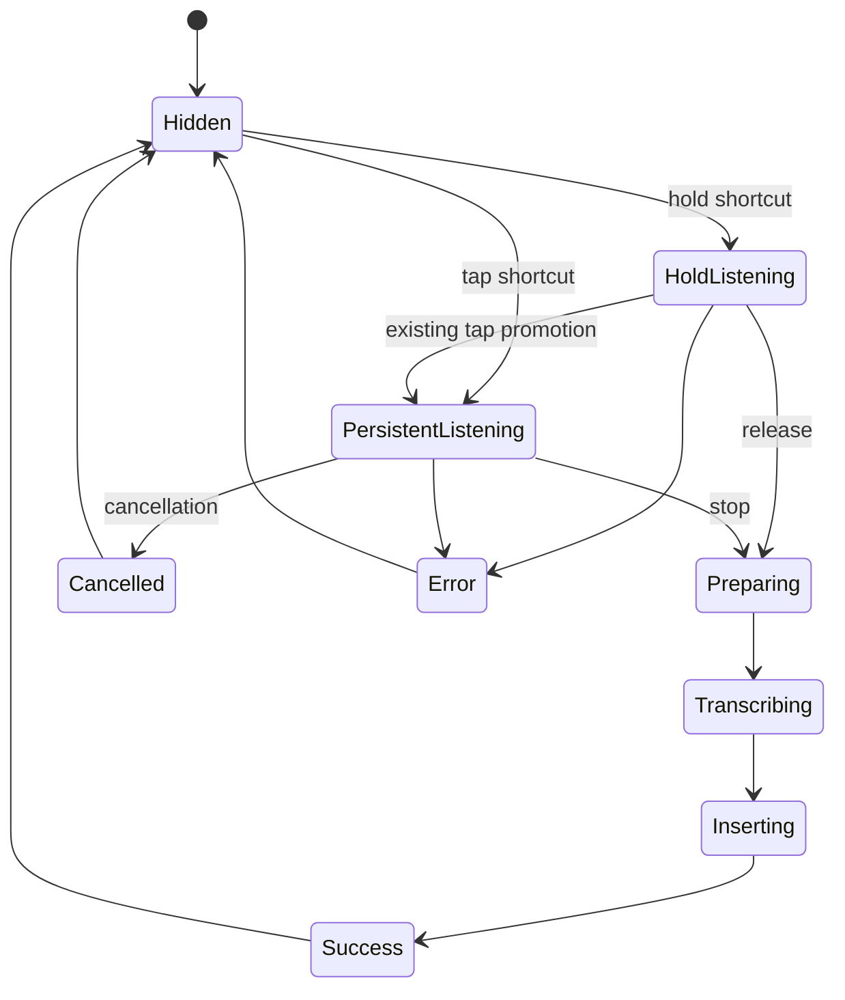

# feat: Clarify Dictation HUD states and hold-mode feedback

## Goal Capsule

| Field | Value |
|---|---|
| Objective | Make Cadence’s existing Dictation HUD clearly distinguish transient hold dictation, persistent tap-to-start/stop listening, processing, success, cancellation, and error. |
| Authority | GitHub issue #16, `AGENTS.md`, `docs/codebase-guide.md`, `docs/privacy.md`, and the existing Dictation/HUD implementation. |
| Execution profile | Add a pure, testable state projection; integrate it through `DictationCoordinator`; verify the real Debug HUD without recording ambient system audio. |
| Stop conditions | Stop if the work needs Scribe/provider behavior, changes global hotkey semantics, changes meeting capture, persists audio/transcripts, or weakens focus/privacy boundaries. |

---

## Product Contract

### Summary

Issue #16 applies a narrow interaction lesson from the reviewed reference evidence: an indicator may communicate a genuine persistent listening/latch state, but must not be treated as a privacy assertion or decorative status.

### Problem Frame

Cadence’s HUD currently represents recording, model preparation, transcription, and error, but its first-use hold hint disappears after a small usage cutoff and leaves hold and persistent listening insufficiently self-explanatory.
Success and cancellation disappear immediately, while final transcription and insertion share the same generic processing presentation.

### Requirements

- R1. The HUD must distinguish hold-to-talk listening from user-started persistent tap-to-start/stop listening using state-derived text, iconography, and accessibility output; no meaning may depend only on color or motion.
- R2. A persistent-listening indicator appears only when the active Dictation session is genuinely in `tapToStartStop` mode, including the existing hold-to-tap promotion path; it must not claim privacy, recording scope, or a copied Willow gesture contract.
- R3. Preparing the model, transcribing, inserting, success, cancellation, and error must have concise, truthful state-specific presentation derived from the coordinator lifecycle.
- R4. The HUD remains a nonactivating, draggable, all-Spaces panel; target-app focus, hold release behavior, tap controls, Dictation responsiveness, and existing error recovery remain intact. Delayed terminal feedback is owned by its originating Dictation session and cannot hide a newer HUD.
- R5. Reduced Motion retains every state change without continuous waveform or spinner motion, and controls/status expose VoiceOver labels, hints, and concise non-repeating state announcements.
- R6. The change does not modify Scribe/provider work, meeting capture/storage/transcript behavior, permissions, or analytics/log fields.

### Acceptance Examples

- AE1. Holding the Dictation shortcut shows a transient listening HUD; when the onboarding hint is eligible it says that release finishes the session, and no persistent-latch claim is made.
- AE2. Starting a tap-to-start/stop session shows a persistent-listening indicator plus stop/cancel controls; promoting a live hold session to tap mode updates the same projection.
- AE3. After a successful literal Dictation insertion, the HUD briefly confirms success before hiding; cancelling a persistent tap-to-start/stop session briefly confirms cancellation; neither alters insertion behavior.
- AE4. With Reduced Motion enabled, a user can identify listening, processing, success, cancellation, and error through static text/icon state alone.
- AE5. Existing Dictation and meeting-capture tests remain green, and the installed Debug app verifies the affected panel does not take focus.

### Scope Boundaries

- Deferred for later: Scribe generation/review UI, Scribe-specific shortcuts, semantic providers, and onboarding redesign.
- Outside this change: actual audio capture for screenshot-only verification, ambient listening, Screen Recording permission changes, meeting audio/transcript persistence, and copied proprietary assets or wording.

---

## Planning Contract

### Key Technical Decisions

- KTD1. Introduce a pure Dictation HUD presentation projection rather than extending view conditionals directly. It maps coordinator lifecycle and trigger mode to the visible HUD state, keeping state semantics testable without WhisperKit, AppKit panels, or actual audio capture.
- KTD2. Model persistent listening explicitly, independently of `showsHint`. `showsHint` remains a first-use education affordance; the new indicator derives from the active tap-to-start/stop mode so it remains correct after the hint cutoff and after hold-to-tap promotion.
- KTD3. Keep terminal feedback short-lived and coordinator-owned. Success, cancellation, and error own one cancellable dismissal task keyed to a session/presentation generation; a new session invalidates stale dismissal before it can hide the newer HUD. Error remains tied to the current humanized error boundary, never raw logged/provider text.
- KTD4. Preserve the HUD panel contract. `HUDWindowController` continues to own the nonactivating panel, placement, drag persistence, Spaces/full-screen behavior, and control callbacks; the UI receives only the projection it needs to render accessibly. Shared presentation metrics own content size and compact/truncation behavior so the SwiftUI view and AppKit panel cannot drift.

### High-Level Technical Design

### Assumptions

- The persistent listening concept maps to Cadence’s existing `.tapToStartStop` mode, not to hold-to-talk.
- Brief terminal status feedback can reuse the existing HUD hide-delay pattern without changing text insertion or session ownership.
- No user data needs to be created or deleted to verify the visual states; mock-driven tests and safe Debug-app checks are sufficient.

### Risks and Dependencies

- Rapid audio callbacks, preview updates, and terminal dismissal tasks can overwrite a terminal state or hide a newer session; integration must stop or ignore stale work once a session enters finalizing, inserting, cancellation, or terminal feedback.
- The current panel sizes are keyed to `HUDVisualState`; shared presentation metrics and a compact/truncation policy must cover every added state so content never clips at narrow widths.
- The existing UI test surface is limited; unit coverage must protect state mapping, while real-app verification protects focus and panel behavior.

---

## Implementation Units

### U1. Define a testable Dictation HUD presentation projection

- **Goal:** Expand the HUD model into an explicit, state-derived presentation contract for listening modes, processing stages, terminal feedback, controls, and accessibility text.
- **Requirements:** R1, R2, R3, R5.
- **Dependencies:** None.
- **Files:** `Cadence/Models/DictationModels.swift`, `CadenceTests/CadenceTests.swift`.
- **Approach:** Keep `HUDState` as the payload boundary and add value semantics that distinguish transient hold listening, persistent tap listening, preparation, transcription, insertion, success, cancellation, and error. Put shared size/compact policy and concise accessibility status text on that presentation boundary. Preserve the current first-use hold hint as supplemental guidance rather than deriving latch meaning from it. Expose the labels/actions the renderer requires without embedding SwiftUI details in the coordinator.
- **Patterns to follow:** Existing value models in `Cadence/Models/DictationModels.swift`; mock-driven tests in `CadenceTests/CadenceTests.swift`.
- **Test scenarios:** Verify hold listening with and without the first-use hint; persistent tap listening; hold-to-tap promotion semantics; preparation, transcription, insertion, success, cancellation, and error copy/visibility; no persistent-latch label in hold mode; static semantic output required when motion is reduced; state-specific announcement text; and sizes/compact policy for every presentation.
- **Verification:** Every defined lifecycle state maps to one truthful, accessible HUD presentation with no dependence on raw transcript, audio, shortcut keys, or provider error text.

### U2. Publish terminal and mode-correct HUD states from DictationCoordinator

- **Goal:** Route real Dictation lifecycle transitions through the new projection while retaining insertion, cancellation, and error behavior.
- **Requirements:** R2, R3, R4, R6.
- **Dependencies:** U1.
- **Files:** `Cadence/Services/DictationCoordinator.swift`, `Cadence/Services/HotkeyService.swift`, `Cadence/Services/PermissionsService.swift`, `Cadence/Services/HUDWindowController.swift`, `CadenceTests/CadenceTests.swift`.
- **Approach:** Replace ad hoc visible-state construction with the projection at session start, hold-to-tap promotion, preparation, transcription, insertion, successful completion, cancellation, and failure. Introduce only the narrow dependency seams required for fakes to drive hotkey callbacks, permission snapshots, and HUD publication; production composition remains unchanged. Keep one cancellable terminal-feedback task keyed to the originating session/presentation generation, invalidate it before a new session, and guard terminal states from late preview/audio callbacks. Preserve existing HUD callbacks, analytics event shape, and Dictation session ownership.
- **Execution note:** Add characterization coverage around the current transition sequence and test seams before changing terminal visibility.
- **Patterns to follow:** `publishHUD`, `hideHUD`, `publishError`, `finishDictationIfNeeded`, and `cancelFromHUD` in `Cadence/Services/DictationCoordinator.swift`.
- **Test scenarios:** With fake hotkey, permissions, and HUD collaborators, verify successful insertion produces exactly one success presentation before hiding; persistent-session cancellation produces no insertion and a cancellation presentation; errors retain current humanization and timed hide; hold release and tap stop both finalize; promotion from hold to tap produces persistent-mode semantics; a new session invalidates an older success/cancellation/error dismissal; late preview updates cannot replace a terminal state; and meeting services are not touched.
- **Verification:** Mocked Dictation lifecycle tests pass without loading WhisperKit, and existing Dictation behavior remains unchanged except for truthful HUD feedback.

### U3. Render accessible, reduced-motion-safe HUD states

- **Goal:** Make the modelled states legible in the nonactivating HUD without changing its placement/focus contract.
- **Requirements:** R1, R3, R4, R5.
- **Dependencies:** U1, U2.
- **Files:** `Cadence/UI/HUDView.swift`, `Cadence/Services/HUDWindowController.swift`, `CadenceTests/CadenceTests.swift`.
- **Approach:** Render concise state labels and icons, a mode-specific persistent-listening indicator, and clear stop/cancel hierarchy. Add accessibility labels and hints to icon-only controls plus one concise status announcement per meaningful transition, never for waveform samples. Disable continuous waveform smoothing and spinner rotation under Reduced Motion while retaining static state changes. Consume shared presentation metrics for panel sizing and apply its compact/truncation policy; retain nonactivation, drag offsets, and all-Spaces behavior.
- **Patterns to follow:** Existing `accessibilityReduceMotion` handling and `HUDControlButtonStyle` in `Cadence/UI/HUDView.swift`; panel construction and sizing in `Cadence/Services/HUDWindowController.swift`.
- **Test scenarios:** Verify accessibility strings and announced status for each visible action/state; reduced-motion rendering has no smoothing/spinner loop while retaining static state; tap mode retains stop/cancel actions; hold mode has no accidental persistent-session action; every status text fits shared panel metrics or follows its compact policy; and error/success/cancellation use distinct hierarchy.
- **Verification:** Build and run the Debug app, inspect hold/tap/processing/terminal states through safe test seams or supported debug flows, and confirm the HUD remains nonactivating and draggable.

---

## Verification Contract

| Gate | Applies to | Evidence |
|---|---|---|
| Unit tests | U1-U3 | `./script/build_and_run.sh --test` passes with new HUD projection and coordinator transition coverage. |
| Generated project integrity | U1-U3 | `xcodegen generate` followed by the macOS test target succeeds; no generated project file is hand-edited. |
| Real Debug app | U3 | `./script/build_and_run.sh --verify` launches the installed Debug build and exposes the main window. |
| Manual HUD check | U3 | Verify the affected Dictation HUD preserves target-app focus, panel drag placement, and state-specific accessible semantics without capturing ambient system audio. |
| Regression boundary | U2-U3 | Meeting capture durability and transcript/recovery tests remain part of the full XCTest run and no Meeting files change. |

---

## Definition of Done

- R1-R6 and AE1-AE5 are met by code, focused tests, and real Debug-app evidence.
- The hold-to-talk hint and persistent tap-mode semantics are independent and correct after hold-to-tap promotion.
- Success, cancellation, processing, and error never make a claim the coordinator has not reported.
- Reduced Motion and VoiceOver retain state meaning without color-only or animation-only cues.
- No meeting-capture, persistence, permission, privacy-boundary, or generated-project regression is introduced.
- The branch contains only issue #16 planning/implementation evidence and passes the Verification Contract.

---

## Appendix

### Sources

- GitHub issue #16: Dictation HUD state clarity and hold-mode feedback.
- `docs/codebase-guide.md`: Dictation and HUD ownership boundaries.
- `docs/privacy.md`: logging and analytics exclusions.
- `Cadence/Models/DictationModels.swift`, `Cadence/Services/DictationCoordinator.swift`, `Cadence/Services/HUDWindowController.swift`, and `Cadence/UI/HUDView.swift`: current implementation evidence.
