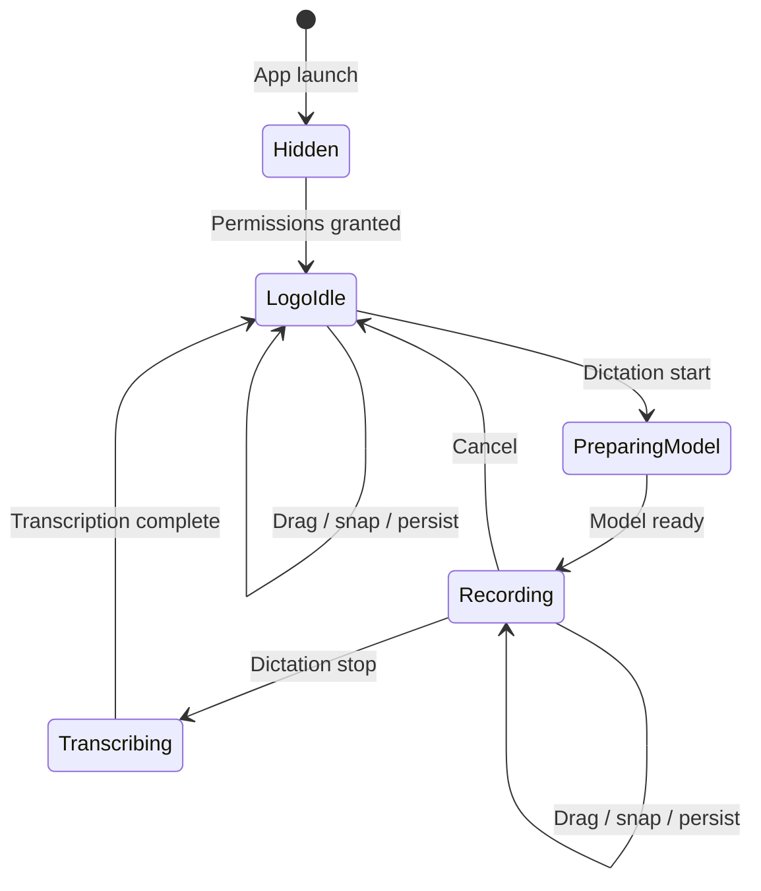
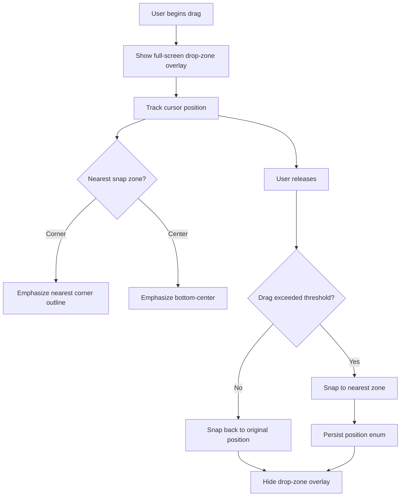

# Always-On Draggable Logo HUD - Plan

## Goal Capsule

- **Objective:** Transform the transient dictation HUD into an always-on Cadence logo indicator that morphs into the recording pill during dictation. The logo defaults to bottom-center (flush against the Dock), snaps to any of four screen corners when dragged, and teaches draggability via a one-time tooltip after a few dictations. The HUD shape is edge-hugging — flat sides where it meets the screen boundary, squircle curves on the open side — and tracks Dock size changes.
- **Authority hierarchy:** Product behavior from the user's feature request; architecture follows existing `HUDWindowController` / `AppModel` / `DictationCoordinator` patterns; coding conventions from `AGENTS.md`.
- **Stop conditions:** All R-IDs satisfied, all unit test scenarios pass, `--verify` smoke check passes, manual drag-snap and tooltip behavior confirmed.
- **Execution profile:** Standard — 5 implementation units, SwiftUI/AppKit hybrid, no external dependencies.
- **Tail ownership:** `ce-work` or equivalent executor.

---

## Product Contract

### Summary

An always-on Cadence logo indicator replaces the transient dictation HUD. The logo is visible whenever the app is running with permissions granted, morphs into the existing recording pill during dictation, and returns to the logo afterward. The HUD is edge-hugging — flat sides flush against screen boundaries, squircle curves on the open side — with the shape adapting per position. It defaults to bottom-center flush against the Dock's top edge, snaps to any of four screen corners on drag, tracks Dock size changes, and shows drop-zone outlines during drag. A one-time tooltip after three dictations teaches the drag feature.

### Problem Frame

The current HUD (`HUDView` + `HUDWindowController`) only appears during active dictation — it is hidden via `orderOut` whenever `HUDState.isVisible` is false. Users have no persistent visual indicator that Cadence is running and ready. The existing drag gesture persists a free-form pixel offset, but there is no affordance showing where the HUD can go, and no guidance teaching that dragging is possible.

### Requirements

**Always-on presence**

- R1. The HUD displays the Cadence logo (black background, white swoosh) whenever the app is running and all required permissions (`PermissionsSnapshot.allRequiredGranted`) are granted, even when no dictation is in progress.
- R2. The logo and the existing recording pill are the same morphing element — the logo renders in an idle state, the pill renders during recording / transcribing / error states, and transitions animate between them.

**Positioning**

- R3. The HUD defaults to bottom-center of the screen containing the mouse.
- R4. The HUD can be dragged and snaps to one of five positions: bottom-center (default) or any of the four screen corners (top-left, top-right, bottom-left, bottom-right).
- R5. The chosen position persists across app restarts.

**Drop-zone overlay**

- R6. During drag, outlines of the four corner drop zones are visible on screen.
- R7. The nearest zone to the current drag position is visually emphasized.

**Drag-discoverability tooltip**

- R8. After three successful dictations, a one-time tooltip appears near the HUD teaching that it can be dragged to corners, accompanied by the four corner outlines.
- R9. The tooltip dismisses on first drag interaction or after a timeout, and never appears again once shown.

**Edge-hugging shape and Dock alignment**

- R10. The HUD shape is flush against screen edges — flat sides where it meets the screen boundary, squircle curves on the non-boundary side. The shape adapts based on current position (e.g., bottom-center = flat bottom + squircle top; top-left corner = flat top + left, squircle bottom-right).
- R11. The default bottom-center position aligns its flat bottom edge with the Dock's top edge (`NSScreen.visibleFrame.minY`).
- R12. If the Dock is resized (detected via `NSScreen.didChangeScreenParametersNotification`), the HUD repositions so its flat edge stays aligned with the Dock's top edge.

### Scope Boundaries

**In scope:** always-on logo rendering, edge-hugging adaptive squircle shape, corner-snap positioning with flush edges, Dock-aligned default position, Dock-size tracking, drop-zone overlay, drag-discoverability tooltip, position persistence.

#### Deferred to Follow-Up Work

- Settings UI toggle to hide/show the always-on HUD.
- User-customizable position beyond the five presets.
- Per-app or per-Space position memory.
- Replacing the menu bar icon with the always-on logo.
- Resetting the drag tooltip so it re-shows after major version bumps.

---

## Planning Contract

### Key Technical Decisions

KTD1. **Single morphing element.** The always-on logo and recording pill share one `NSPanel` and one `NSHostingView<HUDView>`. The logo is a new `.idle` case on `HUDVisualState`, not a separate panel. This avoids two competing floating overlays and reuses the existing panel infrastructure. (User-confirmed.)

KTD2. **Five-position snap model with flush edges.** Positions are defined as a `HUDPosition` enum (`bottomCenter`, `topLeft`, `topRight`, `bottomLeft`, `bottomRight`). Corner positions use `screen.frame` edges (physical screen boundary) with zero inset — the HUD is flush against the corner. Bottom-center uses `visibleFrame.minY` (Dock top edge) with zero additional inset. The existing free-drag offset persistence (`FlowState.hudOffsetX` / `FlowState.hudOffsetY` in `HUDWindowController`'s private `PreferenceKey`) is replaced by a position-enum `PreferenceKey` with a `Cadence.` prefix. (User-confirmed: bottom-center default flush to Dock, snap to corners.)

KTD3. **Always-on lifecycle ownership.** `AppModel` decides when the always-on logo is permitted — it fires when `permissions.allRequiredGranted` transitions to true (in `refreshPermissions()`, around line 452). `DictationCoordinator` drives state transitions between logo-idle and recording. `HUDState.idle` (isVisible: false) remains for the pre-permission / not-ready state. `AppModel` already owns permissions; `DictationCoordinator` already owns HUD transitions — the split is clean.

KTD4. **Drop-zone overlay as a separate full-screen transparent panel.** A third `NSPanel` spanning the screen renders the corner outlines, shown only during drag or tooltip. The outlines must cover the full screen area, not the pill panel — this follows the existing multi-panel pattern (pill + subtitle already coexist in `HUDWindowController`).

KTD5. **Tooltip trigger reuses the dictation-count pattern.** After three successful dictations (matching the existing `PreviewTuning.holdHintCutoff = 3` precedent in `DictationCoordinator`), the tooltip fires once. A persisted boolean flag (`Cadence.dragTooltipShown`) prevents re-display. This is consistent with the existing onboarding hint and privacy-safe (coarse count only, no content sent anywhere).

KTD6. **Logo asset derived from existing AppIcon swoosh.** A new imageset (`HUDLogo`) uses the swoosh path from `AppIcon.appiconset/AppIcon.svg`, recolored to white stroke on a black background. Brand consistency without a new design pass.

KTD7. **Edge-hugging adaptive squircle shape.** The HUD shape is position-aware: sides that meet the screen boundary are flat, the non-boundary side uses a squircle curve (approximated via `RoundedRectangle(style: .continuous)` or a custom `Shape` implementing the superellipse formula). `HUDPosition` exposes which edges are flat (e.g., `.topLeft` → top + left flat, bottom-right squircle; `.bottomCenter` → bottom flat, top + sides squircle). The `HUDView` reads the current position to clip its content into the correct shape. This replaces the current floating capsule/pill background — the HUD no longer appears as a detached pill but as an extension of the screen edge. (User-confirmed.)

KTD8. **Dock tracking via screen-parameter notifications.** `HUDWindowController` listens for `NSScreen.didChangeScreenParametersNotification` (fires when the Dock is resized, moved, or when display configuration changes). On notification, if the current position is `.bottomCenter`, recompute the origin using the updated `visibleFrame.minY`. Corner positions are unaffected (they use `screen.frame`, not `visibleFrame`). This keeps the flat bottom edge aligned with the Dock's top edge without polling.

### High-Level Technical Design

**HUD visual state machine** — the `.idle` case is the new always-on logo state:

**Drag-to-snap interaction flow:**

### Assumptions

- "A few dictations" = three successful dictations, matching the existing `holdHintCutoff`.
- The tooltip auto-dismisses after approximately five seconds if not interacted with.
- The always-on HUD appears only after permissions are granted (consistent with the current permission-gated behavior).
- The logo badge is approximately 32pt — compact enough not to obstruct content.
- Drag snap threshold: if total drag distance is below a small minimum (~4pt), the HUD stays in its current position.
- The existing free-drag offset keys (`FlowState.hudOffsetX/Y`) become orphaned; no migration is needed since the new position enum is independent.
- Corner positions are flush against physical screen edges (`screen.frame`) with zero inset — the HUD floats at `.statusBar` level above the Dock if there is overlap at bottom corners.
- Bottom-center uses `visibleFrame.minY` (Dock top edge) with zero additional inset, replacing the current `bottomInset` of 32pt.
- The squircle curve is approximated with `RoundedRectangle(style: .continuous)` unless a custom superellipse `Shape` proves visually necessary during implementation.

---

## Implementation Units

### U1. Logo brand asset

- **Goal:** Create the black-background, white-swoosh logo imageset for the HUD idle state.
- **Requirements:** R1.
- **Dependencies:** None.
- **Files:**
  - `Cadence/Assets.xcassets/HUDLogo.imageset/` (Contents.json + vector PDF or SVG at 1x/2x/3x)
- **Approach:** Derive the swoosh path from `Cadence/Assets.xcassets/AppIcon.appiconset/AppIcon.svg` (the `d="M206 579C..."` path at line 19). Recolor: black rounded-square background, white swoosh stroke, omit the teal dot or render it in a lighter gray. Compact badge, roughly 32pt at display size. Run `xcodegen generate` after adding the imageset so the project file picks it up.
- **Patterns to follow:** `Cadence/Assets.xcassets/AppIcon.appiconset/AppIcon.svg` — same swoosh geometry, different palette.
- **Test expectation:** none — pure asset addition.
- **Verification:** Asset loads via `Image("HUDLogo")` at runtime; logo renders in the HUD idle state during manual testing.

### U2. Always-on logo HUD state and rendering

- **Goal:** Add the `.idle` visual state and logo rendering with the edge-hugging adaptive squircle shape, wire the always-on lifecycle so the logo is visible whenever the app has permissions.
- **Requirements:** R1, R2, R10.
- **Dependencies:** U1.
- **Files:**
  - `Cadence/Models/DictationModels.swift` — add `.idle` case to `HUDVisualState`; add `HUDState.logoIdle` static constant; add flat-edge properties to `HUDPosition` (which sides are flat vs. squircle)
  - `Cadence/UI/HUDView.swift` — add `.idle` case rendering the `HUDLogo` image clipped into the position-aware squircle shape; add a custom `Shape` or `clipShape` modifier for the adaptive edge-hugging form
  - `Cadence/Services/HUDWindowController.swift` — keep panel visible in logo-idle state; set logo badge content size; pass current `HUDPosition` to the view model so the shape adapts; remove the existing `hasShadow = false` panel setting and add a directional shadow on the open (squircle) side only
  - `Cadence/App/AppModel.swift` — show logo when `allRequiredGranted` transitions to true in `refreshPermissions()`; hide when permissions revoked
  - `Cadence/Services/DictationCoordinator.swift` — replace `hideHUD()` (which sends `.idle` / isVisible: false) with a transition to `.logoIdle`; the `onHUDChange` callback mirrors the logo-idle state
  - `CadenceTests/CadenceTests.swift` — state model and shape-edge tests
- **Approach:** Add `.idle` to `HUDVisualState`. `HUDState.logoIdle` sets `isVisible = true`, `visualState = .idle`, all other fields empty/zero. `HUDView` renders the `HUDLogo` image in a black badge clipped into the adaptive squircle shape — flat where it meets the screen boundary, curved on the open side. `HUDPosition` exposes which edges are flat (e.g., `var flatEdges: Edge.Set` returning `.bottom` for `.bottomCenter`, `[.top, .left]` for `.topLeft`). The view applies a clip shape that rounds only the non-flat corners. `HUDWindowController.update()` treats logo-idle like any visible state — shows the panel with the badge content size, and passes the current position to the view model. `AppModel` calls `hudController.update(with: .logoIdle)` when permissions transition to granted. `DictationCoordinator.hideHUD()` becomes `showLogoIdle()` — the pill morphs back to the logo instead of disappearing.
- **Patterns to follow:**
  - `HUDView.recordingPill(triggerMode:showsHint:)` structure for the new badge view
  - `HUDWindowController.makePanel(size:)` panel configuration
  - `AppModel.refreshPermissions()` permission-transition logic at line 452
  - `DictationCoordinator.publishHUD()` / `hideHUD()` at lines 479–502
  - `RoundedRectangle(style: .continuous)` for the squircle approximation; `clipShape` with asymmetric corner radii for flat-edge behavior
- **Test scenarios:**
  - Happy path: `HUDState.logoIdle` has `isVisible == true` and `visualState == .idle`.
  - Happy path: `HUDVisualState.idle` is a valid enum case distinct from `.recording`, `.preparingModel`, `.transcribing`, `.error`.
  - Edge case: `HUDState.idle` (truly hidden, isVisible: false) is distinct from `HUDState.logoIdle` (visible logo) — both exist and serve different purposes.
  - Happy path: `HUDPosition.bottomCenter.flatEdges` returns `.bottom` (only bottom is flat, top + sides squircle).
  - Happy path: `HUDPosition.topLeft.flatEdges` returns `[.top, .left]` (two adjacent edges flat).
  - Happy path: `HUDPosition.topRight.flatEdges` returns `[.top, .right]`.
- **Verification:** App launches with permissions granted → logo badge visible at bottom-center, flush against Dock, with squircle top. Start dictation → morphs to recording pill with same edge-hugging shape. Stop dictation → returns to logo. Shape adapts when dragged to a corner (flat sides change).

### U3. Corner-snap positioning with flush edges and Dock tracking

- **Goal:** Replace free-drag offset positioning with a five-position flush-edge snap model, including Dock-size tracking for the default position.
- **Requirements:** R3, R4, R5, R11, R12.
- **Dependencies:** U2.
- **Files:**
  - `Cadence/Models/DictationModels.swift` — add `HUDPosition` enum with computed origin per screen frame (corners use `screen.frame`, bottom-center uses `visibleFrame.minY`); add `flatEdges` property for the shape
  - `Cadence/Services/HUDWindowController.swift` — replace offset-based positioning with enum-based; update drag handlers to snap on release; register `NSScreen.didChangeScreenParametersNotification` for Dock tracking; update persistence
  - `Cadence/App/AppModel.swift` — add `PreferenceKey.hudPosition` (Cadence. prefix)
  - `CadenceTests/CadenceTests.swift` — snap math, flush-edge, and persistence tests
- **Approach:** `HUDPosition` is an enum with five cases. Each case computes an `NSPoint` origin given the physical `screen.frame`, the `visibleFrame` (Dock-aware), and the HUD size: `bottomCenter` uses `visibleFrame.minY` (Dock top) with horizontal centering and zero inset — replacing the current `bottomInset: 32` logic; corner cases use `screen.frame` edges (physical boundary) with zero inset so the HUD is flush against the actual screen corner. A static `nearest(to:in:)` method returns the closest position for a given drag endpoint. `HUDWindowController` persists the enum rawValue via `PreferenceKey.hudPosition`; `position(pillPanel:)` resolves the stored position to an origin. `handleDragEnded()` checks a minimum drag threshold (~4pt); if exceeded, computes the nearest position and snaps. For Dock tracking: register `NSScreen.didChangeScreenParametersNotification` in `init` or panel creation; on notification, if current position is `.bottomCenter`, recompute origin from the updated `visibleFrame.minY` and reposition the panel without animation. Replace the existing `FlowState.hudOffsetX/Y` read/write with the enum key. The position applies identically to logo-idle and recording states.
- **Patterns to follow:**
  - `PreferenceKey` enum in `AppModel` (Cadence. prefix for new keys)
  - `HUDWindowController.centeredOrigin(for:)` and `targetScreenFrame()` for screen geometry — adapt `centeredOrigin` to use `visibleFrame.minY` (zero inset) instead of `frame.minY + bottomInset`
  - Existing `handleDragChanged` / `handleDragEnded` drag lifecycle in `HUDWindowController`
  - `NotificationCenter` pattern for screen-parameter changes
- **Test scenarios:**
  - Happy path: `HUDPosition.bottomCenter.origin(...)` returns horizontally centered at `visibleFrame.minY` (flush with Dock top, zero inset).
  - Happy path: `HUDPosition.topLeft.origin(...)` returns top-left of `screen.frame` with zero inset (flush against physical corner).
  - Happy path: `HUDPosition.topRight`, `.bottomLeft`, `.bottomRight` each return their respective corner of `screen.frame`.
  - Happy path: `HUDPosition.nearest(to: point, in: frame)` returns the correct corner for a point near that corner.
  - Edge case: drag endpoint equidistant between two corners → deterministic tiebreak (e.g., prefer clockwise-first).
  - Happy path: position round-trips through `UserDefaults` (save rawValue → load → same enum case).
  - Edge case: unknown persisted rawValue → falls back to `.bottomCenter`.
  - Happy path: `bottomCenter` origin changes when `visibleFrame.minY` changes (Dock resized) — recomputed origin reflects new Dock height.
  - Happy path: corner positions are unaffected by `visibleFrame` changes (they use `screen.frame`).
- **Verification:** Drag logo from bottom-center to top-right → snaps flush into top-right corner. Relaunch app → logo appears at top-right. Drag under threshold → stays in place. Resize Dock → bottom-center logo repositions to stay flush with Dock top. Unit tests for snap math, flush edges, and Dock tracking pass.

### U4. Drop-zone overlay

- **Goal:** Show full-screen corner zone outlines during drag with nearest-zone emphasis.
- **Requirements:** R6, R7.
- **Dependencies:** U3.
- **Files:**
  - `Cadence/UI/HUDDropZoneOverlay.swift` (new) — SwiftUI view rendering four corner outlines and center indicator
  - `Cadence/Services/HUDWindowController.swift` — create/manage a third `NSPanel` for the overlay; show on drag start; hide on drag end; pass nearest-zone state
  - `CadenceTests/CadenceTests.swift` — overlay view-model tests (nearest-zone computation)
- **Approach:** New SwiftUI view draws four rounded-rectangle outlines at the four corners of the screen plus a subtle indicator at bottom-center. The nearest zone (computed via U3's `HUDPosition.nearest(to:in:)`) renders at higher opacity; others are dimmed. Respects `accessibilityReduceMotion` for fade transitions. A new full-screen transparent `NSPanel` (same `collectionBehavior` as pill panel, but `ignoresMouseEvents = true`) hosts this view. `HUDWindowController` creates the overlay lazily on first drag, shows it on `handleDragChanged`, updates the nearest-zone published property as the cursor moves, and fades it out on `handleDragEnded`.
- **Patterns to follow:**
  - `HUDWindowController.makePanel(size:)` for panel creation (extended to full-screen, transparent, click-through)
  - `FlowTheme` palette in `HUDView` / `MenuContentView`
  - `accessibilityReduceMotion` handling in `HUDView`
  - `HUDViewModel` as a pattern for the overlay's published state
- **Test scenarios:**
  - Happy path: overlay view model initializes with `nearestZone == nil`; setting it updates the published property.
  - Happy path: computing nearest zone from a corner-proximal point returns that corner.
  - Edge case: nearest zone set to `bottomCenter` when cursor is near screen bottom-center.
- **Verification:** Drag the logo → four corner outlines appear on screen → nearest corner emphasized as cursor approaches it. Release → outlines fade out. Overlay does not intercept clicks.

### U5. Drag-discoverability tooltip

- **Goal:** One-time tooltip after three dictations teaching draggability with corner outlines.
- **Requirements:** R8, R9.
- **Dependencies:** U3, U4.
- **Files:**
  - `Cadence/Services/DictationCoordinator.swift` — expose or reuse dictation count for tooltip trigger; call tooltip show after threshold
  - `Cadence/Services/HUDWindowController.swift` — tooltip show/hide logic; show drop-zone overlay alongside tooltip
  - `Cadence/App/AppModel.swift` — add `PreferenceKey.dragTooltipShown` (Cadence. prefix)
  - `Cadence/UI/HUDView.swift` or new tooltip view — small dark rounded-rectangle bubble ("Drag to any corner")
  - `CadenceTests/CadenceTests.swift` — tooltip trigger logic tests
- **Approach:** Add `PreferenceKey.dragTooltipShown` boolean (default false). After a successful dictation completes and the HUD transitions back to logo-idle, check whether `dictationCount >= 3 && !defaults.bool(forKey: .dragTooltipShown)`. If true, show a small dark tooltip bubble near the HUD and simultaneously show the drop-zone overlay (from U4) to visualize the corner targets. Dismiss on first drag interaction or after ~5 seconds (whichever comes first). On dismiss, set `dragTooltipShown = true`. If the user drags before reaching the threshold, set `dragTooltipShown = true` on first drag (feature discovered independently). The tooltip panel reuses the subtitle panel's visual style — small, transparent, floating, `nonactivatingPanel`.
- **Patterns to follow:**
  - `DictationCoordinator.incrementSuccessfulRecordingCount()` and `shouldShowHoldHint(for:)` at lines 761–770 for the dictation-count precedent
  - `HUDSubtitleView` in `HUDWindowController.swift` for the tooltip bubble's visual style
  - `PreferenceKey` pattern for the persisted flag
- **Test scenarios:**
  - Happy path: tooltip trigger condition returns true when dictationCount is 3 and `dragTooltipShown` is false.
  - Happy path: tooltip trigger returns false when dictationCount is 2.
  - Happy path: tooltip trigger returns false when `dragTooltipShown` is already true.
  - Happy path: setting `dragTooltipShown = true` persists to `UserDefaults` and prevents future triggers.
  - Edge case: user drags before 3 dictations → `dragTooltipShown` is set true (no tooltip needed, feature discovered).
- **Verification:** Complete three dictations → tooltip appears near HUD with corner outlines. Drag the HUD → tooltip dismisses and never returns. Relaunch → tooltip does not appear. Unit tests for trigger logic pass.

---

## Verification Contract

| Gate | Command | Scope |
|---|---|---|
| Project regeneration | `xcodegen generate` | After adding imageset or new source files |
| Unit tests | `./script/build_and_run.sh --test` | All `CadenceTests` including new snap-math, position-persistence, tooltip-trigger, and state-model tests |
| Smoke build + verify | `./script/build_and_run.sh --verify` | App launches, main window appears |
| Manual drag-snap | `./script/build_and_run.sh` then drag | Logo snaps flush into corners, flat edges against screen boundary, squircle on open side, drop zones visible, position persists across relaunch |
| Manual Dock tracking | `./script/build_and_run.sh` then resize Dock in System Settings | Bottom-center HUD repositions to stay flush with Dock top edge |
| Manual tooltip | `./script/build_and_run.sh` then dictate 3x | Tooltip appears after third dictation, dismisses on drag, does not reappear |

CI equivalent: `xcodebuild test -project Cadence.xcodeproj -scheme Cadence -configuration Debug -destination 'platform=macOS' CODE_SIGNING_ALLOWED=NO`

---

## Definition of Done

**Global:**

- All R-IDs (R1–R12) satisfied.
- All unit test scenarios across U2–U5 pass in `./script/build_and_run.sh --test`.
- `--verify` smoke check passes.
- No `print()` statements in production code (use `Logger` with a category per `AGENTS.md`).
- Privacy: the dictation count for tooltip triggering is a coarse integer — no audio, transcript text, vocabulary terms, or dictated app names are sent to analytics or logs.
- Cleanup: experimental or debug overlay code removed before declaring done.

**Per-unit:**

- U1: Logo asset loads via `Image("HUDLogo")` and renders at runtime.
- U2: Logo visible when permissions granted, morphs to pill and back, edge-hugging squircle shape adapts per position, position preserved across state transitions.
- U3: Drag snaps flush to correct corner, bottom-center stays aligned with Dock top on Dock resize, position persists across restart, snap-math and flush-edge unit tests pass.
- U4: Drop-zone outlines appear during drag, nearest zone emphasized, disappears on release, click-through works.
- U5: Tooltip fires after exactly three dictations (not before), dismisses on drag or timeout, never reappears, trigger-logic unit tests pass.
