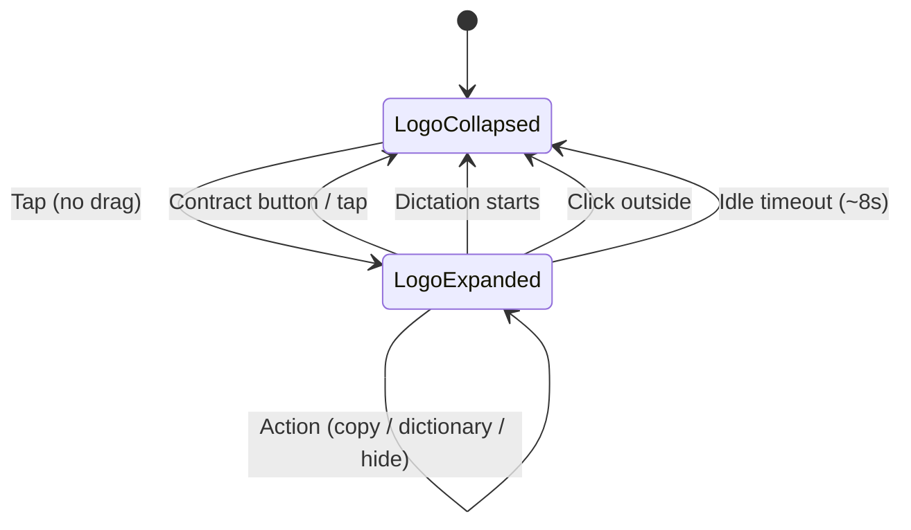
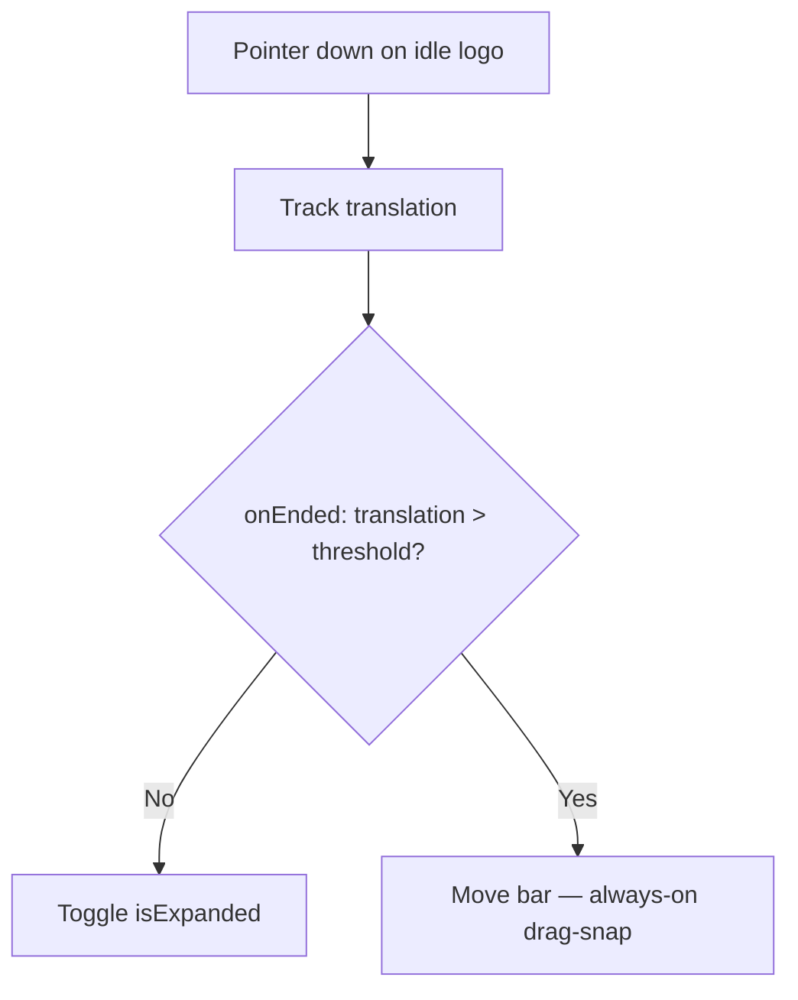
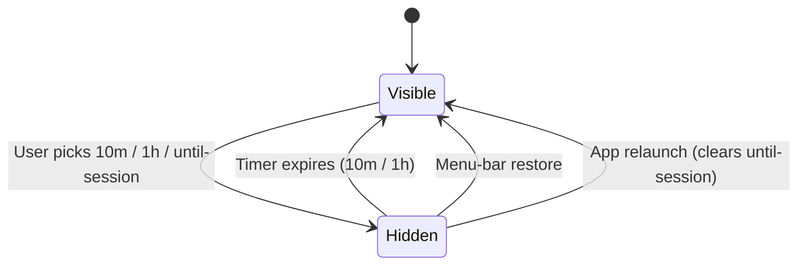

# Idle Logo Expandable Tray - Plan

## Goal Capsule

- **Objective:** Make the always-on idle logo click-to-expand into an animated action tray holding copy-last-transcription, add-selected-text-to-dictionary, a visibility/hide dropdown, and a contract button. A tap toggles expand/contract; a drag still moves the bar.
- **Authority hierarchy:** Product behavior from the user's feature request; architecture follows existing `HUDWindowController` / `HUDViewModel` / `AppModel` patterns; coding conventions from `AGENTS.md`.
- **Stop conditions:** All R-IDs satisfied, all unit test scenarios pass, `--verify` smoke passes, manual expand/contract + each action confirmed.
- **Execution profile:** Standard — 5 implementation units, SwiftUI/AppKit hybrid, no external dependencies.
- **Prerequisite:** Depends on the always-on idle logo state defined in `docs/plans/2026-07-10-002-feat-always-on-draggable-logo-hud-plan.md` (its `.idle` / `logoIdle` visual state and the idle logo rendering). This plan builds on top of that state; it does not re-implement the logo or drag-snap.
- **Tail ownership:** `ce-work` or equivalent executor.

---

## Product Contract

### Summary

Tapping the idle always-on logo expands it into an animated horizontal action tray with four controls: copy the last transcription to the clipboard, add the currently-selected text to the dictionary, a visibility dropdown that hides the bar for 10 minutes / 1 hour / until next session, and a contract button that collapses the tray back to the logo. Tapping again also collapses. The expanded tray auto-collapses when dictation starts, on click-away, or after a short idle timeout.

### Problem Frame

The always-on HUD (planned in `2026-07-10-002`) gives users a persistent logo indicator, but it is inert in idle state — there is no quick access to common actions like re-copying the last transcript or teaching the model a new word. Users currently must open the menu bar or main window for these. The idle logo is prime real estate for a lightweight, always-available action tray that expands on demand and collapses to stay unobtrusive.

### Requirements

**Expandable idle tray**

- R1. Tapping the idle logo (a tap, not a drag) expands it into an action tray with an animated transition; tapping again or pressing the contract button collapses it back to the logo.
- R2. The expand/contract animation respects `accessibilityReduceMotion` (no animation when reduced motion is on).
- R3. A tap and a drag are disambiguated: movement below a small threshold toggles expand; movement beyond threshold moves the bar per the always-on drag-snap behavior.
- R4. The expanded tray auto-collapses when dictation starts, when the user clicks outside the tray, or after a short idle timeout.

**Tray actions**

- R5. The tray shows a copy-last-transcription action; invoking it copies the most recent transcript to the pasteboard and shows brief confirmation. The action is disabled (visually and functionally) when there is no transcript history.
- R6. The tray shows an add-to-dictionary action; invoking it captures the currently-selected text in the frontmost app and appends it to the vocabulary, with a clipboard fallback when selection capture returns nothing. Selection text is never logged or sent to analytics.
- R7. The tray shows a visibility dropdown with three options: hide for 10 minutes, hide for 1 hour, hide until next session. Selecting one hides the always-on bar for that duration.
- R8. A hidden bar auto-restores when its timer expires (10 minutes / 1 hour), restores on next app launch for "until next session", and can be restored immediately at any time from the menu-bar item.

### Scope Boundaries

**In scope:** expanded tray UI and animation, tap/drag disambiguation, auto-collapse triggers, copy/dictionary/visibility actions, hide scheduling and restore.

#### Deferred to Follow-Up Work

- The always-on idle logo and drag-snap positioning (separate plan, `2026-07-10-002`).
- A transcript-history browser inside the tray (tray only exposes copy-last).
- Inline vocabulary editing/preview UI in the tray.
- Reordering or customizing which actions appear in the tray.
- A Settings toggle to disable the expandable tray.

---

## Planning Contract

### Key Technical Decisions

KTD1. **Expand state is UI-local on `HUDViewModel`, not a new `HUDVisualState` case.** `HUDVisualState` models dictation pipeline states (recording, transcribing, error, plus the always-on plan's `.idle`). Expand/contract is a user-interaction concern local to the idle logo, so it lives as an `@Published var isExpanded: Bool` on `HUDViewModel`. The expanded tray renders only when `visualState == .idle && isExpanded`. `HUDWindowController` observes `isExpanded` to resize the panel for the wider tray. (User-confirmed scope.)

KTD2. **Tap-vs-drag disambiguation reuses the always-on plan's drag threshold.** The existing `DragGesture(minimumDistance: 1)` in `HUDView` fires `onChanged` immediately. A tap is recognized in `onEnded` when total translation is below the threshold (~4pt, matching the always-on plan's snap threshold); otherwise the drag moves the bar. This keeps tap-expand and drag-move mutually exclusive on the same gesture. (User-confirmed: tap expands, drag moves.)

KTD3. **Selection capture via a dedicated `SelectionCaptureService` using the Accessibility API, with a clipboard fallback.** A new service reads the frontmost app's selected text via `AXUIElement` (`kAXSelectedTextAttribute` on the focused UI element). If AX returns empty or errors, it falls back to reading `NSPasteboard.general` (treats the last-copied string as the selection). The captured text is appended to vocabulary through the existing `AppModel.setVocabularyText(_:)`. Cadence already holds the Accessibility permission (`PermissionsSnapshot.accessibilityGranted`). Privacy: selection text is never logged or sent to analytics — consistent with the AGENTS.md ban on vocabulary terms in telemetry. (User-confirmed: AX capture with clipboard fallback.)

KTD4. **Visibility hide scheduling owned by `AppModel`.** A new `HUDVisibility` state (`.visible`, `.hidden(until: Date?)`) on `AppModel` drives whether the always-on logo is shown. Timed hides schedule a `Task` that restores visibility at the expiry date; "until next session" persists a flag cleared on app launch. The menu-bar item and the logo both consult this state. `AppModel` already owns permissions and the HUD controller wiring, so it is the natural owner of visibility lifecycle. (User-confirmed: auto-restore on timer, menu-bar restores immediately, app relaunch clears until-session hide.)

KTD5. **Auto-collapse via event monitor + lifecycle hooks.** Click-away collapse uses an `NSEvent` local monitor for left-mouse-down outside the panel frame, installed only while expanded. Dictation-start collapse hooks into the existing `onHUDChange` transition (when visualState leaves `.idle`). An idle timeout (~8s) collapses via a cancellable `Task`. All three are torn down on collapse.

### High-Level Technical Design

**Expanded-tray state machine** — expand/contract is a sub-state of the idle logo:

**Tap-vs-drag decision** on the idle logo:

**Visibility hide lifecycle:**

### Assumptions

- The always-on plan's `.idle`/`logoIdle` state and idle logo rendering exist before this plan's units are implemented (U1 references them).
- A "tap" is a press whose total translation stays under ~4pt — matching the always-on plan's drag-snap threshold, so the two gestures never conflict.
- The idle auto-collapse timeout is ~8 seconds.
- "Until next session" means the bar stays hidden until the app process is relaunched (not until the Mac sleeps).
- The clipboard fallback for selection capture reads the current pasteboard string; if both AX and pasteboard are empty, the action shows a "nothing selected" state and does nothing.
- Vocabulary terms are appended one per line (matching `VocabularyEntry.parseList`'s newline-delimited format).
- The expanded tray uses the existing `FlowTheme` palette and capsule/pill styling so it reads as the same element as the recording pill.

---

## Implementation Units

### U1. Idle-expanded state and animated tray rendering

- **Goal:** Add the expanded sub-state to `HUDViewModel` and render the animated action tray with the four controls as callback hooks.
- **Requirements:** R1, R2.
- **Dependencies:** None (assumes the always-on plan's `.idle`/`logoIdle` state exists).
- **Files:**
  - `Cadence/Models/DictationModels.swift` — add `HUDHideDuration` enum (`.tenMinutes`, `.oneHour`, `.untilNextSession`) used by the tray's visibility menu callback
  - `Cadence/Services/HUDWindowController.swift` — add `@Published var isExpanded` to `HUDViewModel`; add expanded-tray panel sizing in `pillSize(for:)` and resize handling in `update(with:)`; observe `isExpanded` to set the tray content size
  - `Cadence/UI/HUDView.swift` — add `.idle` case rendering: collapsed = idle logo; expanded = `IdleExpandedTray` view with the four action buttons and the contract toggle
  - `Cadence/UI/IdleExpandedTray.swift` (new) — the expanded tray SwiftUI view: copy button, dictionary button, visibility `Menu` (dropdown), contract button; styled with `FlowTheme`/`FlowMotion`
  - `CadenceTests/CadenceTests.swift` — `isExpanded` state-model tests
- **Approach:** `HUDViewModel` gains `isExpanded` (default false) and an `func toggleExpanded()` plus callbacks (`onCopyLast`, `onAddToDictionary`, `onHide(HUDHideDuration)`, `onContract`). `HUDView` switches on `visualState == .idle`: if `!model.isExpanded`, render the idle logo (from the always-on plan); if `model.isExpanded`, render `IdleExpandedTray(model:)`. The tray is a horizontal `HStack` in the same capsule background as the recording pill, wider (~260pt). The contract button shows a chevron-down; the copy/dictionary buttons show `doc.on.doc` / `text.book.closed` SF Symbols respectively; the visibility control is a SwiftUI `Menu` with a `eye.slash` label. The expand/contract transition animates via `FlowMotion.control` (or no animation when `accessibilityReduceMotion`). `HUDWindowController.pillSize(for:)` returns an expanded size when the model reports expanded-idle; `update(with:)` resizes the panel when `isExpanded` flips (observe the published property).
- **Patterns to follow:**
  - `HUDView.recordingPill(triggerMode:showsHint:)` capsule/pill structure and `pillBackground`/`pillStroke`
  - `HUDControlButtonStyle` for the action buttons' press feedback
  - `FlowTheme` palette and `FlowMotion.control` animation in `Cadence/UI/MenuContentView.swift:3-34`
  - The always-on plan's `.idle` logo rendering
- **Test scenarios:**
  - Happy path: `HUDViewModel.isExpanded` defaults to false; `toggleExpanded()` flips it to true and back.
  - Happy path: expanded tray view renders only when `visualState == .idle && isExpanded == true`.
  - Edge case: when `accessibilityReduceMotion` is true, no animation is applied to the expand/contract transition.
  - Edge case: the tray's action callbacks are wired (invoking `onCopyLast` reaches the hook) without requiring the actions implemented yet.
- **Verification:** Tap idle logo → tray expands with animation, four controls visible. Tap again or press contract → collapses to logo. Reduce Motion on → instant snap, no animation.

### U2. Tap-to-expand interaction, disambiguation, and auto-collapse

- **Goal:** Distinguish tap from drag on the idle logo, wire tap to toggle expand/contract, and auto-collapse on dictation start, click-away, and idle timeout.
- **Requirements:** R1, R3, R4.
- **Dependencies:** U1.
- **Files:**
  - `Cadence/UI/HUDView.swift` — update the idle-logo drag gesture `onEnded` to compute total translation and toggle expand when under threshold (delegate drag to the always-on move behavior when over threshold)
  - `Cadence/Services/HUDWindowController.swift` — install/remove an `NSEvent` local monitor for click-away while expanded; idle-timeout `Task`; clear `isExpanded` on dictation-state transitions
  - `CadenceTests/CadenceTests.swift` — tap-vs-drag threshold logic tests
- **Approach:** In the idle logo's `DragGesture.onEnded`, compare `value.translation` magnitude to a threshold constant (~4pt). If under, call `model.toggleExpanded()` and swallow the drag; if over, let the always-on `onDragEnded` move handler run. When `isExpanded` becomes true, the controller installs a local mouse-down monitor that collapses if the event location is outside the panel frame, and starts an ~8s idle-timeout `Task`; both are cancelled on collapse. The controller also observes `HUDState.visualState` transitions: leaving `.idle` (dictation starting) sets `isExpanded = false`. Extract the threshold/tap-recognition into a small pure function so it is unit-testable.
- **Patterns to follow:**
  - Existing `DragGesture(minimumDistance: 1)` + `onDrag`/`onDragEnded` callbacks in `HUDView`
  - The always-on plan's drag-snap threshold (~4pt) and `handleDragEnded`
  - `NSEvent.addLocalMonitorForEvents(matching:handler:)` pattern for click-outside detection
- **Test scenarios:**
  - Happy path: tap-recognition function returns `.tap` for translation `(2, 1)` (under threshold).
  - Happy path: tap-recognition function returns `.drag` for translation `(20, 5)` (over threshold).
  - Edge case: translation exactly at threshold is treated as a tap (boundary inclusive on the tap side).
  - Happy path: when `isExpanded` is true and a mouse-down lands outside the panel frame, `isExpanded` resets to false.
  - Happy path: when `visualState` transitions from `.idle` to `.recording`, `isExpanded` resets to false.
- **Verification:** Quick tap expands; a deliberate drag moves the bar. Expanded tray collapses when you start dictating, click elsewhere, or wait ~8s.

### U3. Copy last transcription action

- **Goal:** Wire the tray's copy button to copy the most recent transcript and show brief confirmation, disabled when history is empty.
- **Requirements:** R5.
- **Dependencies:** U1.
- **Files:**
  - `Cadence/Services/HUDWindowController.swift` — set `viewModel.onCopyLast` to call back into `AppModel`
  - `Cadence/App/AppModel.swift` — add `copyLastTranscriptFromTray()` that calls existing `copyTranscript(_:)` with `transcriptHistory.first`; expose a published `trayCopiedTranscriptID`/brief flag for confirmation
  - `Cadence/UI/IdleExpandedTray.swift` — disable the copy button when no history; show a transient "Copied" checkmark for ~1.2s
  - `CadenceTests/CadenceTests.swift` — action-delegation test
- **Approach:** `AppModel.copyLastTranscriptFromTray()` guards `transcriptHistory.first` (no-op + analytics-safe log when empty), then calls the existing `copyTranscript(_:)` (which already writes `NSPasteboard.general`, tracks `copiedTranscriptID`, and fires the privacy-safe `transcript_copied` analytics event). The tray's copy button binds `disabled` to `transcriptHistory.isEmpty`; `AppModel` publishes a brief `trayCopiedTranscriptID` the tray observes to flash a checkmark. Wire `HUDViewModel.onCopyLast` through `HUDWindowController` → `AppModel` (mirroring the existing `onStop`/`onCancel` callback wiring).
- **Patterns to follow:**
  - `AppModel.copyTranscript(_:)` at `Cadence/App/AppModel.swift:1496` (pasteboard write + `copiedTranscriptID` + analytics)
  - `transcriptHistory.first` as "latest transcript"
  - `HUDWindowController.onStop`/`onCancel` callback wiring pattern
- **Test scenarios:**
  - Happy path: with a non-empty history, invoking the copy action calls `copyTranscript` with `history.first` and sets the confirmation flag.
  - Edge case: with empty history, the copy action is a no-op and the confirmation flag is not set.
  - Edge case: the copy button's `disabled` state is true when `transcriptHistory.isEmpty`.
- **Verification:** Dictate something → expand tray → press copy → paste elsewhere yields the last transcript. With no history, copy button is visibly disabled and does nothing.

### U4. Add selected text to dictionary action

- **Goal:** Capture the frontmost app's selected text (Accessibility API, clipboard fallback) and append it to the vocabulary.
- **Requirements:** R6.
- **Dependencies:** U1.
- **Files:**
  - `Cadence/Services/SelectionCaptureService.swift` (new) — `@MainActor final class` reading selected text via `AXUIElement` (`kAXSelectedTextAttribute`), clipboard fallback, empty handling
  - `Cadence/App/AppModel.swift` — add `addSelectedTextToVocabulary()` using the new service + existing `setVocabularyText(_:)`; published tray feedback state (`.idle` / `.capturing` / `.added` / `.nothingSelected` / `.failed`)
  - `Cadence/Services/HUDWindowController.swift` — wire `viewModel.onAddToDictionary` to `AppModel`
  - `Cadence/UI/IdleExpandedTray.swift` — show transient feedback glyph (added ✓ / nothing-selected / failed) for ~1.5s; show a spinner and ignore re-taps while in `.capturing`
  - `CadenceTests/CadenceTests.swift` — vocabulary-append and fallback logic tests
- **Approach:** `SelectionCaptureService.capture() -> String?` queries `NSWorkspace.shared.frontmostApplication`, builds an `AXUIElement` for it, reads the focused element (`kAXFocusedUIElementAttribute`) and its `kAXSelectedTextAttribute`. If empty or errored, fall back to `NSPasteboard.general.string(forType: .string)`. Return nil only when both are empty/whitespace. `AppModel.addSelectedTextToVocabulary()` calls the service, trims the result, appends it as a new line to the existing `transcriptionConfiguration.vocabularyText` (preserving prior content), then calls `setVocabularyText(_:)` (which persists and applies it). Set a published feedback enum the tray observes. Privacy: the captured text never enters logs or analytics — the analytics call (if any) carries only a coarse outcome (`added` / `nothing` / `failed`), never the term itself, per AGENTS.md.
- **Patterns to follow:**
  - `AppModel.setVocabularyText(_:)` at `Cadence/App/AppModel.swift:1367` (persists + applies vocabulary)
  - `VocabularyEntry.parseList(from:)` newline-delimited format in `Cadence/Models/DictationModels.swift:491`
  - `NSPasteboard.general` read pattern (inverse of the copy write at `AppModel.swift:1519`)
  - File header convention: focused imports + `private let selectionLogger = Logger(subsystem:..., category: "SelectionCapture")`
- **Test scenarios:**
  - Happy path: appending a captured term to existing vocabulary yields `existing + "\n" + term` and round-trips through `setVocabularyText`.
  - Happy path: when `capture()` returns nil, `addSelectedTextToVocabulary()` sets feedback to `.nothingSelected` and does not mutate vocabulary.
  - Edge case: captured text that is only whitespace is treated as empty (no append).
  - Edge case: appending to an empty vocabulary yields just the term (no leading newline).
  - Edge case: the service falls back to pasteboard when AX returns empty.
- **Verification:** Select a word in Notes/Safari → expand tray → press dictionary → the word appears in Settings → Vocabulary (or via `vocabularyText`). Select nothing → action shows "nothing selected" and changes nothing.

### U5. Visibility/hide dropdown and restore scheduling

- **Goal:** Implement the hide-for-duration dropdown, schedule timed restoration, persist "until next session", and allow immediate restore from the menu bar.
- **Requirements:** R7, R8.
- **Dependencies:** U1, U2.
- **Files:**
  - `Cadence/Models/DictationModels.swift` — add `HUDVisibility` enum (`.visible`, `.hidden(until: Date?)`) (`HUDHideDuration` is already defined in U1)
  - `Cadence/App/AppModel.swift` — add `@Published hudVisibility`; `hideHUD(for:)` scheduler with expiry `Task`; restore on timer / app launch / menu-bar; new `PreferenceKey.hudHiddenUntilNextSession` (`Cadence.` prefix)
  - `Cadence/UI/MenuContentView.swift` — add a "Show Cadence bar" control in the menu that calls `appModel.restoreHUD()`
  - `Cadence/Services/HUDWindowController.swift` / `Cadence/Services/DictationCoordinator.swift` — consult `hudVisibility` so the idle logo is hidden when `.hidden`; restore shows it again
  - `CadenceTests/CadenceTests.swift` — hide-scheduling and restore-logic tests
- **Approach:** `HUDVisibility` carries an optional expiry date. `AppModel.hideHUD(for:)` sets `.hidden(until: expiry)` where expiry is `now + 10m` / `now + 1h` / `nil` (until-session); for until-session it persists `PreferenceKey.hudHiddenUntilNextSession = true`, cleared on launch in `init`. A cancellable `Task` sleeps until the expiry date then sets `.visible`. `AppModel.restoreHUD()` cancels any pending task, clears the persisted flag, and sets `.visible`. The always-on logo's visibility (owned by the always-on plan's lifecycle) reads `hudVisibility`: when `.hidden`, the controller keeps the panel ordered out; when `.visible` and permissions granted, it shows the idle logo. The tray's visibility `Menu` calls `hideHUD(for:)` and collapses the tray. On app launch, if `hudHiddenUntilNextSession` is true, start hidden; else visible.
- **Patterns to follow:**
  - `AppModel.setShowsShortcutDock(_:)` persisted-bool-toggle pattern at `Cadence/App/AppModel.swift:1539`
  - `PreferenceKey` `Cadence.`-prefix convention for new keys
  - `AppModel` cancellable-`Task` scheduling (see the existing `copiedTranscriptID` 1.2s `Task` at `AppModel.swift:1524`)
  - `DictationCoordinator.hideHUD()`/`publishHUD()` lifecycle in `Cadence/Services/DictationCoordinator.swift:479-502`
- **Test scenarios:**
  - Happy path: `hideHUD(for: .tenMinutes)` sets `hudVisibility = .hidden(until: <now + 600s>)`.
  - Happy path: `hideHUD(for: .untilNextSession)` sets `.hidden(until: nil)` and persists the until-session flag.
  - Happy path: `restoreHUD()` sets `.visible`, cancels the pending expiry task, and clears the persisted flag.
  - Edge case: on launch with the until-session flag true, `hudVisibility` starts `.hidden`.
  - Edge case: on launch with the flag absent/false, `hudVisibility` starts `.visible`.
  - Happy path: a timed hide's expiry date is within 1s of `now + duration`.
- **Verification:** Expand tray → pick "hide 1 hour" → logo disappears; ~1h later it returns. Pick "until next session" → relaunch app → logo hidden. Open menu bar → "Show Cadence bar" → logo returns immediately even mid-hide.

---

## Verification Contract

| Gate | Command | Scope |
|---|---|---|
| Project regeneration | `xcodegen generate` | After adding new source files (`IdleExpandedTray.swift`, `SelectionCaptureService.swift`) |
| Unit tests | `./script/build_and_run.sh --test` | All `CadenceTests` including new isExpanded, tap/drag threshold, vocabulary-append, selection-fallback, hide-scheduling tests |
| Smoke build + verify | `./script/build_and_run.sh --verify` | App launches, main window appears |
| Manual expand/contract | `./script/build_and_run.sh` then tap logo | Tray expands/collapses with animation; reduce-motion snaps instantly |
| Manual actions | `./script/build_and_run.sh` then use tray | Copy yields last transcript; dictionary adds selected word; hide options hide + restore correctly |

CI equivalent: `xcodebuild test -project Cadence.xcodeproj -scheme Cadence -configuration Debug -destination 'platform=macOS' CODE_SIGNING_ALLOWED=NO`

---

## Definition of Done

**Global:**

- All R-IDs (R1–R8) satisfied.
- All unit test scenarios across U1–U5 pass in `./script/build_and_run.sh --test`.
- `--verify` smoke check passes.
- No `print()` statements in production code (use `Logger` with a category per `AGENTS.md`).
- Privacy: selected text captured by the dictionary action is never logged or sent to analytics; any analytics from tray actions carries only coarse outcomes (copied / added / nothing / failed / hidden-with-duration), never transcript text, vocabulary terms, dictated app names, or selected content.
- Cleanup: experimental or debug tray code removed before declaring done.

**Per-unit:**

- U1: Tray expands/collapses on the idle logo with animation; reduce-motion respected; four controls render.
- U2: Tap expands, drag moves; auto-collapse on dictation start, click-away, and ~8s idle confirmed.
- U3: Copy action copies the latest transcript, disabled when history empty, shows confirmation.
- U4: Dictionary action appends selected text via AX (clipboard fallback), shows correct feedback, never leaks the term.
- U5: Hide options hide for the right duration, restore on timer / relaunch / menu bar; unit tests for scheduling pass.
