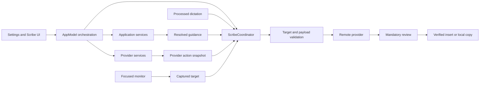
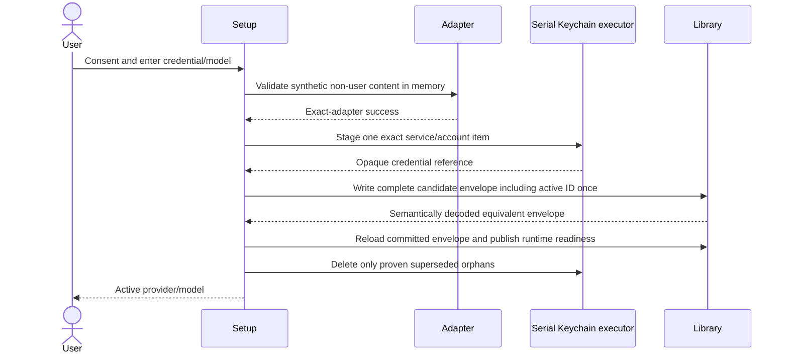
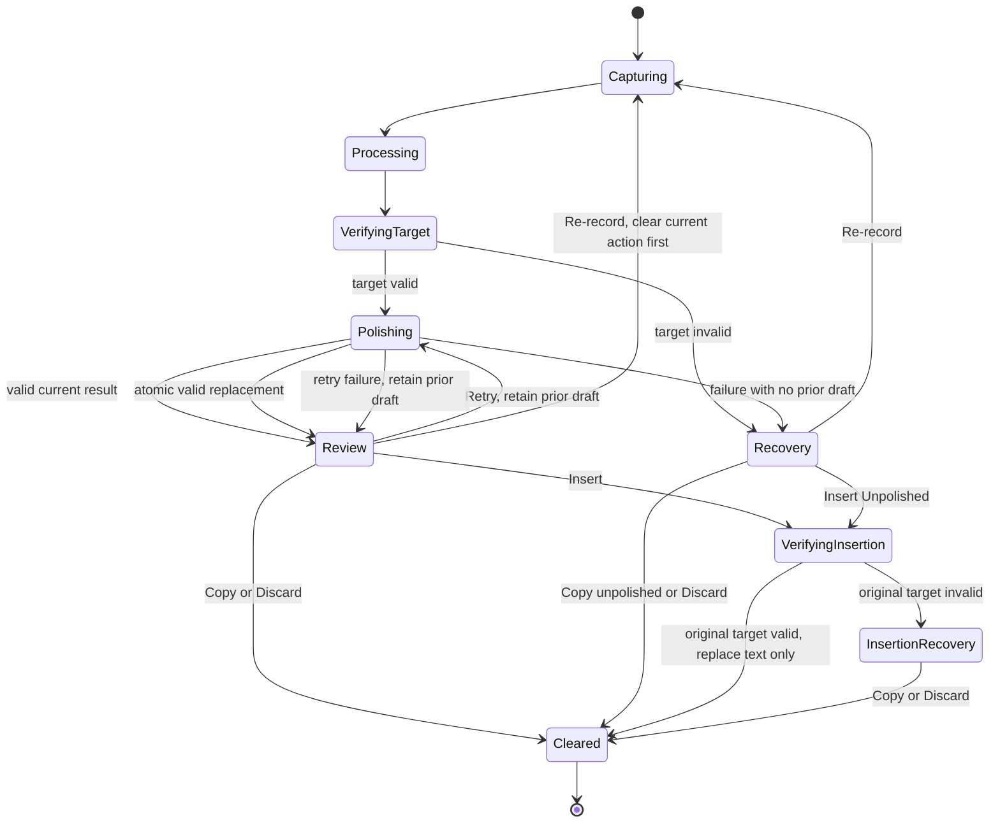
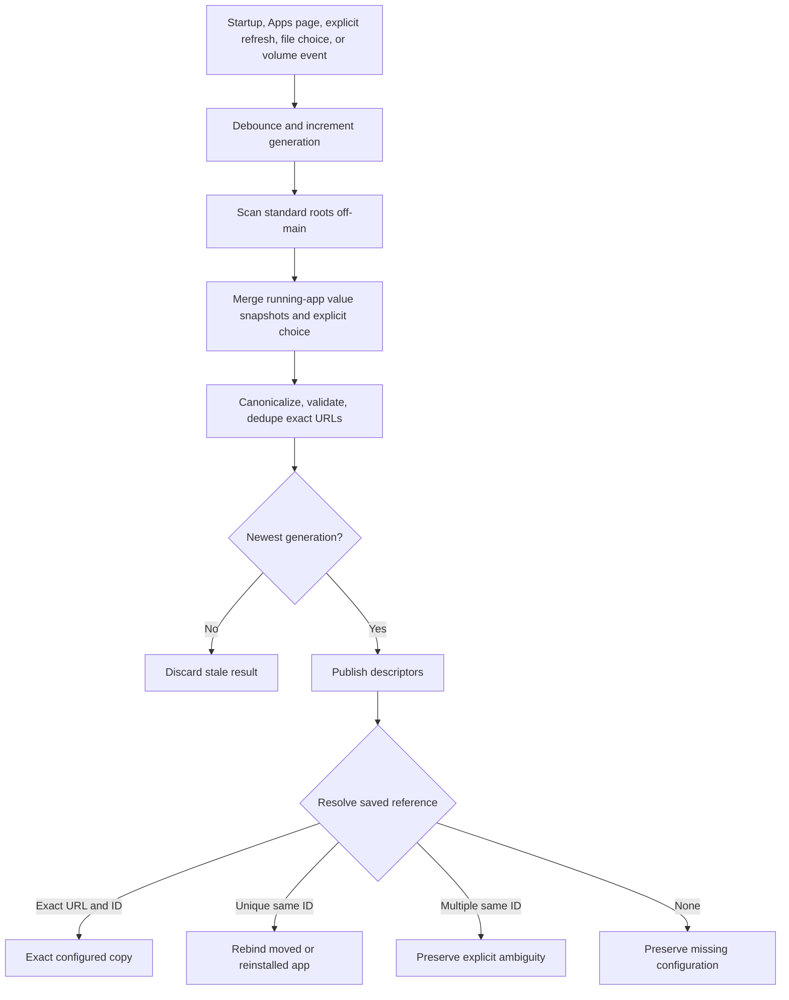
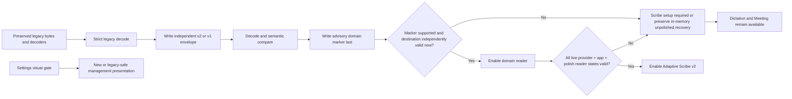
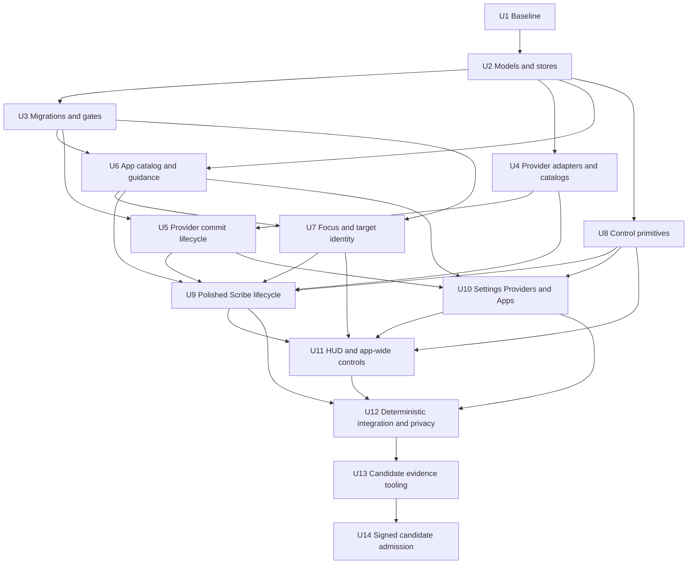

# feat: Implement Scribe providers and Settings

## Goal Capsule

Extend the Adaptive Scribe baseline at commit `04391d3` into a single meaning-preserving polished-dictation flow with explicit OpenAI Direct and OpenRouter providers, app-aware guidance, correct target identity, and a cohesive SaaS-style Settings surface. Preserve the existing safety seams, local Dictation and Meeting boundaries, rollback data, and mandatory human review. The destination is one signed and notarized Release candidate whose deterministic, live-provider, real-app, accessibility, privacy, and dogfood evidence all bind to the same source commit and DMG.

**Product Contract preservation:** Changed only R15 and AE8 to include unmount and volume rename/move handling in the installed-app lifecycle; the origin specified mount-triggered refresh only. All other product behavior is preserved.

---

## Product Contract

### Problem Frame

PR #34 established hardened Scribe safety infrastructure, but its intent picker, closed app-environment model, singular provider configuration, manual bundle-identifier setup, and native-looking Settings controls no longer match the intended product. Cadence needs one review-first dictation experience whose provider, target, guidance, persistence, migration, and release contracts remain fail-closed across app and provider changes.

### Actors

- **A1 — Dictating user:** configures providers and applications, dictates, reviews, and explicitly inserts, copies, retries, re-records, or discards.
- **A2 — Release owner:** refreshes release-time model data, produces the signed candidate, performs live checks, and admits evidence.
- **A3 — Local Cadence runtime:** owns capture, local processing, immutable action snapshots, validation, persistence, target checks, and UI presentation.
- **A4 — Remote provider:** receives only the consented allowlist and returns one candidate polished draft.

Consent, credentials, permissions, provider activation, polished-draft approval, and insertion are human-only actions. Codex, Cursor, and other configured applications are text destinations, not agents; this scope adds no MCP, tool, automation, or autonomous execution surface.

### Requirements

#### Scribe and payload safety

- **R1:** Replace Compose, Respond, Edit, selected-text capture, and the intent picker with one `dictate → process locally → polish → review → insert or copy` flow.
- **R2:** Capture Processed dictation, target, provider/model/recipient, resolved guidance, and literal rules once per action; Retry Polish reuses that immutable snapshot.
- **R3:** Send only the immutable Cadence contract, compiled preset, optional normalized Custom guidance, Processed dictation, and literal metadata; never send app identity or ambient context.
- **R4:** Require fresh target verification before provider egress and insertion, reject malformed or literal-violating output, ignore stale completions, and never insert automatically.
- **R5:** Preserve Processed dictation for local recovery. Retry retains a prior valid Polished draft until a new valid current result atomically replaces it; failure preserves both the prior draft and Processed dictation.

#### Providers, models, and credentials

- **R6:** Support one saved configuration per explicit provider kind and one global active provider/model, with no silent provider, model, route-policy, or Legacy Local fallback. The selected exact model ID is durable configuration; live eligibility and account metadata are memory-only.
- **R7:** OpenAI Direct uses non-streaming Responses at `https://api.openai.com/v1/responses` with `store: false`; OpenRouter uses non-streaming Chat Completions at `https://openrouter.ai/api/v1/chat/completions`, one exact model, `max_completion_tokens`, and fixed ZDR/data-collection denial.
- **R8:** Model discovery is consent-gated and memory-only. OpenRouter readiness requires the selected model to exist in authenticated user-visible models, support text output, and have a ZDR-eligible endpoint before production-adapter synthetic validation.
- **R9:** Validate candidate credentials in setup memory, then stage exactly one Keychain item on a dedicated serial security executor, persist and semantically read back one complete provider-library envelope whose candidate already names the active ID, publish runtime readiness from that committed envelope, and only then reconcile proven orphans through a narrow cleanup ledger.
- **R10:** Dismissing setup or switching provider cancels requests and clears credential memory. A typed consent receipt binds provider kind, fixed recipient/origin, and the material routing/retention/data-policy disclosure revision. Material contract changes invalidate consent and cancel work; model-only changes do not. Mutations that invalidate an active action require human confirmation and cancel that action before the library changes.

#### Applications, guidance, and target identity

- **R11:** Discover and search installed apps by local name/icon, support one application-bundle file-panel choice, preserve missing configurations, and resolve exact URL, unique move/reinstall, duplicate ambiguity, and runtime exact-copy identity deterministically.
- **R12:** Resolve General, Messaging, or Coding plus a compatible preset and optional bounded Custom guidance locally. Adaptation off, missing, invalid, disabled, ambiguous, or unknown apps resolve General · Neutral without guidance.
- **R13:** Preserve `Cadence.adaptScribeToApp`; individual reset leaves it unchanged and Reset All App Settings restores enabled while touching no other domain.
- **R14:** One focused-application monitor owns current runtime identity. Dictation and Scribe pin their authoritative action targets; the HUD shows current identity while idle and pinned identity during an action, with generic icon fallback for known targets.
- **R15:** Catalog refresh observes mount, unmount, and volume rename/move notifications through a debounced generation-tagged pipeline. It snapshots running-app values and rejects late scan/icon/focus results.

#### Settings, persistence, rollout, and release

- **R16:** Provide seven responsive Settings categories and shared semantic Cadence controls while preserving native control semantics and OS-owned dialogs; discrete choices become dropdowns and waveform sensitivity remains continuous.
- **R17:** Use strict independent envelopes, markers, and feature gates for providers, application configurations, preset state, Settings presentation, and rollout. Migrations are additive, marker-last, idempotent, and retain legacy decoders and bytes for at least one rollback-capable release line.
- **R18:** Ship only when privacy copy and observed wire behavior agree and one signed/notarized candidate passes deterministic, live-provider, real-app, accessibility, privacy, and bounded dogfood gates. Evidence is collected from immutable snapshots and cryptographically and semantically consistent with the candidate.

### Key Flows

- **F1 — Provider setup and activation:** typed consent → in-memory credential validation → model readiness → production synthetic validation → Keychain stage → one complete candidate-envelope write/readback with active ID → runtime readiness publication from committed state → ledger-backed orphan reconciliation.
- **F2 — Scribe action:** capture target/provider/guidance → local transcription and processing → pre-egress verification → provider polish → validation → mandatory review → explicit output action → terminal clearing.
- **F3 — Application configuration:** catalog refresh/search → exact app selection → family/preset/guidance edit → strict local save → deterministic runtime resolution.
- **F4 — Focus and target lifecycle:** initial focus sample → activation/launch/termination/volume updates → current presentation → immutable action pin → pre-egress/pre-insertion verification.
- **F5 — Migration and rollout:** decode preserved legacy data → write/read back independent destination → marker last → enable only validated dependency-safe readers → retain rollback readers.
- **F6 — Candidate admission:** package and notarize → mount and independently derive the signed candidate descriptor → bind required gate/schema/corpus/policy revisions to live envelopes → reject incomplete, duplicate, mutated, or mismatched evidence → atomically finalize a privacy-safe PASS/FAIL manifest.

### Acceptance Examples

- **AE1 — Setup succeeds atomically:** Given no active provider, when A1 consents, validates a credential and model, and chooses Save and Use, then one validated library becomes active and no superseded credential is removed before successful readback.
- **AE2 — Setup cancellation leaves no secret:** Given credential text in setup, when A1 dismisses the sheet or switches provider, then validation is cancelled, credential memory is cleared, and no new Keychain item or provider record exists.
- **AE3 — OpenRouter route fails closed:** Given a selected OpenRouter model without a user-visible text-output ZDR endpoint, when readiness runs, then activation is blocked and no synthetic or content request relaxes the routing policy.
- **AE4 — Retry preserves recovery:** Given a valid reviewed Polished draft, when Retry Polish fails or completes late, then the prior draft and Processed dictation remain available and no output inserts.
- **AE5 — Target change blocks egress:** Given a pinned target, when focus or the Accessibility target changes before egress, then no provider request occurs and Processed dictation remains available for local recovery.
- **AE6 — Target change blocks insertion:** Given a reviewed draft, when the original process terminates or target verification fails, then insertion is refused while polished and unpolished copy options remain.
- **AE7 — Duplicate app copies stay ambiguous:** Given two installed bundles with the same bundle ID and no exact saved URL match, when configuration resolves, then neither copy wins by scan order and the user is asked to choose.
- **AE8 — External app reconnects:** Given a missing configured app on an external volume, when its volume mounts or is renamed, then a debounced newest-generation refresh reconnects the unique matching bundle without losing the configuration.
- **AE9 — App adaptation is bounded:** Given Slack with Messaging · Formal and valid Custom guidance, when Scribe compiles a request, then only the compiled preset and normalized guidance influence expression; Slack identity and surrounding content are absent from the wire.
- **AE10 — Adaptation off is safe:** Given `Cadence.adaptScribeToApp` is false, when a configured coding app is targeted, then guidance resolves General · Neutral without Custom guidance while target verification remains active.
- **AE11 — HUD follows lifecycle:** Given Cursor is already frontmost at launch, when Cadence samples focus and later begins dictation, then the HUD shows Cursor while idle and preserves the pinned Cursor presentation through action cleanup despite subsequent focus changes.
- **AE12 — Migration interruption resumes:** Given legacy provider and Slack bytes with no completed v2 marker, when migration is interrupted after destination write, then rerun produces one equivalent destination, preserves all legacy bytes and credential references, and writes the marker only after semantic readback.
- **AE13 — Responsive Settings retain semantics:** Given keyboard-only navigation at compact and wide widths, when A1 moves between all seven categories and exercises controls, then focus order, labels, default/cancel behavior, destructive confirmation, and state remain correct.
- **AE14 — Evidence mismatch is rejected:** Given a live result whose commit, Release identity, signed-code identity, or DMG hash differs from the mounted candidate, when collection begins, then the artifact is rejected before admission or hashing and remains absent from the manifest.
- **AE15 — Consent follows the material contract:** Given accepted consent for a provider, when only its selected model changes, then consent remains valid; when recipient, origin, routing, retention, or data-policy disclosure revision changes, then consent is invalidated, active work is cancelled, and zero transport occurs until the user consents again.
- **AE16 — Incomplete or mismatched evidence is inadmissible:** Given a live envelope with a missing required gate/revision or a descriptor mismatch, when collection validates the mounted candidate and expected gate set, then the duplicate, partial, mutated, or mismatched artifact is rejected without overwriting a prior PASS/FAIL manifest.
- **AE17 — Feature rollback preserves state:** Given v2 stores and legacy compatibility data, when v2 readers or feature gates are disabled, then all bytes and Keychain references remain intact, Scribe is setup-required or preserves in-memory unpolished recovery, and retired intent/selected-context behavior never becomes active.

### Scope Boundaries

**In scope:** PR #34 extension; five explicit provider kinds; searchable model selection; polished-dictation review and recovery; installed-app selection and guidance; focused-target/HUD correctness; seven-category Settings and shared controls; additive migrations, privacy-safe diagnostics, feature gates, deterministic tests, candidate tooling, and release evidence.

**Non-goals:** changes to WhisperKit capture or Meeting storage/final pass; selected, clipboard, window, screen, file, or prior-turn context; per-app providers; chat, coding execution, tools, web search, or agents; user-defined environment families or provider JSON; persisted runtime identity/icons/catalogs/content; restyling OS security dialogs; automatic fallback or insertion.

**Deferred to Follow-Up Work:** removing legacy decoders/keys after the rollback horizon, adding future General presets, expanding certified app surfaces, or adding any selected-context capability requires a separately reviewed migration or product contract.

---

## Planning Contract

### Key Technical Decisions

- **KTD1 — Extend the PR #34 seams:** Rebase or land the exact baseline before feature work, retain its credential, transport, consent, target-verification, mandatory-review, diagnostics, privacy-canary, and evidence foundations, and replace only superseded product semantics.
- **KTD2 — Independent strict envelopes:** Each durable domain owns one versioned envelope and advisory marker. At every launch, a reader activates only when the marker version is supported and the destination independently decodes and validates; the master gate is the conjunction of live reader states. Loads reject the entire value on schema, duplicate, active-reference, or semantic failure; writes compare a semantic decode of the complete envelope. A UserDefaults readback detects encoding/semantic errors but is not described as a durable disk transaction.
- **KTD3 — Explicit production adapters:** OpenAI Direct and OpenRouter have typed fixed-origin adapters. OpenAI has no Assistants or prior-response state. OpenRouter readiness is exact selected ID in the authenticated user-model set intersected with text-output models and ZDR-eligible endpoints, followed by production synthetic validation; Cadence performs no retry.
- **KTD4 — Stage credentials only after validation:** Candidate secrets remain in setup memory until exact-adapter validation succeeds. Blocking Security framework operations run on a dedicated serial executor/actor with exact service/account queries. A separately enumerable Cadence-owned staging service holds opaque candidate references across a pre-commit crash. The candidate envelope already includes its active ID, so setup performs exactly one durable write and semantic readback, then publishes readiness by reloading that committed envelope rather than issuing a second activation write. Pre-readback failure restores prior runtime state; launch reconciliation compares staging against every readable retained provider store before deleting an unreferenced item. Post-commit publication failure reloads valid persisted state. Before U5 persists any new provider credential, security review must explicitly accept the inherited `AfterFirstUnlockThisDeviceOnly` accessibility class for compatibility or stop execution for a separately planned credential migration.
- **KTD5 — Immutable Scribe action, replace-on-success retry:** Provider, target, guidance, literals, and Processed dictation are captured once. Retry creates a new attempt revision but retains any valid prior draft until a valid current response atomically replaces it.
- **KTD6 — Identity layers do not collapse:** Installed descriptors, persisted references, active identities, captured targets, and presentations remain separate. Only compiled guidance crosses the provider boundary; display names and bundle IDs never substitute for exact identity.
- **KTD7 — AppKit at explicit boundaries:** SwiftUI owns picker state; AppKit supplies `NSOpenPanel`, workspace notifications, running-app snapshots, and icons. Use classic NSWorkspace notification APIs compatible with the current Xcode baseline and restrict the panel with `allowedContentTypes` to application bundles.
- **KTD8 — Event freshness is generation-based:** Mount, unmount, volume rename/move, launch, termination, wake, and activation trigger debounced or targeted refresh/invalidation. Scans run off the main actor; published focus, running-app, and icon values are copied snapshots tagged with the newest revision.
- **KTD9 — Native semantics under Cadence visuals:** Shared role-based controls wrap native Button, Menu/Picker, Toggle, TextField, and Slider behavior. OS-owned panels and alerts remain native; destructive operations are never default Return actions.
- **KTD10 — Additive reader-gated rollout:** Safety gates own providers, app intelligence, and polished dictation; their conjunction enables Adaptive Scribe only from independently valid live reader states, never marker presence alone. Invalid state makes Scribe setup-required or preserves an existing in-memory unpolished recovery; General · Neutral is guidance-only, not a runtime safety fallback. Dictation and Meeting remain available. Settings visuals roll back independently. Legacy decoders and `Cadence.adaptScribeToApp` survive through the first v2 release and at least one subsequent rollback-capable release line; removal is a separate evidenced change.
- **KTD11 — Evidence binds the executable:** Packaging embeds the full clean commit before signing. The collector independently derives a candidate descriptor from the mounted signed/notarized DMG: full embedded commit, canonical Release identity, DMG SHA-256, and signed-code identity. Live envelopes embed that descriptor plus required gate, schema, corpus, and policy revisions. Before admission, the collector recomputes the descriptor, checks required-gate completeness and mismatch, rejects symlinks/path escapes/duplicates/mutation, then validates, privacy-scans, and hashes one immutable regular-file snapshot. Manifest finalization is atomic and never overwrites PASS or FAIL. This protects against corruption and accidental evidence mixing, not a malicious owner of the verification machine.
- **KTD12 — Human approval is irreducible:** Provider consent/activation, credential entry, permissions, polished-draft approval, and insertion remain human-only. No agent or automation surface is introduced.
- **KTD13 — Consent is typed and transport-gating:** The receipt binds provider kind, fixed recipient/origin, and material routing/retention/data-policy disclosure revision. A material revision invalidates the receipt and cancels active work; an exact-model change under the same contract does not. Startup, migration, reopen, provider switching, and stale callbacks all require a valid receipt before any transport.
- **KTD14 — Cleanup is recoverable and conservative:** Launch and post-commit reconciliation share the serial security executor. First reconcile the enumerable staging service against the union of every successfully decoded retained provider store, including legacy; if any required store is unreadable, delete nothing. After a committed library proves an item unreferenced, a narrow tombstone ledger records only that opaque reference when exact service/account deletion fails or crashes, and clears on success or item-not-found.
- **KTD15 — Provider and guidance output are inert text:** Accept exactly one completed text candidate bound to action/provider/model/request revision. Reject tools/functions, multiple choices, incomplete finish, and OpenRouter returned-model mismatch. Render plain escaped review text and insert only text replacement; never submit Return, invoke a tool, or execute a URL.
- **KTD16 — Automatic app rebind is a guarded commit:** Rebind only when the saved URL is absent, the newest catalog generation has exactly one same-lineage candidate, and the application envelope revision is unchanged. Write/read back before publishing; duplicate appearance, concurrent edit, unmount, stale scan, or write failure preserves the prior reference.
- **KTD17 — Release fixtures cannot authorize production:** Synthetic/debug launch hooks are compile-excluded from Release or cryptographically unforgeable outside the test host. Release ignores fixture arguments/defaults; fixtures cannot grant consent, activation, approval, insertion, or admissible live evidence. Candidate admission proves their absence.
- **KTD18 — Rollback changes readers, not data:** Feature/readers may be disabled while v2 and legacy bytes and Keychain references remain untouched. An unsupported reader makes Scribe setup-required or preserves an existing in-memory unpolished recovery; retired intent and selected-context behavior never becomes active in the current implementation. Legacy decoders remain through the first v2 release and at least one subsequent rollback-capable release line, proven by deterministic downgrade fixtures rather than a second live release product.
- **KTD19 — Local threat boundary is explicit:** Strict decoding and exact Keychain queries protect against corruption and accidental local edits. Same-user malicious modification of UserDefaults, Keychain, or filesystem state and a compromised macOS account are outside scope; this plan adds no MAC or encryption layer over UserDefaults.

### Durable Key Contracts

U2 defines and tests these injected constants; U3 migrates into them without changing legacy keys.

| Domain | Durable key | Ownership |
|---|---|---|
| Provider library | `Cadence.scribeProviderLibrary.v2` | Complete provider envelope and active ID |
| Application configurations | `Cadence.applicationConfigurationLibrary.v1` | Application references and overrides |
| Preset/catalog state | `Cadence.scribePresetCatalogState.v1` | Fixed fallback and catalog revision/readiness |
| Settings presentation | `Cadence.settingsPresentation.v1` | Navigation and presentation state only |
| Feature gates | `Cadence.adaptiveScribeFeatureGates.v2` | Local rollout/readership state |

Legacy keys remain byte-for-byte unchanged through the declared rollback horizon. Tests receive owning constants through injected stores rather than duplicating string literals.

### Scribe Action Hierarchy

| State | Primary/default | Secondary | Quiet | Destructive |
|---|---|---|---|---|
| Review ready | Insert, when enabled | Retry Polish | Copy; Re-record | Discard |
| Retry with retained draft | Insert remains available and cancels retry before target verification | Retry remains in progress | Copy remains available and cancels retry; Re-record | Discard |
| Provider failure without prior draft | Retry Polish | Insert Unpolished | Copy Unpolished; Re-record | Discard |
| Target or insertion recovery | Copy | Retry Insert after the original target is restored | Re-record | Discard |

Destructive and submit-like actions are never default. Every polished or unpolished insertion enters `VerifyingInsertion`; choosing any output while Retry is active cancels that attempt before verification or clearing.

### Scribe Transition Accessibility

| Transition state | Announcement | Focus destination |
|---|---|---|
| Capturing | Recording started and target cue | Stop/cancel capture control |
| Processing | Processing dictation | Stable panel status; no forced focus move |
| Review ready | Polished draft ready and destination cue | Insert when enabled, otherwise first available recovery action |
| Retry with retained draft | Retrying; prior draft remains available | Preserve current control unless it disappears, then nearest equivalent output action |
| Provider failure | Polishing failed with recovery choices | Retry Polish |
| Target failure | Original target unavailable; no text sent or inserted | Copy recovery action |
| Insertion recovery | Insertion blocked; text preserved | Copy |
| Cleanup | Action completed or discarded | Return focus to the stable Scribe entry surface without synthesizing app activation |

### Assumptions

- PR #34 remains the required extension baseline even if its branch is rebased; behavior and golden fixtures take precedence over stale line locations.
- Exact recommended model IDs and policy-review dates are release-time data, refreshed from current provider primary sources and validated against the versioned corpus rather than hard-coded as architecture.
- The inherited Keychain accessibility choice is not assumed acceptable: U1 records an explicit security decision before U5, and rejection blocks new provider credential persistence pending a separate migration plan.
- Installed-app discovery can be incomplete by design; explicit file selection and preserved missing state are the recovery paths.

### System-Wide Impact

- **Users:** provider setup, Scribe review, app configuration, HUD identity, and all Settings categories change together; recovery remains explicit and content-safe.
- **Developers:** `AppModel` continues coordinating while provider, app, identity, migration, and UI behavior live in dedicated services. Shared hotspots must be integrated serially.
- **Privacy and security:** cloud egress changes public privacy claims, Keychain lifecycle, diagnostic taxonomy, evidence retention, and release review.
- **Release operations:** live verification becomes candidate-bound and credential-safe; a corrected defect requires a new candidate rather than edited evidence.
- **Unaffected surfaces:** Dictation capture/Whisper processing, Meeting durability/final-pass semantics, Google OAuth, analytics consent, vocabulary, and shortcut data remain within their current boundaries.

### Risks and Dependencies

- Provider API and policy drift can invalidate release model data or disclosure. Keep fixed adapters and repeat primary-source review for every candidate.
- UserDefaults cannot provide a disk transaction. Complete-envelope semantic comparison, marker-last migrations, retained source bytes, and interruption tests bound the risk without overstating durability.
- Keychain cleanup could destroy recovery. Never clean from rejected state or before a committed complete library and every readable retained store prove the referenced set; an unreadable required store blocks deletion and tombstones permit exact retry.
- App discovery and focus notifications race. Exact URL/process keys, value snapshots, generations, cancellation, and rapid-switch tests make freshness explicit.
- Custom guidance may conflict with safety intent. Structural priority, deterministic literal checks, bounded input, and mandatory review remain authoritative.
- Broad UI migration can regress semantics. Freeze primitives first, migrate consumers in bounded batches, and combine fixtures with assistive-technology review.
- Debug fixtures could become a production authorization bypass. Compile them out or bind them to an unforgeable test host and make candidate admission prove their absence.
- Mutable or mixed evidence could falsely admit a candidate. Independent descriptor derivation, required-gate/schema/revision checks, immutable regular-file snapshots, atomic finalization, and non-overwriteable PASS/FAIL records prevent corruption and accidental mixing; a malicious machine owner remains outside scope.
- The implementation crosses `Cadence/App/AppModel.swift`, `Cadence/UI/SettingsView.swift`, `Cadence/UI/ScribePanel.swift`, `Cadence/Services/ScribeCoordinator.swift`, `project.yml`, corpus files, and release scripts. These write surfaces are serialized by the dependency graph below.

### Sources and Research

- `docs/plans/2026-07-11-cadence-scribe-settings-implementation-specification.md` — authoritative product and technical specification.
- `docs/plans/2026-07-11-adaptive-scribe-pr34-baseline-research.md` — baseline seams and preserved safety behavior.
- `docs/plans/2026-07-11-openai-openrouter-provider-contract.md` — recipient, transport, discovery, and disclosure contracts.
- `docs/plans/2026-07-11-polished-dictation-scribe-contract.md` — one-flow lifecycle, review, retry, recovery, and payload rules.
- `docs/plans/2026-07-11-installed-app-identity-picker-contract.md` and `docs/plans/2026-07-11-focused-app-identity-icon-correctness-contract.md` — catalog and runtime identity boundaries.
- `docs/plans/2026-07-11-app-environments-presets-guidance-contract.md` and `docs/plans/2026-07-11-saas-settings-control-system-contract.md` — guidance and UI contracts.
- `docs/plans/2026-07-11-cross-cutting-acceptance-rollout-contract.md` — migration, privacy, candidate, and rollout gates.
- OpenAI official references: [Responses API](https://developers.openai.com/api/reference/resources/responses/methods/create), [data controls](https://developers.openai.com/api/docs/guides/your-data), [deprecations](https://developers.openai.com/api/docs/deprecations), and [models](https://developers.openai.com/api/docs/models) — fixed stateless request contract, release-time model data, and disclosure review.
- OpenRouter official references: [provider routing](https://openrouter.ai/docs/guides/routing/provider-selection), [Zero Data Retention](https://openrouter.ai/docs/guides/features/zdr), [user models](https://openrouter.ai/docs/api/api-reference/models/get-user-models), and [model endpoints](https://openrouter.ai/docs/api/api-reference/endpoints/list-endpoints-for-a-model) — authenticated readiness intersection and fixed privacy routing.
- Apple official references: [UserDefaults](https://developer.apple.com/documentation/foundation/userdefaults), [TN3137 on Mac keychains](https://developer.apple.com/documentation/technotes/tn3137-on-mac-keychains), [SecItem](https://developer.apple.com/documentation/security/secitem), [NSWorkspace](https://developer.apple.com/documentation/appkit/nsworkspace), [NSRunningApplication](https://developer.apple.com/documentation/appkit/nsrunningapplication), [Accessibility](https://developer.apple.com/documentation/applicationservices/axuielement), and [code-signing services](https://developer.apple.com/documentation/security/code-signing-services) — persistence limits, Keychain review, app identity, target authority, and candidate identity.

---

## High-Level Technical Design

### Component topology and provider-safe data flow

### Provider setup and credential commit sequence

Cancellation or provider switching terminates validation, clears setup memory, and leaves the prior library intact. Failure before semantic readback restores prior in-memory state and removes only the staged item. Failure while publishing after a successful commit reloads the valid persisted envelope; it does not write activation a second time.

### Scribe lifecycle state machine

### Application identity and catalog lifecycle

Launch, termination, mount, unmount, and volume rename/move invalidate affected catalog/icon state. Runtime bundle URL may select an exact duplicate copy; scan order never does.

### Migration and feature-gate flow

### Implementation-unit dependency graph

---

## Implementation Units

### Unit Index

| U-ID | Title | Files touched | Dependencies |
|---|---|---|---|
| U1 | Establish and characterize PR #34 baseline | Baseline tests, `project.yml`, evidence check | — |
| U2 | Freeze v2 value models and strict envelopes | Models, stores, store tests | U1 |
| U3 | Add additive migrations and dependency-safe gates | Migration services, gates, golden fixtures | U2 |
| U4 | Implement exact provider adapters and model readiness | Provider adapters, catalog, wire tests | U2 |
| U5 | Make provider setup and credential commit atomic | Controller, connection manager, Keychain store | U3, U4 |
| U6 | Build installed-app catalog, configurations, and guidance | App catalog, resolver, guidance services | U2, U3 |
| U7 | Own focused identity, target pinning, and icons | Focus monitor, coordinators, HUD service | U3, U6 |
| U8 | Freeze shared semantic control primitives | Cadence controls and semantics fixtures | U2 |
| U9 | Replace intent Scribe with polished dictation | Coordinator, request policy, Scribe panel, corpus | U4, U5, U6, U7, U8 |
| U10 | Build Settings shell, Providers, and Apps pages | Settings category and management views | U5, U6, U8 |
| U11 | Complete Scribe UI, HUD, and app-wide control migration | Product UI surfaces and HUD views | U7, U8, U9, U10 |
| U12 | Prove deterministic integration and privacy | Integration tests, docs, CI, privacy scripts | U9, U10, U11 |
| U13 | Bind packaging and evidence to one candidate | Packaging, verifiers, collector, release tests | U12 |
| U14 | Admit one signed candidate through live gates | Release catalog, evidence manifest, release docs | U13 |

Shared-hotspot integration is serialized where work converges: U5 and U7 feed U9; U5, U6, and U8 feed U10; U9 and U10 feed U11 and U12. Only isolated new services and their dedicated tests may develop in parallel before convergence; no parallel writer touches `AppModel`, Scribe/Settings/HUD integration views, shared project configuration, corpus files, or release scripts.

### U1. Establish and characterize the Adaptive Scribe baseline

**Goal:** Begin from PR #34 commit `04391d3` or its reviewed rebased equivalent and preserve its safety behavior before replacing product semantics.

**Requirements:** R1, R4, R17, R18; F5, F6.

**Dependencies:** None.

**Files:** `project.yml`; `CadenceTests/ScribeCoordinatorTests.swift`; `CadenceTests/ScribeContextServiceTests.swift`; `CadenceTests/ScribeActionPolicyTests.swift`; `CadenceTests/ScribeMigrationTests.swift`; `CadenceUITests/AdaptiveScribeUITests.swift`; `docs/adaptive-scribe-release-evidence.md`.

**Approach:** Integrate the exact baseline, record its resulting source identity in implementation evidence, regenerate the Xcode project, and retain characterization coverage for consent, transport, credential isolation, target checks, literals, mandatory review, migration, privacy canaries, UI fixtures, and evidence checks. Before U5, security review records either explicit acceptance of inherited `AfterFirstUnlockThisDeviceOnly` for this compatibility release or a stop decision requiring a separate credential-migration plan; no new provider credential may persist before that gate clears.

**Execution note:** Run baseline characterization before changing models or UI so regressions can be distinguished from intentional contract replacement.

**Patterns to follow:** `docs/plans/2026-07-11-adaptive-scribe-pr34-baseline-research.md`; `docs/codebase-guide.md`; `TranscriptionEngine` test seams; generated-project rules in `project.yml`.

**Test scenarios:**

1. A clean baseline regenerates the project without source changes and completes existing focused Scribe tests.
2. Consent denial, redirect refusal, target mismatch, literal violation, and provider cancellation remain fail-closed.
3. Dictation and Meeting characterization suites remain unchanged and pass independently of Scribe setup.
4. The evidence-tool check operates on synthetic fixtures and emits no content or credentials.
5. Security review can record acceptance and unblock U5, while rejection prevents new provider credential persistence and leaves existing baseline behavior intact.

**Verification:** The reviewed baseline is identifiable, project generation is idempotent, existing safety suites pass, Dictation/Meeting regressions are absent, and the Keychain accessibility decision is recorded before U5.

### U2. Define v2 value models and strict persistence envelopes

**Goal:** Freeze the provider, application, guidance, identity, diagnostics, catalog-state, Settings-presentation, and rollout contracts used by parallel feature work.

**Requirements:** R2, R3, R6, R11–R17; F1–F5; AE7, AE9, AE10.

**Dependencies:** U1.

**Files:** `Cadence/Models/ScribeModels.swift`; `Cadence/Models/ScribeRequestModels.swift`; `Cadence/Models/ScribeProviderModels.swift`; `Cadence/Models/ScribeProviderDisclosure.swift`; `Cadence/Models/ApplicationConfigurationModels.swift`; `Cadence/Models/ScribePresetCatalogStateModels.swift`; `Cadence/Models/ApplicationIdentityModels.swift`; `Cadence/Models/DictationModels.swift`; `Cadence/Models/ScribeDiagnosticModels.swift`; `Cadence/Models/WritingEnvironmentModels.swift`; `Cadence/Services/ScribeProviderConfigurationStore.swift`; `Cadence/Services/ApplicationConfigurationStore.swift`; `Cadence/Services/ScribePresetCatalogStateStore.swift`; `Cadence/Services/SettingsPresentationStore.swift`; `Cadence/Services/AdaptiveScribeFeatureGates.swift`; `Cadence/App/AppModel.swift`; `CadenceTests/ScribeProviderLibraryTests.swift`; `CadenceTests/ApplicationConfigurationTests.swift`; `CadenceTests/AdaptiveScribeFeatureGateTests.swift`.

**Approach:** Define value-only, schema-versioned envelopes with unique stable IDs, normalized semantic equality, typed absent/rejected states, and exact active-reference validation. Provider candidate writes contain the active ID and all configurations in one complete envelope written once. Keep AppKit images and runtime identity out of persistence. Preserve legacy models as compatibility-only decoders. Add exact preference keys in `AppModel.PreferenceKey` and inject them; keep behavior in services.

**Patterns to follow:** Existing Codable stores and injected UserDefaults keys; `ScribeProviderConfigurationStore`; value types in `Cadence/Models`; `AppModel` as coordinator rather than IO owner.

**Test scenarios:**

1. Empty stores decode to typed absent states and do not synthesize active records.
2. Future schema, malformed bytes, duplicate IDs/kinds/references, invalid active ID, and invalid fields reject the entire envelope byte-for-byte.
3. Encoding, write/readback, semantic decode, and normalized comparison succeed for each valid complete envelope.
4. A rejected provider library never yields a credential cleanup set; a rejected app library resolves only the fixed safe fallback.
5. Runtime PID, icon, focus revision, live model results, and Scribe text cannot be encoded into any durable envelope.
6. Each store uses its injected constant from the Durable Key Contracts table; legacy key bytes remain unchanged and tests contain no duplicated production key literals.

**Verification:** Frozen models support every downstream state without duplicate ownership; strict store suites pass; no second active provider or application store exists; generated project changes are idempotent.

### U3. Add additive migrations and dependency-safe feature gates

**Goal:** Migrate preserved v1 provider and app data into independent envelopes without breaking downgrade or reviving retired intent behavior.

**Requirements:** R13, R17; F5; AE10, AE12, AE17.

**Dependencies:** U2.

**Files:** `Cadence/Services/ProviderLibraryMigrationService.swift`; `Cadence/Services/ApplicationConfigurationMigrationService.swift`; `Cadence/Services/AdaptiveScribeMigrationService.swift`; `Cadence/Services/AdaptiveScribeFeatureGates.swift`; `Cadence/Services/WritingEnvironmentStore.swift`; `Cadence/Models/WritingEnvironmentModels.swift`; `Cadence/Services/PersonalizationStore.swift`; `Cadence/App/AppModel.swift`; `CadenceTests/ScribeMigrationTests.swift`; `CadenceTests/ApplicationConfigurationMigrationTests.swift`; `CadenceTests/AdaptiveScribeFeatureGateTests.swift`; `CadenceTests/Fixtures/AdaptiveScribe/legacy-provider-library.json`; `CadenceTests/Fixtures/AdaptiveScribe/legacy-application-preferences.json`.

**Approach:** Give provider, application, preset, Settings, and rollout domains separate advisory markers. Decode source without mutation, write/read back and semantically compare the destination, then write that marker last. At every launch, require both a supported marker and a fresh independently valid envelope before enabling its reader; compute the master gate from those live reader states. Map only exact Slack states; do not map Claude state to Codex/Cursor or compile legacy writing profiles. Continue reading/writing `Cadence.adaptScribeToApp`. Keep legacy bytes, decoders, credential references, and golden fixtures through the first v2 release and at least one subsequent rollback-capable release line. Their removal requires a separate change proving supported-version exclusion, no shipped flag reader, retained migration fixtures, and release evidence that supported downgrade paths no longer require them.

**Execution note:** Add interruption and legacy-byte characterization tests before changing migration orchestration.

**Patterns to follow:** PR #34 migration ledger behavior where compatible; marker-last store migrations; compatibility fixtures rather than production defaults mutation.

**Test scenarios:**

1. Valid legacy DeepSeek or custom configuration becomes one active v2 record without changing credential reference or source bytes.
2. Slack formal/neutral/casual/disabled maps exactly; ambiguous or missing Slack remains recoverable; Claude data does not materialize Codex or Cursor state.
3. Interruption before write, after write, after readback, and before marker resumes idempotently without duplicates.
4. Absent, true, false, and wrong-type adaptation preferences recover per legacy semantics; individual reset preserves the key and Reset All Apps restores enabled only.
5. Invalid gate combinations fail closed without choosing legacy intent semantics, while disabling the Settings visual gate preserves safe management access.
6. A supported rollback reader can still decode all retained legacy golden bytes after v2 migration.
7. A present marker with missing, corrupt, future, or newly invalid destination state does not activate its reader; invalidation during an action cancels remote work and preserves only safe in-memory unpolished recovery.
8. Disabling v2 readers or feature gates preserves v2 and legacy bytes/keys, never activates intent/selected context, leaves Dictation/Meeting available, and makes Scribe setup-required or preserves only existing in-memory unpolished recovery.

**Verification:** Migration suites prove byte preservation, marker ordering without marker trust, launch-time semantic validation, idempotence, deterministic downgrade readability, feature-gate rollback, exact Slack mapping, adaptation compatibility, and domain isolation.

### U4. Implement exact provider adapters and model readiness

**Goal:** Add OpenAI Direct and OpenRouter as typed fixed-origin providers with exact discovery, readiness, transport, parsing, and privacy contracts.

**Requirements:** R3, R6–R8; F1, F2; AE3.

**Dependencies:** U2.

**Files:** `Cadence/Services/ScribeHTTPTransport.swift`; `Cadence/Services/OpenAIDirectScribeProvider.swift`; `Cadence/Services/OpenRouterScribeProvider.swift`; `Cadence/Services/DeepSeekScribeProvider.swift`; `Cadence/Services/OpenAICompatibleScribeProvider.swift`; `Cadence/Services/FoundationModelsScribeProvider.swift`; `Cadence/Services/UnavailableScribeProvider.swift`; `Cadence/Services/ScribeModelCatalogService.swift`; `Cadence/Models/ScribeProviderDisclosure.swift`; `Cadence/Models/ScribeDiagnosticModels.swift`; `CadenceTests/OpenAIDirectScribeProviderTests.swift`; `CadenceTests/OpenRouterScribeProviderTests.swift`; `CadenceTests/ScribeModelCatalogTests.swift`; `CadenceTests/ScribeHTTPTransportTests.swift`.

**Approach:** Serialize OpenAI Responses with `store: false` and no server-side conversation state. Serialize OpenRouter Chat Completions with one exact model, `max_completion_tokens`, ZDR required, data collection denied, and no Cadence retry. For OpenRouter activation, intersect authenticated user-visible model IDs, text-output capability, and ZDR-eligible endpoints before running exact-adapter synthetic generation. Persist the exact selected model ID as configuration; keep only live availability, endpoint eligibility, and account catalog metadata in memory. On relaunch, restore the ID; disappearance marks Needs Attention without switching it. Preserve the ephemeral, no-cache/cookie/redirect/retry transport and closed error categories.

**Execution note:** Start with byte-level failing request/response and route-eligibility tests for each new adapter.

**Patterns to follow:** `ScribeHTTPTransport`; `DeepSeekScribeProvider`; provider disclosure revisions; mock URL transport fixtures from PR #34.

**Test scenarios:**

1. OpenAI emits only the fixed origin, bearer authentication, selected model, allowed instructions/input, non-streaming mode, and `store: false`; completed text parses and incomplete/malformed output fails closed.
2. OpenRouter emits one selected model, non-streaming mode, `max_completion_tokens`, and fixed ZDR/data-collection fields with no plugins, tools, web search, fallback model, or arbitrary routing.
3. A selected OpenRouter ID missing from any member of the readiness intersection blocks validation; an eligible ID proceeds through the production adapter.
4. Redirect, timeout, cancellation, oversize response, rate limit, quota, policy, model disappearance, and no-ZDR-route map to typed privacy-safe failures without retry.
5. Offline discovery preserves an already validated configuration; live exact-ID merge does not persist account/private model data or silently switch selection.
6. DeepSeek, Custom OpenAI-Compatible, and Legacy Local remain explicit and cannot become fallback recipients.
7. Relaunch restores the exact selected ID without a live catalog; later disappearance retains that ID and credential in Needs Attention with no automatic switch.
8. OpenAI accepts exactly one completed text output and OpenRouter exactly one matching-model completed text choice; tools/functions, multiple choices, incomplete finish, and returned-model mismatch fail closed.

**Verification:** Wire fixtures prove exact requests, inert single-text output, and prohibited-field absence; readiness/filtering, selected-ID restoration/disappearance, and error suites pass; live eligibility/account metadata never persists and exact model IDs never enter analytics or diagnostics.

### U5. Make provider setup and credential commit atomic

**Goal:** Safely manage multiple provider configurations, activation, edits, removal, cancellation, and Keychain references around one complete library.

**Requirements:** R6, R9, R10; F1; AE1, AE2, AE15.

**Dependencies:** U3, U4.

**Files:** `Cadence/Services/ScribeCredentialStore.swift`; `Cadence/Services/ScribeProviderConnectionManager.swift`; `Cadence/Services/ScribeProviderController.swift`; `Cadence/Services/ScribeProviderConfigurationStore.swift`; `Cadence/Models/ScribeProviderModels.swift`; `Cadence/App/AppModel.swift`; `CadenceTests/ScribeCredentialStoreTests.swift`; `CadenceTests/ScribeProviderConsentTests.swift`; `CadenceTests/ScribeProviderConnectionManagerTests.swift`; `CadenceTests/ScribeProviderControllerTests.swift`; `CadenceTests/ScribeProviderLibraryTests.swift`.

**Approach:** Proceed only after U1 records acceptance of inherited Keychain accessibility; otherwise stop for a separate credential-migration plan. Keep credential text inside the setup view model until synthetic validation succeeds. Persist a typed consent receipt bound to provider kind, fixed recipient/origin, and material routing/retention/data-policy disclosure revision. Run blocking exact service/account Security operations on one dedicated serial executor/actor while returning UI state on the main actor. Stage a random opaque reference in a separately enumerable Cadence-owned Keychain staging service, write and semantically read back exactly one complete candidate envelope that already names the active ID, then publish readiness by reloading committed state. Before readback, failure restores prior runtime state; launch reconciliation compares staging against the union of all successfully decoded retained stores before exact deletion. After commit, publication failure reloads the valid envelope. Post-commit deletion failures use a narrow opaque-reference tombstone on the same executor. Any required unreadable store blocks staging or tombstone deletion. Disable retains credentials; remove deletes its credential only after library commit. Require confirmation when a mutation would invalidate an active Scribe snapshot and cancel/clear that action before commit.

**Patterns to follow:** PR #34 credential store accessibility and non-synchronizing attributes; injected stores and deterministic credential fakes; `AppModel` coordination methods.

**Test scenarios:**

1. Invalid or cancelled validation creates no staged Keychain item and leaves the existing library unchanged; U5 refuses to persist when U1 has not accepted the inherited accessibility class.
2. Successful first Save and Use stages once, writes/readbacks one complete envelope containing the active ID, reloads it to publish readiness without a second durable write, and performs cleanup last.
3. Stage success followed by write/readback failure preserves the prior provider/key; immediate cleanup removes the unreferenced staged item, while a simulated crash leaves it enumerable for safe launch reconciliation. Readiness-publication failure after commit reloads the valid persisted envelope and retains its referenced key.
4. Exact service/account queries cannot read or delete another provider configuration; remove and disable have distinct credential effects.
5. Setup dismissal and provider switching cancel network work and clear credential buffers even when a late completion arrives.
6. Active-action edit, disable, or remove requires confirmation; cancellation keeps the old library, while confirmation clears the action before mutation.
7. Security work does not block main-actor responsiveness, and callback ordering cannot publish stale setup state.
8. Material recipient/origin/routing/retention/data-policy revision invalidates consent and cancels work; model-only change under the same contract preserves consent.
9. Startup, migration, reopen, provider switch, and stale validation callbacks produce zero transport without a currently valid typed consent receipt.
10. Failed or crashed post-commit deletion records only proven opaque references; launch/post-commit reconciliation retries exact service/account items and clears tombstones on success or item-not-found.
11. An unreadable current or retained legacy provider store prevents all cleanup, while a fully decoded union protects every still-referenced credential.
12. Concurrent setup attempts serialize staging, commit, publication, and reconciliation so one attempt cannot delete or activate another attempt's reference.

**Verification:** The security decision gate, credential, consent, and connection-manager suites prove one-write commit/readiness publication, zero-transport consent gating, enumerable pre-commit staging recovery, concurrent-attempt isolation, crash-safe tombstones, exact-query cleanup, accessibility compatibility, and retained-store union orphan safety across every provider kind.

### U6. Build installed-app configuration and guidance services

**Goal:** Replace manual bundle-ID and closed environment setup with a searchable local app catalog, stable configurations, and deterministic provider-safe guidance.

**Requirements:** R3, R11–R13, R15; F3; AE7–AE10.

**Dependencies:** U2, U3.

**Files:** `Cadence/Services/InstalledApplicationCatalogService.swift`; `Cadence/Services/ApplicationIdentityResolver.swift`; `Cadence/Services/ApplicationConfigurationStore.swift`; `Cadence/Services/ApplicationConfigurationResolver.swift`; `Cadence/Services/ScribeGuidanceCatalog.swift`; `Cadence/Services/ScribePresetCatalogStateStore.swift`; `Cadence/Services/CustomGuidanceValidator.swift`; `Cadence/Services/WritingEnvironmentCatalog.swift`; `Cadence/Services/WritingEnvironmentResolver.swift`; `Cadence/Services/WritingEnvironmentRecognizer.swift`; `Cadence/Services/ShortcutExpansionService.swift`; `Cadence/Services/PersonalizationStore.swift`; `Cadence/Models/ApplicationConfigurationModels.swift`; `CadenceTests/InstalledApplicationCatalogTests.swift`; `CadenceTests/ApplicationConfigurationTests.swift`; `CadenceTests/ScribeGuidanceTests.swift`; `CadenceTests/CustomGuidanceTests.swift`.

**Approach:** Scan standard macOS application roots off-main, stop at application bundles, canonicalize and validate bundle ID/executable, merge copied running-app values and explicit selections, reject Cadence, and dedupe exact URLs. Observe mount, unmount, and volume rename/move through an injected debounced generation pipeline with deterministic teardown. Resolve exact URL+ID, unique same-ID move/reinstall, duplicate ambiguity, and missing state in order. Automatically commit a move/reinstall rebind only when the saved URL is absent, the newest generation has exactly one lineage candidate, and the application-envelope revision is unchanged; write/read back before publishing. Compile stable General/Messaging/Coding presets plus bounded app-specific guidance; keep the certified Claude Code signature narrow. Reuse references in shortcut/profile editors without exposing bundle-ID entry.

**Patterns to follow:** Injected filesystem/workspace seams; strict application envelope from U2; PR #34 literal capability separation; legacy bundle-scoped data preservation.

**Test scenarios:**

1. Startup and explicit refresh find valid apps, stop recursion at bundles, reject Cadence/invalid bundles, and dedupe canonical URLs.
2. Mount/unmount/rename/move bursts coalesce; only the latest generation publishes; cancellation and service shutdown prevent later publication.
3. Exact URL wins, a unique same-ID reinstall rebinds, multiple copies remain ambiguous, and runtime exact URL selects only its configured copy.
4. Recommended Slack, Codex/OpenAI Desktop, and Cursor templates resolve expected defaults; unknown/disabled/missing/ambiguous apps resolve General · Neutral without guidance.
5. Guidance trims outer whitespace, preserves internal lines, rejects more than 2,000 UTF-8 bytes, NUL, and unsupported controls without replacing the last valid value.
6. Adaptation false omits Custom guidance but retains target safety; scoped reset behavior affects only intended app data.
7. Resolved guidance contains versioned compiled instructions and literal capabilities but no app label, bundle ID, URL, icon, or accessibility signature.
8. Unique rebind writes/readbacks before publication; duplicate appearance, concurrent configuration edit, unmount, stale scan completion, or write failure preserves the prior saved reference and visible recovery state.
9. A configured app missing on an external volume reconnects directly when mount or volume rename/move produces the newest unique generation; an older scan cannot overwrite that recovery.

**Verification:** Catalog, resolution, guidance, reset, notification-lifecycle, and privacy tests pass with deterministic injected events; no normal configuration UI requires a bundle identifier.

### U7. Own focused identity, target pinning, and icon presentation

**Goal:** Establish one current-focus authority and carry exact live or pinned app presentation safely through Dictation, Scribe, and HUD lifecycles.

**Requirements:** R4, R14, R15; F4; AE5, AE6, AE11.

**Dependencies:** U3, U6.

**Files:** `Cadence/Services/FocusedApplicationMonitor.swift`; `Cadence/Services/ApplicationIconResolver.swift`; `Cadence/Services/DictationCoordinator.swift`; `Cadence/Services/ScribeContextService.swift`; `Cadence/Services/HUDWindowController.swift`; `Cadence/Models/ApplicationIdentityModels.swift`; `Cadence/Models/DictationModels.swift`; `Cadence/App/AppModel.swift`; `CadenceTests/FocusedApplicationMonitorTests.swift`; `CadenceTests/ApplicationIconResolverTests.swift`; `CadenceTests/ScribeContextServiceTests.swift`; `CadenceTests/DictationCoordinatorTests.swift`; `CadenceTests/HUDServicesTests.swift`.

**Approach:** Register classic workspace notifications, immediately sample frontmost application, copy running-app values, and publish main-actor current and historical identities with monotonic revisions. Cadence focus clears current but keeps history nonauthoritative. Dictation samples and pins exact process/URL/launch identity at accepted shortcut start; Scribe retains Accessibility PID/element authority and only enriches an exact match. Resolve icons from matching running app, exact bundle, then generic glyph; reserve Cadence branding for no target. Cache runtime images only and invalidate on lifecycle or metadata change.

**Execution note:** Add startup, rapid-switch, and stale-completion characterization fixtures before replacing `lastExternalApplication` wiring.

**Patterns to follow:** Main-actor observable services; `HUDWindowController` nonactivating behavior; Scribe Accessibility target verification; OSLog privacy rules.

**Test scenarios:**

1. Cursor already frontmost at monitor start publishes current identity and icon without waiting for a later activation notification.
2. Rapid activation and delayed icon/resample completions publish only the newest revision; Cadence focus shows branding, not last-external history.
3. Launch/termination and volume/catalog changes invalidate only affected icon/identity entries; a known target without an icon gets a generic glyph.
4. Dictation pins at accepted shortcut start; Scribe rejects running-app enrichment whose PID/URL differs from its Accessibility authority.
5. Focus change or termination blocks egress/insertion for the pinned target and cannot redirect text to the newly focused app.
6. HUD uses live presentation while idle, pinned presentation during an action, and clears only at terminal cleanup.
7. Durable `ApplicationReference` may encode only its defined bundle lineage, last-known canonical URL/name, and schema metadata. Runtime PID, launch discriminator, focus revision, icons, and current/pinned presentations never enter stores; all application identity remains absent from provider requests, logs, analytics, and evidence.

**Verification:** Focus, icon, target, HUD-service, and rapid-race suites pass; Cursor identity flows end to end in deterministic fixtures; no duplicate focus owner remains in `AppModel`.

### U8. Freeze shared semantic control primitives

**Goal:** Establish the Cadence visual and interaction language before migrating Settings and other product surfaces.

**Requirements:** R16; F3; AE13.

**Dependencies:** U2.

**Files:** `Cadence/UI/CadenceActionButton.swift`; `Cadence/UI/CadenceControls.swift`; `Cadence/UI/MenuContentView.swift`; `Cadence/App/ScribeLaunchFixtures.swift`; `CadenceTests/CadenceControlSemanticsTests.swift`; `CadenceUITests/AdaptiveScribeUITests.swift`.

**Approach:** Extract or reference existing warm theme tokens from `MenuContentView` without migrating that product surface. Define Primary, Secondary, Quiet, Destructive, Icon, Navigation row, and Menu item roles over native semantics. Add shared dropdown trigger/menu row, toggle, continuous slider, field, card, status, loading, focus, and full-width disclosure primitives using solid bordered surfaces, fixed chevron geometry, and reduced-motion behavior. Freeze component APIs with synthetic fixtures; U11 exclusively owns migration of existing product controls.

**Execution note:** Treat this as UI infrastructure: prove runtime semantics and accessibility state matrices before broad visual migration.

**Patterns to follow:** `FlowTheme` in `Cadence/UI/MenuContentView.swift`; existing `CadenceActionButton`; native SwiftUI focus/default/cancel/accessibility behaviors.

**Test scenarios:**

1. Each role exposes correct enabled, disabled, loading, hover, pressed, focus, default/cancel, and accessibility state without replacing native activation semantics.
2. Destructive controls never become Return defaults and require confirmation when credentials, content, or configuration would be lost.
3. Dropdowns support keyboard search/navigation, Return, Escape, and VoiceOver labels; waveform slider remains continuous and adjustable.
4. Disclosure row maintains a centered 24-by-24 trailing chevron, one hit target, expanded/collapsed value, and reduced-motion-safe transition.
5. Light/dark, increased contrast, reduced transparency, reduced motion, and larger-text fixtures retain legibility and focus visibility.

**Verification:** Semantic unit and native UI fixtures pass; primitives are stable enough for U10/U11 consumers; OS-owned and specialized controls have documented exceptions.

### U9. Replace intent Scribe with polished-dictation lifecycle

**Goal:** Deliver one immutable, review-first Scribe action with safe retry, unpolished recovery, target verification, and terminal clearing.

**Requirements:** R1–R5, R10, R12; F2; AE4–AE6, AE9.

**Dependencies:** U4, U5, U6, U7, U8.

**Files:** `Cadence/Models/ScribeModels.swift`; `Cadence/Models/ScribeRequestModels.swift`; `Cadence/Services/ScribeRequestPolicy.swift`; `Cadence/Services/ScribeLiteralNormalizer.swift`; `Cadence/Services/ScribeCoordinator.swift`; `Cadence/Services/ScribeContextService.swift`; `Cadence/UI/ScribePanel.swift`; `Cadence/App/AppModel.swift`; `CadenceTests/ScribeCoordinatorTests.swift`; `CadenceTests/ScribeContextServiceTests.swift`; `CadenceTests/ScribeActionPolicyTests.swift`; `CadenceTests/ScribeLiteralNormalizerTests.swift`; `CadenceTests/Fixtures/AdaptiveScribe/quality-corpus.json`; `CadenceTests/Fixtures/AdaptiveScribe/quality-corpus-manifest.json`; `CadenceUITests/AdaptiveScribeUITests.swift`.

**Approach:** Delete active intent/selected-context state and request compilation. Capture immutable provider, target, guidance, literals, and Processed dictation once, verify before egress, and compile only R3 fields. Treat provider output and Custom guidance as untrusted inert text: accept one completed text candidate bound to action/provider/model/request revision, render it as plain escaped review text, and reject tools/functions, multiple candidates, incomplete completion, or model mismatch. Track action and attempt revisions so duplicate/late results cannot win. Review every valid output. Retry retains the prior valid draft until atomic valid replacement; failure keeps prior draft plus Processed dictation. Both Insert and Insert Unpolished freshly verify the original target and perform text replacement only; neither submits Return, invokes tools, nor executes URLs. Distinguish copy, Re-record, insertion recovery, and terminal clearing. Replace the corpus with synthetic General/Messaging/Coding meaning-preservation cases.

**Execution note:** Implement state transitions test-first, including retry races and target changes, before changing the panel fixtures.

**Patterns to follow:** PR #34 immutable snapshots, request policy allowlist, literal validation, mandatory review, slow-request affordance, and insertion recovery.

**Test scenarios:**

1. Shortcut activation begins capture immediately with no intent picker or selected-text authorization/capture path.
2. Covers F2 / AE5. Target failure before egress makes zero provider requests and preserves Processed dictation.
3. Provider payload contains byte-stable Processed dictation and immutable snapshots across Retry; no app identity, ambient content, or unauthorized fields appear.
4. Covers AE4. Retry success atomically replaces the prior draft; timeout, cancellation, malformed output, literal violation, or stale completion retains the prior draft and Processed dictation.
5. Empty local transcription, missing provider, no route, and provider errors expose only applicable Re-record, Retry, unpolished recovery, copy, and discard actions without automatic insertion.
6. Covers AE6. Insertion verification failure preserves polished and processed text for local copy but never regenerates or redirects insertion.
7. Insert, Copy, and Discard clear every content-bearing action field and create no Scribe journal or Dictation-history content record.
8. Synthetic fixtures preserve claims, requests, ambiguity, constraints, numbers, identifiers, technical literals, and authorization boundaries across all provider kinds and preset families.
9. Insert and Insert Unpolished enter insertion verification; valid original target performs text replacement and clears, while invalid target enters recovery with copy/discard and no submit, Return, tool, or URL execution.
10. HTML-like, markdown-link, command-like, tool-like, and hostile Custom guidance/provider strings render as inert plain review text and insert only their accepted text bytes.
11. Re-record from Review first cancels Retry if present, clears the current action and all drafts/snapshots, then begins a new capture with a new target and configuration.
12. Choosing Insert or Copy while Retry retains a prior draft cancels that attempt before target verification or terminal clearing; late Retry completion cannot replace or resurrect cleared state.

**Verification:** Coordinator, policy, context, literal, corpus, privacy, and native UI suites prove the state machine, immutable retry, output review, recovery, and clearing contracts.

### U10. Build the Settings shell, Providers, and Apps management

**Goal:** Replace the monolithic Settings surface with seven responsive categories and complete provider/app configuration workflows.

**Requirements:** R6, R8–R13, R16; F1, F3; AE1–AE3, AE7–AE10, AE13.

**Dependencies:** U5, U6, U8.

**Files:** `Cadence/UI/SettingsView.swift`; `Cadence/UI/Settings/GeneralSettingsView.swift`; `Cadence/UI/Settings/DictationSettingsView.swift`; `Cadence/UI/Settings/ScribeSettingsView.swift`; `Cadence/UI/Settings/AppsSettingsView.swift`; `Cadence/UI/Settings/ProvidersSettingsView.swift`; `Cadence/UI/Settings/PrivacySettingsView.swift`; `Cadence/UI/Settings/AdvancedSettingsView.swift`; `Cadence/UI/ApplicationConfigurationsView.swift`; `Cadence/UI/InstalledApplicationPickerView.swift`; `Cadence/UI/WritingEnvironmentsView.swift`; `Cadence/UI/ScribeProviderManagementView.swift`; `Cadence/UI/ScribeProviderSetupView.swift`; `Cadence/App/ScribeLaunchFixtures.swift`; `Cadence/App/AppModel.swift`; `CadenceTests/SettingsPresentationTests.swift`; `CadenceTests/CadenceControlSemanticsTests.swift`; `CadenceUITests/AdaptiveScribeUITests.swift`.

**Approach:** Make `SettingsView` a category router with a 176-point nested rail and centered detail column at widths of 560 points or greater; below 560 points use the compact top category selector and stacked setting rows. Split category ownership exactly as the Product Contract states. Providers presents cards, active selection, exact disclosures, searchable bundled/live/custom models, setup memory lifecycle, and confirmed destructive actions. Changing category, closing the window, switching provider kind, or superseding setup cancels validation/generation, ignores late results, clears credential memory, stages nothing, and persists no setup draft; returning always starts fresh. Apps exposes adaptation, installed picker, configurations, presets, Custom guidance, missing/duplicate recovery, and scoped reset. Use a one-app `NSOpenPanel` bridge restricted to application bundles; users never type bundle IDs.

**Patterns to follow:** U8 semantic controls; `SettingsPresentationStore`; AppKit bridge isolation; `AppModel` setter and published-state conventions.

**Test scenarios:**

1. All seven categories render at exact 520-, 560-, and 720-point detail widths; 559 points uses the top selector and stacked rows, while 560 points uses the nested rail. Navigation changes are announced and category state remains scoped.
2. Provider setup makes no request before consent, preserves search/selection during loading and catalog errors, labels custom IDs, and blocks Save/Activate until exact validation succeeds.
3. Setup dismissal/provider switching clears credential input; confirmed active-provider mutation cancels Scribe first; cancellation changes nothing.
4. Installed picker searches localized names, separates recommendations, exposes exact added/disabled state, distinguishes duplicate paths, refreshes, and validates one selected application bundle.
5. Apps page supports family-compatible preset dropdowns, bounded guidance, missing recovery, adaptation toggle, individual reset, and Reset All Apps without touching providers or other settings.
6. Scribe page explains fixed Other Apps → General · Neutral and offers no global preset control; Privacy and Advanced own the specified diagnostics and low-frequency settings.
7. Keyboard, VoiceOver, default/cancel, destructive confirmation, loading/error, light/dark, contrast, motion, and larger-text fixtures pass across both layouts.
8. Category change, window close, provider-kind switch, and superseding setup each cancel in-flight work, ignore late results, clear credentials, stage nothing, and leave no setup draft; reopening begins a fresh session.

**Verification:** Settings unit/native UI fixtures cover every category and state; management remains functionally available when visual gating is off; no manual bundle-ID input or credential persistence exists in view state beyond setup lifetime.

### U11. Complete Scribe UI, HUD, and app-wide control migration

**Goal:** Apply the frozen control language across Cadence and finish the visible polished-dictation and target-presentation experience.

**Requirements:** R1, R4, R5, R14, R16; F2, F4; AE4, AE6, AE11, AE13.

**Dependencies:** U7, U8, U9, U10.

**Files:** `Cadence/UI/ScribePanel.swift`; `Cadence/Services/HUDWindowController.swift`; `Cadence/UI/HUDView.swift`; `Cadence/UI/IdleExpandedTray.swift`; `Cadence/UI/MainWindowView.swift`; `Cadence/UI/MeetingNotesWindow.swift`; `Cadence/UI/OnboardingView.swift`; `Cadence/UI/PermissionsView.swift`; `Cadence/UI/PermissionGuideWindow.swift`; `Cadence/UI/MenuContentView.swift`; `Cadence/App/ScribeLaunchFixtures.swift`; `CadenceTests/HUDServicesTests.swift`; `CadenceTests/CadenceControlSemanticsTests.swift`; `CadenceUITests/AdaptiveScribeUITests.swift`.

**Approach:** Present listen/process/polish/review/recovery states, app/preset cue, and the exact Scribe Action Hierarchy without intent UI. Apply the Scribe Transition Accessibility matrix for announcements and focus destinations; Retry preserves current focus unless that control disappears. Bind HUD to live or pinned `ApplicationPresentation`, preserving nonactivation and generic-icon fallback. Audit every named surface for Cadence-owned actions, migrate compatible controls, and document intentional native menu, drag, editor, panel, and OS-dialog exceptions rather than mechanically replacing them.

**Execution note:** Use deterministic launch fixtures and runtime smoke checks because nonactivating panels, focus, and AppKit icon behavior are not fully proven by unit tests.

**Patterns to follow:** U8 control roles; `MainWindowController` single-window ownership; HUD nonactivating panel behavior; purpose-built menu and drag semantics.

**Test scenarios:**

1. Scribe panel displays the correct progress, review, retained-draft retry, unpolished recovery, insertion recovery, and terminal states with one safe default action at most.
2. Live focus and pinned action presentation transition correctly; Cursor uses its icon, known icon failure uses a generic glyph, and no-target uses Cadence branding.
3. Opening Settings, review, menu, or another Cadence surface does not replace the pinned target or activate an unintended insertion destination.
4. A source/control audit finds no unintended native bordered product buttons while preserving documented specialized and OS-owned controls.
5. Keyboard-only, VoiceOver, larger text, contrast, transparency, reduced motion, light/dark, and responsive fixtures retain complete functionality.
6. Meeting Notes, permissions, onboarding, and menu behavior remain semantically unchanged apart from Cadence styling.
7. Review, retained Retry, first provider failure, target failure, and insertion recovery render the exact primary/default, secondary, quiet, and destructive hierarchy; output selection cancels Retry before verification and no destructive/submit action is default.
8. Capturing, processing, review, retained Retry, provider failure, target failure, insertion recovery, and cleanup announce the specified state and move or preserve focus according to the transition matrix.

**Verification:** Native UI fixtures and installed Debug smoke checks prove panel/HUD lifecycle, control roles, window ownership, accessibility, and documented exceptions without Dictation/Meeting regressions.

### U12. Prove deterministic integration, privacy, and documentation

**Goal:** Integrate all domains behind safe gates and make deterministic tests, privacy claims, diagnostics, fixtures, and CI agree with observed behavior.

**Requirements:** R3–R5, R7–R18; F1–F5; AE1–AE13.

**Dependencies:** U9, U10, U11.

**Files:** `Cadence/App/AppModel.swift`; `Cadence/App/ScribeLaunchFixtures.swift`; `Cadence/Models/ScribeDiagnosticModels.swift`; `CadenceTests/ScribeDiagnosticTests.swift`; `CadenceTests/ScribePrivacyTests.swift`; `CadenceTests/ScribeMigrationTests.swift`; `CadenceTests/ReleaseFixtureIsolationTests.swift`; `CadenceTests/Fixtures/AdaptiveScribe/quality-corpus.json`; `CadenceTests/Fixtures/AdaptiveScribe/quality-corpus-manifest.json`; `CadenceUITests/AdaptiveScribeUITests.swift`; `scripts/test_adaptive_scribe_contracts.sh`; `scripts/verify_scribe_privacy_canaries.sh`; `docs/privacy.md`; `docs/release-checklist.md`; `docs/adaptive-scribe-release-evidence.md`; `CONTEXT.md`; `.github/workflows/ci.yml`; `project.yml`.

**Approach:** Serialize shared-hotspot integration through `AppModel`, project structure, corpus, and deterministic/privacy inputs. Add a deterministic focused wrapper, recursive generated privacy canaries, closed diagnostic categories, synthetic launch fixtures, and CI jobs with no live credentials. Compile fixture hooks out of Release or make them unforgeable outside the signed test host; Release ignores fixture arguments/defaults and fixtures cannot grant consent, provider activation, draft approval, insertion, or admissible live evidence. Update privacy copy to distinguish local transcription from explicit provider egress and keep disclosures, wire fixtures, diagnostics, analytics, persistence, and docs consistent. U13 exclusively owns evidence collector schema and collection behavior.

**Execution note:** Prefer focused contract suites during integration, then require the full generated-project, unit/integration, native UI, installed-launch, and Meeting audio smoke outcomes before release tooling.

**Patterns to follow:** Existing build-and-run verification; CI macOS configuration; analytics privacy boundary; `docs/privacy.md`; PR #34 privacy-canary inputs.

**Test scenarios:**

1. Every provider/preset flow sends only generated synthetic allowlisted content in fixtures; recursive canaries detect transcript, secret, origin, model, app, guidance, request/response, PID, user-path, and identifier leaks across all evidence inputs.
2. Diagnostics and analytics emit only closed coarse outcomes and exclude raw errors, exact model/origin, app identity, guidance, text, audio, and credentials.
3. Unsafe partial feature-gate combinations fail closed while Dictation and Meeting remain usable; Settings visual rollback preserves safe management.
4. Reset Apps, remove provider, Settings reset, and migration each modify only their owned domains.
5. Project generation is idempotent; full unit/integration and native UI suites pass on the CI macOS target; installed launch and Meeting audio smoke remain healthy.
6. Privacy, release, and evidence documentation matches captured request fixtures and visible recipient disclosures.
7. Release configuration contains no usable synthetic fixture entry point; fixture arguments/defaults cannot alter consent, activation, approval, insertion, or live-evidence state in a Release build.

**Verification:** All deterministic validation outcomes defined below pass from a clean implementation state; canary scans are recursive and destructive on detection; documentation and observed fixtures contain no contradiction.

### U13. Bind packaging and evidence to one signed candidate

**Goal:** Make candidate identity tamper-evident across packaging, live verifiers, and evidence collection before any release gate can pass.

**Requirements:** R18; F6; AE14, AE16.

**Dependencies:** U12.

**Files:** `project.yml`; `scripts/package_release.sh`; `scripts/verify_live_scribe_providers.sh`; `scripts/verify_scribe_real_apps.sh`; `scripts/collect_adaptive_scribe_evidence.sh`; `scripts/verify_scribe_privacy_canaries.sh`; `CadenceTests/ReleaseEvidenceContractTests.swift`; `docs/release-checklist.md`; `docs/adaptive-scribe-release-evidence.md`.

**Approach:** Treat the new live-provider and real-app scripts as deliverables, not pre-existing tools. Freeze the evidence schema and collector contract before packaging or verifier work. Packaging injects the full clean source commit into the canonical Release app before signing. The collector independently mounts the signed/notarized DMG and derives its full embedded commit, canonical bundle identity, DMG SHA-256, and signed-code identity. Each credential-free live envelope embeds that descriptor plus its required gate, schema, corpus, and policy revisions. Before admission, reject missing/duplicate gates, descriptor or revision mismatch, symlinks, path escapes, non-regular files, and mutation; validation, privacy canaries, and hashing operate on the same immutable regular-file snapshot. Atomically finalize a candidate-specific immutable PASS/FAIL manifest and never overwrite it. Dogfood contributes only closed aggregate counters and content-free incident codes. This protects against corruption and accidental mixing, not a malicious owner of the verification machine.

**Execution note:** Build contract tests around synthetic DMGs/descriptors and malformed envelopes before relying on manual release runs.

**Patterns to follow:** Existing `scripts/package_release.sh`; existing evidence collector fail-closed conventions; canonical Release identity from project configuration.

**Test scenarios:**

1. Packaging rejects dirty source identity, missing full commit metadata, Debug identity, or a signed app whose embedded commit differs from the candidate.
2. Verifiers embed the required gate/schema/corpus/policy revisions and candidate descriptor; the collector independently rejects executable identity/signature/commit or DMG mismatch.
3. Covers AE14. Collector rejects missing/malformed fields and any commit, canonical identity, signed-code identity, or DMG-hash mismatch before hashing/admission.
4. A valid mounted candidate and matching result envelopes produce an immutable manifest with hashes, gate status, and no credential/content/app inventory.
5. Directories without every required valid result envelope and failed canary snapshots cannot enter the manifest; unrun gates remain `NOT_RUN`.
6. Duplicate gates, missing schema/corpus/policy revisions, partial required gate sets, or descriptor mismatches are rejected before admission.
7. Symlinks, path escapes, non-regular files, snapshot mutation, and file swaps between validation/canary/hash are detected; interruption leaves no finalized manifest and rerun cannot overwrite an existing PASS/FAIL.
8. Dogfood input accepts only allowlisted aggregate counters and closed incident codes.
9. Candidate admission rejects any Release executable that contains a usable synthetic fixture hook or accepts fixture authorization state.

**Verification:** Release evidence contract tests and collector check mode prove independently derived candidate binding, required-gate completeness, schema/corpus/policy revision checks, immutable regular-file snapshot validation, path and mutation defense, aggregate-only dogfood, fixture absence, atomic finalization, and new-candidate-on-failure semantics.

### U14. Admit one signed candidate through live release gates

**Goal:** Produce the final PASS/FAIL decision from one exact signed/notarized candidate after all deterministic work is green.

**Requirements:** R7, R8, R11–R18; F6; AE3, AE8, AE11, AE13, AE14, AE16.

**Dependencies:** U13.

**Files:** `Cadence/Resources/ScribeModelCatalog.json`; `CadenceTests/Fixtures/AdaptiveScribe/quality-corpus.json`; `docs/release-checklist.md`; `docs/adaptive-scribe-release-evidence.md`.

**Approach:** Refresh exact recommended model IDs and policy-review dates from current primary provider guidance, validate them against the versioned synthetic corpus, and package one clean candidate. Run live OpenAI/OpenRouter, real Cursor/Slack/Codex, rapid-switch/duplicate/missing-app, accessibility, privacy, and five-workday dogfood gates against the installed app copied from that same mounted DMG. Feature/readers-off rollback and legacy retention remain deterministic U3/U12 gates, not a second release product or live candidate matrix. Retain only bounded aggregate and credential-free evidence. Any critical incident fixes source and starts a new candidate; evidence is never edited from FAIL to PASS.

**Execution note:** This unit is release verification, so signed-candidate runtime evidence and human accessibility/privacy review are the primary proof rather than additional mocked unit coverage.

**Patterns to follow:** `docs/release-checklist.md`; candidate descriptor and collector from U13; synthetic corpus and privacy retention rules.

**Test scenarios:**

1. Live OpenAI validates Responses behavior and OpenRouter validates selected-model ZDR routing using synthetic text, with recipient/model policy reviewed for the same candidate.
2. Real-app checks cover Cursor frontmost at launch, rapid Cursor/Slack switching, pinned-target rejection, Codex/Cursor Coding defaults, Slack presets, unknown fallback, termination/relaunch, duplicates, file choice, and missing recovery.
3. Human review covers VoiceOver, Accessibility Inspector, Full Keyboard Access, larger text, appearances, increased contrast, reduced transparency, and reduced motion.
4. Dogfood reaches five workdays and at least 40 genuine actions across all families with only aggregate counts and content-free incidents retained.
5. Every admitted result binds to the same descriptor before and after execution; any privacy, stale-target, silent-fallback, migration-loss, accessibility-critical, or data-loss incident yields FAIL.

**Verification:** One manifest-bound signed/notarized candidate has green deterministic gates, live provider and real-app evidence, accessibility/privacy approval, bounded aggregate-only dogfood, and an explicit immutable PASS decision.

---

## Verification Contract

### Deterministic gates

- XcodeGen regenerates the project without leaving a source diff.
- The full `Cadence` Debug unit/integration suite passes on macOS with code signing disabled where CI expects it.
- The `CadenceUITests` native synthetic fixture suite passes with the repository's ad-hoc/manual signing setup.
- The new focused Adaptive Scribe contract wrapper passes provider, migration, app, identity, guidance, lifecycle, control, diagnostic, and privacy suites.
- Typed-consent tests prove zero transport across startup, migration, reopen, provider switching, material disclosure revision, and stale callbacks; model-only changes under the same contract preserve consent.
- U1 records acceptance of inherited `AfterFirstUnlockThisDeviceOnly` before U5 persists new credentials; otherwise execution stops for a separate migration plan. Pre-commit staging and post-commit tombstones reconcile safely across crash and concurrency.
- Every launch recomputes live reader validity from supported marker plus independently valid destination; marker-only, corrupt, future, missing, and mid-action invalidation cases fail closed without affecting Dictation or Meeting.
- Selected exact model IDs survive relaunch and disappearance without switching; provider results and Custom guidance remain inert single-candidate text.
- Provider setup exits clear credential memory, cancel work, ignore late results, stage nothing, and persist no draft; 520/559/560/720-point Settings fixtures prove the exact compact breakpoint.
- Scribe action hierarchy and transition-accessibility fixtures prove default roles, Retry cancellation, insertion verification, announcements, and focus destinations for every state.
- Release builds ignore or omit all synthetic fixture authorization paths.
- The installed Debug app launches and presents its main window; Meeting system-audio smoke continues producing frames.
- Evidence collection check mode validates schema and corpus without claiming live gates.
- Recursive privacy canaries scan test results, logs, defaults snapshots, app-support snapshots, diagnostics, analytics captures, and evidence directories; any match invalidates the bundle.

### Live and candidate gates

- Live credentials are entered only through the Keychain-backed app UI; no key appears in arguments, environment, logs, screenshots, results, or manifests.
- OpenAI Direct and OpenRouter synthetic checks exercise the exact production adapters and currently selected models. OpenRouter additionally proves user-model, text-output, and ZDR-endpoint readiness.
- Real-app verification exercises Cursor, Slack, and Codex/OpenAI Desktop against current, pinned, changed, terminated, duplicate, missing, and relaunched target states.
- The collector independently mounts the signed/notarized DMG and derives the full embedded commit, canonical Release identity, DMG SHA-256, and signed-code identity; every live envelope matches that descriptor and its required gate/schema/corpus/policy revisions.
- Collection rejects missing or duplicate gates, descriptor/revision mismatch, symlinks, path escapes, non-regular files, snapshot mutation, and fixture-capable Release builds before admission.
- Validation, privacy canaries, and hashing consume one immutable regular-file snapshot; dogfood admits only closed aggregate counters, and manifest finalization is candidate-specific, atomic, and immutable.
- Accessibility review and bounded dogfood use the same admitted candidate. A failure produces a new candidate and manifest.

### Traceability and regression gates

- Every feature-bearing U-ID has its listed focused test file and concrete scenarios implemented.
- The synthetic corpus covers General, Messaging, and Coding meaning preservation, exact literals, authorization boundaries, malicious guidance, malformed provider output, and late completion.
- Legacy golden bytes remain decodable; v2 migration remains additive and interruption-safe; `Cadence.adaptScribeToApp` compatibility is exhaustive.
- Cleanup tombstones reconcile only exact proven opaque references from the union of all readable retained stores; an unreadable required store blocks deletion.
- Automatic app rebind requires an absent saved URL, one newest-generation candidate, unchanged envelope revision, and successful write/readback; every race or ambiguity preserves prior state.
- Feature/readers-off deterministic fixtures preserve v2/legacy bytes and Keychain references, make unsupported Scribe readers setup-required or retain only in-memory unpolished recovery, and never activate retired intent/selected context.
- Dictation target insertion, Meeting capture/durability/final pass, permissions, Google OAuth, analytics consent, vocabulary, shortcuts, onboarding, and main-window ownership retain existing behavior.

## Appendix: Requirements-to-Unit Traceability

| Requirement group | Primary units | Principal evidence |
|---|---|---|
| R1–R5 Scribe lifecycle and payload | U2, U7, U9, U11, U12 | Coordinator/policy/literal/UI/corpus/privacy suites |
| R6–R10 providers and credentials | U2, U4, U5, U10, U12 | Adapter wire, catalog, credential, connection, setup fixtures |
| R11–R15 applications and identity | U3, U6, U7, U10, U11 | Catalog/config/guidance/focus/icon/HUD/real-app evidence |
| R16 Settings and controls | U8, U10, U11, U12 | Semantic control and native UI accessibility fixtures |
| R17 migration and rollback | U2, U3, U12 | Golden-byte, interruption, gate, domain-isolation suites |
| R18 candidate and release | U1, U12, U13, U14 | Deterministic gates, descriptor contract, live manifest |

---

## Definition of Done

- PR #34 is the verified implementation baseline and all U1–U14 outcomes are satisfied in dependency order, with shared hotspots integrated serially.
- U1 records explicit security acceptance of inherited `AfterFirstUnlockThisDeviceOnly` before any new provider credential persists; otherwise implementation stops for a separate migration plan.
- The five explicit provider kinds, one active global provider/model, exact OpenAI/OpenRouter contracts, durable selected model ID, one-write active-envelope commit/readiness reload, typed consent, enumerable pre-commit staging, and post-commit tombstone lifecycle pass crash, concurrency, and integration tests.
- Scribe has no active intent or selected-context path; immutable polished dictation, inert single-text provider output, exact action hierarchy, transition accessibility, retained-draft Retry, mandatory review, pre-egress and pre-insertion target verification, text-replacement-only insertion, safe recovery, and terminal clearing satisfy R1–R5 and AE4–AE6.
- Installed-app discovery, app selection, guidance, adaptation compatibility, focused identity, exact icons, duplicate/missing behavior, and HUD pinning satisfy R11–R15 and AE7–AE11.
- Seven responsive Settings categories and the semantic control system pass exact 520/559/560/720-point breakpoint, setup-exit cleanup, keyboard, VoiceOver, contrast, motion, appearance, larger-text, destructive, loading, and error acceptance while OS-owned controls remain native.
- All stores and migrations are strict, additive, marker-last, domain-isolated, and activated only from independently valid live reader state; legacy decoders and `Cadence.adaptScribeToApp` remain through the first v2 release and at least one subsequent rollback-capable release line, with removal separately gated.
- Privacy copy, disclosures, wire fixtures, diagnostics, analytics, persistence, canaries, and evidence agree that only the allowlisted Scribe payload can egress.
- XcodeGen idempotence, full unit/integration tests, native UI tests, focused contract tests, installed launch, Meeting audio smoke, and evidence check mode are green in the clean candidate source state.
- Release configuration contains no usable synthetic fixture authorization path, and candidate admission proves fixtures cannot grant consent, activation, approval, insertion, or evidence.
- Feature/readers-off rollback preserves v2 and legacy bytes/keys, retains the required legacy decoders, makes unsafe Scribe readers setup-required or preserves only in-memory unpolished recovery, and never activates retired intents; deterministic downgrade fixtures provide the proof without a second release product.
- One signed/notarized Release candidate passes current model/policy review, live OpenAI/OpenRouter, real Cursor/Slack/Codex, accessibility, privacy, and five-workday dogfood gates; every artifact matches the independently derived mounted-candidate descriptor before immutable-snapshot admission.
- The collector rejects missing/duplicate/partial gates, path or file mutation, and descriptor/schema/corpus/policy mismatches; admits only dogfood aggregates; and atomically records an immutable explicit PASS with no critical privacy, stale-target, silent-fallback, migration-loss, accessibility, or data-loss incident. This manifest-bound candidate is the destination.
