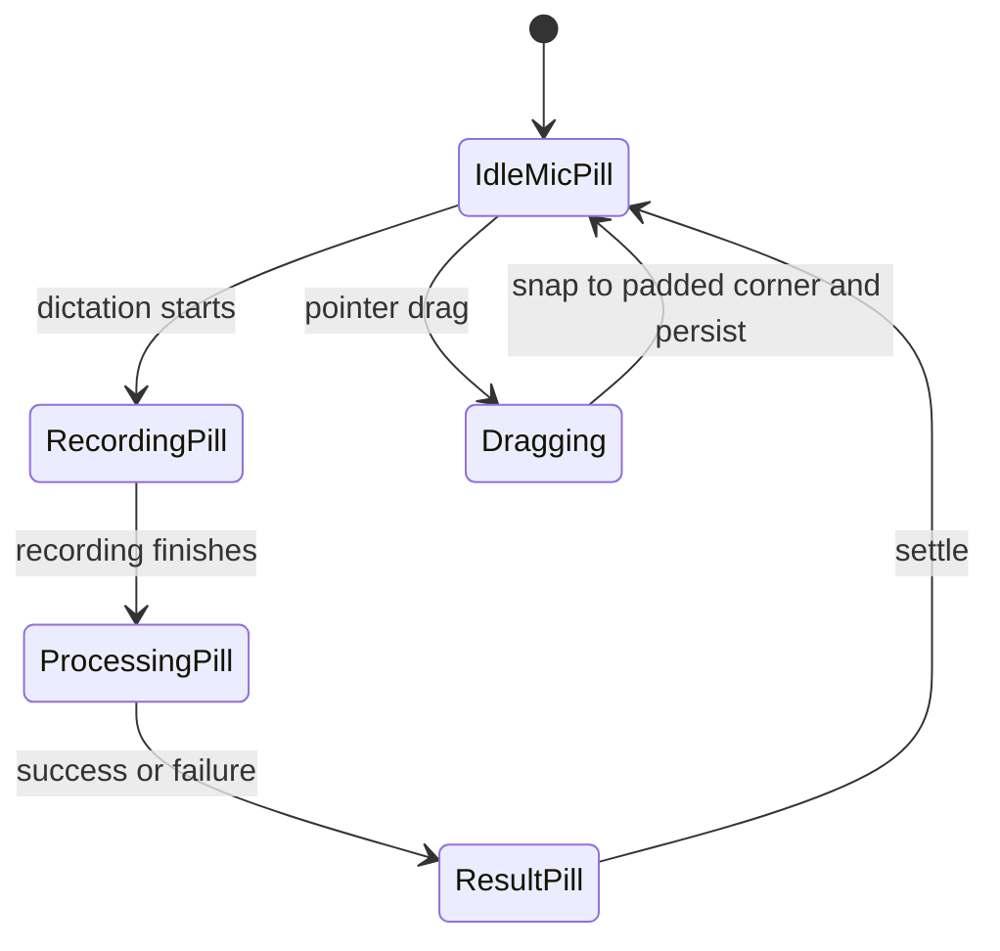
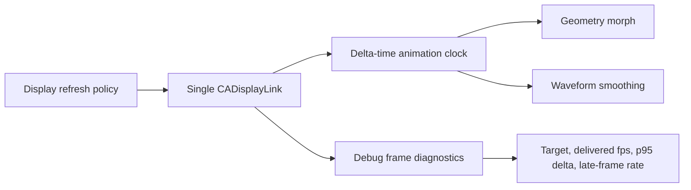
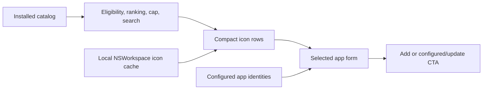

# feat: Polish the floating dictation HUD and Apps settings

## Goal Capsule

Deliver a coherent Cadence interface pass that replaces the edge-attached HUD badge with a responsive floating microphone pill, preserves active-application context in expanded states, makes motion verifiably smooth on 120 Hz displays, and resolves the observed Apps settings inconsistencies. The user request and this plan are authoritative; existing privacy, dictation-pipeline, window-ownership, accessibility, and identity-resolution invariants must remain intact.

Stop and surface a blocker rather than weakening privacy boundaries, introducing a second HUD/window owner, making frame-rate claims without measurable evidence, or shipping an unverified Debug/Release artifact. The implementation tail includes branch validation, review corrections, commit and push, merge to `main`, and a fresh local Debug installation for dogfood; distribution remains out of scope.

---

## Product Contract

### Summary

The HUD should feel like a lightweight object floating over the current workspace rather than a badge attached to the Dock or screen edge. Apps settings should use the same restrained Cadence visual language, accurately represent configured state, and make choosing an application fast and recognizable.

### Problem Frame

The current collapsed HUD is an opaque square application mark positioned flush against screen edges. Its morph and waveform can appear laggy or glitchy even though the display-link policy requests high refresh rates. Apps settings can continue to show an “Add Spotify” action after Spotify is configured, presents an unbounded text-only application list, uses a native blue primary button that conflicts with the surrounding design, and mixes blue, black, and default toggle treatments.

### Requirements

| ID | Requirement | Measurable goal |
| --- | --- | --- |
| R1 | Replace the collapsed HUD application badge with an abstract translucent microphone pill while retaining a minimum 44 × 44 pt interactive target. | Idle HUD renders a microphone, uses a fully rounded floating treatment, and contains no active-app identity; automated view/model assertions and manual light/dark screenshots pass. |
| R2 | Keep the HUD spatially detached from the Dock and screen edges. | Every corner anchor is inset exactly 16 pt from every edge of the screen `visibleFrame`; geometry tests cover all corners, Dock orientations, negative-coordinate displays, and screen changes. |
| R3 | Make the collapsed HUD movable to four padded corners and preserve its position. | Pointer dragging exposes four drop targets and snaps/persists; four explicit “Move to …” actions provide equivalent keyboard and VoiceOver operation and announce the resulting corner. |
| R4 | Show the pinned dictation target application’s icon next to the waveform in the recording pill, without placing application identity in the collapsed state. | Starting dictation in TextEdit morphs the collapsed mic pill into a recording pill that displays the TextEdit icon immediately beside the waveform; missing/stale identity uses the existing privacy-safe fallback without blocking animation. “Expanded tray” remains reserved for the existing idle tray state. |
| R5 | Make pill morphing and waveform motion smooth at the display’s native cadence up to 120 Hz. | Under the controlled protocol below on a 120 Hz display, callback diagnostics report a requested cadence of 120 Hz, steady-state average of at least 115 callbacks/s, p95 callback delta at or below 10 ms, and fewer than 1% late callbacks over a 10-second sample after warm-up; deterministic 60/120 Hz tests prove time-equivalent motion, and Instruments/Core Animation separately confirms presented-frame smoothness without recurring hitch bands. |
| R6 | Prevent animation work from degrading accessibility or idle efficiency. | Reduce Motion removes geometry morphing while preserving immediate state feedback; the display link pauses after stable/collapsed states; icon loading and material setup do not occur per frame. |
| R7 | Make configured-app state truthful after add/update operations. | After Spotify is saved, selection remains hydrated from persistence, a “Configured” badge appears, and the primary action becomes “Update Spotify” in the same session and after reopening Settings; exact runtime/config identity semantics, never display name alone, determine the match. |
| R8 | Replace the unbounded text-only application list with a compact icon-based picker. | Default results show no more than 12 ranked, user-facing apps with icons; helper/background bundles are excluded using explicit catalog metadata; search exposes matching eligible apps; “Choose app…” may select a valid app excluded by curation; empty, loading, read-failure, and icon-fallback states are covered. |
| R9 | Align the Apps primary action with Cadence’s visual language. | The Apps CTA no longer renders as the native blue bordered-prominent control and has deterministic normal, hover, pressed, disabled, loading, focus, and dark/light appearances. |
| R10 | Use one canonical toggle treatment across Settings. | All Settings switches use the shared Cadence toggle style, with identical on/off color semantics and preserved keyboard, focus, VoiceOver, disabled, and Reduce Motion behavior. |
| R11 | Preserve platform and product boundaries. | No transcript, app identity, icon, or frame diagnostic is sent to analytics or remote services; no duplicate window ownership; Debug build remains local-only. |

### Actors and Key Flows

- A1. A user dictates into the currently focused macOS application.
- A2. A user configures per-application Scribe behavior in Settings.
- F1. Idle → recording: the floating microphone pill morphs into the recording pill, pins the dictation target identity, shows its icon beside the waveform, and animates at the active display cadence.
- F2. Recording → processing → completion/error: the pill preserves spatial continuity, communicates state, then returns to the draggable collapsed microphone pill.
- F3. Reposition: the user drags the collapsed pill, sees padded corner targets, drops, and the preference persists.
- F4. Configure app: the user searches or browses a curated icon list, selects Spotify, saves it, and immediately sees configured/update state without a duplicate add affordance.

### Acceptance Examples

- AE1. Given the HUD is idle at bottom-right, when it appears on a display with a bottom Dock, then the pill remains fully rounded and visibly separated from both right and bottom visible-frame edges by the configured inset.
- AE2. Given TextEdit is focused, when dictation starts, then the mic pill expands smoothly and the TextEdit icon appears adjacent to the waveform without synchronous icon resolution on the animation path.
- AE3. Given a 120 Hz display and a warmed-up 10-second recording, when diagnostics sample display-link delivery, then R5’s delivered-frame, p95 delta, and late-frame thresholds pass.
- AE4. Given Reduce Motion is enabled, when dictation starts, then state content updates immediately without a morph animation and remains fully operable.
- AE5. Given Spotify is not configured, when it is selected and saved, then it appears once in Configured apps and the CTA no longer says “Add Spotify.”
- AE6. Given the Apps picker opens with no search term, then it presents at most 12 eligible icon rows and omits nested helpers; entering a query broadens matching eligible results without losing the manual chooser escape hatch.
- AE7. Given Settings categories with switches, when the user navigates among them, then every on state and every off state uses the same canonical Cadence semantics.

### Scope Boundaries

In scope: HUD visuals, geometry, drag/snap persistence, state transitions, display-link measurement, Apps picker projection and icon loading, configured CTA state, the Apps primary control, and Settings toggle consistency.

Out of scope: changing dictation transcription behavior, meeting capture, adding analytics, redesigning unrelated note surfaces, changing provider contracts, shipping/notarizing a Release DMG, or promising 120 fps on hardware whose maximum refresh rate is lower.

### Success Metrics

- All R1–R11 acceptance criteria and AE1–AE7 pass.
- Targeted HUD/catalog/presentation tests and the complete XCTest suite pass with no privacy-canary regression.
- The installed app passes launch/window verification and a Computer dogfood pass for idle, drag, recording, processing, Settings add/update, picker, and toggle states.
- A 120 Hz-capable screen produces an ephemeral debug diagnostic summary meeting R5’s callback thresholds plus an Instruments/Core Animation presented-frame check. If such hardware is unavailable during CI, deterministic clock tests remain required and the hardware measurement is explicitly reported as unavailable rather than inferred.

---

## Planning Contract

### Key Technical Decisions

| ID | Decision | Rationale |
| --- | --- | --- |
| KTD1 | Retain the existing single `HUDWindowController` and focused-application resolver; change only presentation and geometry contracts. | Protects window ownership, session pinning, and privacy-tested identity behavior. |
| KTD2 | Use a fully rounded material-backed pill with a restrained tint, stroke, and shadow; keep the animated subtree small. | Creates the desired floating abstraction without paying per-frame material or icon construction costs. |
| KTD3 | Make the four corners the user-facing targets; set bottom-right for new installs and migrate legacy `bottomCenter` to bottom-right once behind a versioned preference key. | Matches the requested corner model while making migration deterministic and reversible by resetting only the migration marker during rollback. |
| KTD4 | Base all placement on the screen’s visible frame plus one named safe inset, including multi-display and Dock changes. | Produces measurable separation while respecting menu bar and Dock reservations. |
| KTD5 | Keep one view-bound `CADisplayLink`, delta-time-driven animation, and refresh policy up to 120 Hz; optimize update granularity rather than adding timers. | The existing architecture is correct for ProMotion; glitch risk is in work per tick and observable delivery, not lack of another clock. |
| KTD6 | Add Debug/test-only, in-memory frame diagnostics; distinguish callback cadence from presented frames. | Makes the motion claim falsifiable without expanding analytics or logging private state. No Release persistence or analytics is permitted. |
| KTD7 | Reuse `ApplicationIdentityResolver.runtimeExactConfiguration` semantics: bundle identifier plus standardized bundle URL, with the existing unique-lineage rebind path handled separately. | Prevents stale/duplicate UI, covers moved/missing/ambiguous applications, and avoids invented or display-name matching. |
| KTD8 | Build a bounded picker projection over the installed catalog and load icons through a cached local service off the animation/main rendering path. | Preserves catalog identity coverage while presenting only useful apps quickly. |
| KTD9 | Define canonical Cadence primary-action and toggle styles in the design system, then migrate the intended call sites. | Fixes inconsistency at its source while retaining shared accessibility behavior. |

### High-Level Technical Design

### Sequencing and Ownership

HUD model/geometry and performance diagnostics land before the SwiftUI visual morph so tests define the new positioning and timing contract. Apps picker state and icon projection land before the final design-system migration. Independent HUD and Apps work may run in parallel only when workers own disjoint files; shared design-system or test files require sequential integration.

### Risks and Mitigations

- Material blur and publishing waveform bars every display tick can increase GPU/SwiftUI work. Keep material static, avoid layout-invalidating state, and measure delivered cadence before and after.
- Synthetic CI cannot prove physical 120 Hz delivery. Require deterministic timing tests plus local hardware diagnostics; never substitute a screenshot or requested frame rate for delivered performance.
- Migrating `bottomCenter` could surprise existing users. Perform a one-time deterministic migration to bottom-right and preserve explicit corner preferences.
- Filtering application bundles can hide legitimate tools. Apply eligibility/ranking to the picker projection, retain search and “Choose app…” escape hatches, and keep the underlying catalog complete.
- A global control-style change can affect unrelated surfaces. Add style-state coverage and migrate explicit Settings call sites rather than changing destructive or menu-specific semantics accidentally.

---

## Implementation Units

### U1. Define padded HUD geometry and migration

**Goal:** Establish the new four-corner floating placement contract and persisted-position migration.

**Requirements:** R2, R3, R11; AE1.

**Dependencies:** None.

**Files:** `Cadence/Models/DictationModels.swift`, `Cadence/Services/HUDWindowController.swift`, `CadenceTests/HUDServicesTests.swift`, `CadenceTests/CadenceTests.swift`.

**Approach:** Replace edge-flush origins and flattened radii with a 16 pt visible-frame inset and fully rounded geometry. Preserve the current controller and drag lifecycle, expose four padded drop targets plus four accessible move actions, and migrate legacy bottom-center state once via a versioned marker without rewriting valid corner choices.

**Patterns to follow:** Existing `HUDPosition`, screen-selection, negative-coordinate display, persistence, and drop-zone tests.

**Test scenarios:**

1. Covers AE1. Each corner computes the exact configured horizontal/vertical inset for displays with bottom, left, and right Dock visible frames.
2. A negative-origin secondary display produces correct local corner coordinates.
3. A persisted legacy bottom-center value migrates once to bottom-right; every persisted corner remains unchanged.
4. Drag/drop chooses the nearest eligible corner, persists it, and reconstructs at the same padded origin; each accessible Move action produces the same result and announcement.
5. A display removal or visible-frame change relocates the pill to a valid padded corner without going offscreen.

**Verification:** Geometry, migration, screen-change, persistence, and drop-zone tests pass; manual drag shows visible space around the pill in all four corners.

### U2. Build the translucent microphone pill and state hierarchy

**Goal:** Implement the collapsed and expanded HUD visual contract without changing dictation semantics.

**Requirements:** R1, R4, R6, R11; AE2, AE4.

**Dependencies:** U1.

**Files:** `Cadence/UI/HUDView.swift`, `Cadence/UI/CadenceDesignSystem.swift`, `Cadence/Services/HUDWindowController.swift`, `CadenceTests/HUDServicesTests.swift`, `CadenceUITests/AdaptiveScribeUITests.swift` or a new HUD UI-test file added through `project.yml`.

**Approach:** Replace the collapsed application mark with a compact horizontal capsule (approximately 36 × 28 pt) inside the 44 × 44 pt hit target, using a medium-weight `mic.fill`, static material/tint, subtle one-pixel-equivalent stroke, and soft elevation shadow. Keep application identity out of idle; reuse the pinned target-app cue beside the recording waveform and status content, using icon-only presentation to keep the pill compact. Define hover, pressed, lifted-drag, Increase Contrast, Reduce Transparency, Reduce Motion, cancellation, error, and success treatments.

**Patterns to follow:** Existing application cue resolver, tooltip material treatment, HUD pointer surface, theme tokens, and accessibility identifiers.

**Test scenarios:**

1. Idle state exposes a microphone label/icon and no focused-app name or icon.
2. Covers AE2. Recording with a resolved TextEdit identity renders its icon beside the waveform; missing identity renders the existing fallback.
3. Processing, success, cancelled, and error states preserve the padded anchor and return to the collapsed mic pill.
4. Covers AE4. Reduce Motion changes state immediately without animated geometry while leaving content and actions intact.
5. Light/dark, Increase Contrast, and Reduce Transparency appearances maintain legible mic, waveform, icon, border, and status contrast with an opaque fallback where required.
6. The collapsed hit target remains at least 44 × 44 pt and exposes a discoverable drag accessibility hint.

**Verification:** State-model/view tests pass and Computer screenshots confirm the intended hierarchy across idle, recording, processing, and completion.

### U3. Instrument and optimize ProMotion animation delivery

**Goal:** Remove laggy/glitchy pill motion and prove delivered cadence up to 120 Hz.

**Requirements:** R5, R6, R11; AE3, AE4.

**Dependencies:** U1, U2.

**Files:** `Cadence/Services/HUDWindowController.swift`, `Cadence/Models/DictationModels.swift`, `CadenceTests/HUDServicesTests.swift`, optional new `Cadence/Services/HUDFrameDiagnostics.swift` and its matching test file if separation improves testability.

**Approach:** Retain the view-bound display link and delta-time clock, profile the tick path, remove redundant published/layout work, pre-resolve static visual assets, and coalesce updates where values do not materially change. Add a Debug/test-injected, in-memory accumulator that ignores warm-up and records only anonymous deltas/aggregates—never wall-clock timestamps, screen/app/session identity, transcript, or audio. It reports target callback cadence, delivered callback cadence, p95 delta, late-callback percentage, and informational maximum delta, with explicit OSLog privacy. Release builds do not persist or expose diagnostics. Pause the link when stable.

**Measurement protocol:** Disable Low Power Mode and screen mirroring; use the built-in 120 Hz display at its native refresh; warm up for 2 seconds; drive a deterministic continuously changing waveform fixture for 10 seconds so the link cannot intentionally pause; exclude warm-up and the first invalid delta; define “late” as greater than 1.5× the requested interval. Use callback metrics for scheduling and Instruments/Core Animation for presented-frame validation.

**Execution note:** Establish deterministic diagnostics tests before optimizing; compare before/after hardware samples when a 120 Hz screen is available.

**Patterns to follow:** Existing refresh-policy, 60/120 equivalence, stable-pause, and Reduce Motion timing tests. Use `Logger`, never analytics or transcript/app-name payloads.

**Test scenarios:**

1. Deterministic 120 Hz samples calculate approximately 120 delivered fps, p95 below the threshold, and zero late frames.
2. Deterministic 60 Hz samples produce equivalent animation progress over equal wall-clock time.
3. A synthetic delta above 1.5× expected interval increments late-frame counts and affects p95/max correctly.
4. Warm-up and invalid/zero deltas do not corrupt metrics.
5. Morph and waveform share one clock, do not restart on view refresh, and pause once stable.
6. Reduce Motion bypasses morph work and does not keep the display link running unnecessarily.
7. Covers AE3. The controlled local 10-second 120 Hz fixture meets R5 callback thresholds and the presented-frame trace has no recurring hitch bands, or the run explicitly records that suitable hardware was unavailable.

**Verification:** Deterministic timing tests pass; Instruments/Core Animation or the debug diagnostic reports the R5 thresholds on suitable hardware; no content-bearing log fields are introduced.

### U4. Make configured-app state accurate

**Goal:** Eliminate the stale “Add Spotify” state and keep the selected form synchronized with saved configuration.

**Requirements:** R7, R11; AE5.

**Dependencies:** None.

**Files:** `Cadence/UI/SettingsView.swift`, relevant AppModel/model persistence files identified by implementation exploration, `CadenceTests/InstalledApplicationCatalogTests.swift` or a new Apps settings presentation test file, `CadenceUITests/AdaptiveScribeUITests.swift`.

**Approach:** Introduce a pure configured-state projection that reuses exact runtime/config identity matching and existing unique-lineage rebind behavior. Model exact configured, unique rebind, missing, and ambiguous states explicitly. After save, keep selection, hydrate the persisted form, display a Configured badge, change the CTA to “Update <app>,” and prevent duplicate configured rows.

**Patterns to follow:** Existing application identity resolver, configured-app upsert, Settings accessibility identifiers, and AppModel explicit setters.

**Test scenarios:**

1. Covers AE5. Saving a new Spotify identity changes the CTA away from “Add Spotify” immediately and creates exactly one configured row.
2. Reopening Settings reconstructs the same configured/update state from persistence.
3. Two apps with the same display name but different canonical identities do not collide.
4. Updating guidance/preset for an existing app edits that record rather than duplicating it.
5. A save failure retains the editable selection and presents recoverable state without falsely showing configured.

**Verification:** Presentation/domain tests and the add→configured UI smoke pass.

### U5. Create the curated icon-based application picker

**Goal:** Make application selection compact, recognizable, and useful without weakening identity correctness.

**Requirements:** R8, R11; AE6.

**Dependencies:** U4.

**Files:** `Cadence/UI/SettingsView.swift`, `Cadence/Services/InstalledApplicationCatalogService.swift`, `Cadence/Models/ApplicationIdentityModels.swift` only if metadata is required, optional new picker projection/icon-cache files under `Cadence/Services/` or `Cadence/UI/`, `CadenceTests/InstalledApplicationCatalogTests.swift`, new picker projection tests, `CadenceUITests/AdaptiveScribeUITests.swift`.

**Approach:** Keep the full catalog as the identity source, extend its descriptor/load result with user-facing eligibility metadata (`LSUIElement`, `LSBackgroundOnly`, package location) and a non-secret loading/error state, then create a deterministic UI projection that filters helpers, ranks top-level/running/common apps, caps the default at 12, and searches eligible results. The manual chooser may bypass curation after normal bundle validation. Use an actor/main-actor-safe local icon loader keyed by standardized bundle URL, with bounded cache, cancellation, prepared images before publication, and invalidation on catalog refresh; do not place `NSImage` in Sendable domain models.

**Execution note:** Characterize current catalog identity behavior before adding UI eligibility metadata or filtering.

**Patterns to follow:** Existing catalog actor/caching behavior, ApplicationIconResolver arbitration principles, Swift concurrency boundaries, and local `NSWorkspace` APIs.

**Test scenarios:**

1. Covers AE6. Empty search returns at most 12 ranked eligible apps with deterministic ordering.
2. Nested helpers, `LSUIElement`, and background-only bundles are omitted from default and searched eligible results.
3. Search is case-insensitive and returns eligible matches outside the default cap.
4. Icons load from canonical URLs, cache, and fall back without blocking or changing identity.
5. Catalog refresh updates projection without duplicate rows or stale selection.
6. Empty, loading, permission/read failure, and no-results states retain “Choose app…”.

**Verification:** Catalog and projection tests pass; Computer dogfood confirms compact icon rows, search, fallback, and manual selection.

### U6. Unify Cadence primary actions and Settings toggles

**Goal:** Remove native-blue CTA drift and inconsistent switch styling across Settings.

**Requirements:** R9, R10, R11; AE7.

**Dependencies:** U4, U5.

**Files:** `Cadence/UI/CadenceDesignSystem.swift`, `Cadence/UI/CadenceActionButton.swift`, `Cadence/UI/SettingsView.swift`, `Cadence/UI/ScribeProviderManagementView.swift`, other Settings toggle call sites discovered by search, design-system/presentation tests, `CadenceUITests/AdaptiveScribeUITests.swift`.

**Approach:** Introduce an opt-in neutral Cadence primary-action style for Apps/Settings rather than changing the global `CadenceActionButton.primary` contract. Define one canonical Settings toggle style with theme tokens and migrate Settings raw/native/custom switches through the shared component while preserving destructive distinctions and native interaction semantics. Keep animation restrained and honor Reduce Motion.

**Patterns to follow:** Existing CadenceActionButton roles, CadenceToggle wrapper, FlowTheme tokens, focus rings, minimum hit targets, and accessibility labels.

**Test scenarios:**

1. Apps CTA renders the Cadence treatment in normal, hover, pressed, disabled, loading, focused, light, and dark states without native accent-blue fill.
2. Covers AE7. Representative General, Dictation, Scribe, Apps, Provider, Privacy, and Advanced toggles use the same on/off semantics.
3. Keyboard Space toggles focused controls; VoiceOver reports role, label, and value; disabled state cannot mutate.
4. Reduce Motion removes ornamental control motion without changing state feedback.
5. Destructive actions retain their distinct destructive role and are not restyled as primary.

**Verification:** Design-system/presentation tests pass and a full Settings dogfood pass finds no blue/black switch divergence or native-blue Apps CTA.

---

## Verification Contract

The worker must run `xcodegen generate` only when new files or project structure require it, then targeted HUD, application-catalog, picker-presentation, Settings, privacy, and release-contract tests. The final branch gate is `./script/build_and_run.sh --test`, followed by `./script/build_and_run.sh --verify`, `git diff --check`, `git status --short`, and `git diff --stat`. A local XCTest Accessibility authorization failure is a harness failure—not green and not a product assertion failure; targeted non-UI tests must still pass and UI dogfood remains required after authorization is restored.

Runtime verification must use the installed Debug app and include:

1. Idle mic pill in light and dark contexts.
2. Drag and snap to every corner with visible right/bottom/top/left padding, including a secondary display when available.
3. TextEdit recording with the active-app icon beside the waveform, then processing and completion/cancellation.
4. Reduce Motion behavior.
5. The controlled R5 measurement protocol on a 120 Hz display when available, including callback diagnostics and a presented-frame trace; otherwise report the unavailable hardware and do not infer a result.
6. Spotify add→configured/update transition, reopen persistence, picker default/search/manual paths, icon fallback, and toggle consistency across all Settings categories.

No frame-rate, privacy, or UI acceptance claim may be based solely on a successful build.

---

## Definition of Done

- U1–U6 satisfy their cited requirements and test scenarios.
- R1–R11 and AE1–AE7 have explicit passing evidence or a clearly reported hardware-only limitation that does not conceal a software failure.
- The full test suite, launch verification, privacy checks, and diff hygiene pass.
- Computer dogfood confirms the installed app behavior across HUD and Settings flows.
- Frame diagnostics are local/content-free and no new analytics payload crosses the privacy boundary.
- No duplicate window owner, abandoned experiment, unused style, temporary DerivedData, or generated debug artifact remains in the branch.
- Changes are committed and pushed on `codex/hud-settings-polish`, reviewed, merged into `main`, `origin/main` contains the merge, and a fresh `/Applications/Cadence Debug.app` is installed and launched.
