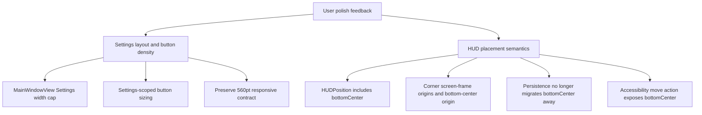

## Goal Capsule

- **Objective:** Fix the Settings surface so the right-hand detail side uses the available desktop width and Settings buttons feel appropriately compact, while restoring a usable bottom-center HUD position and moving corner HUD snaps to true padded screen corners.
- **Authority hierarchy:** User feedback in this session is the source of truth; the July 12 HUD four-corner-only choice is superseded where it conflicts with bottom-center placement.
- **Execution profile:** Code implementation on a fresh `codex/` branch, followed by tests, review, commit, push, PR, and CI watch through the LFG pipeline.
- **Stop conditions:** Stop if the implementation would require a new product decision beyond the stated layout/density/HUD-placement intent, if macOS automation permissions block only dogfood interaction after automated tests pass, or if CI reveals a non-convergent failure.
- **Tail ownership:** LFG owns implementation, review-fix persistence, PR creation, and CI watch; merge remains a separate user decision unless explicitly requested.

---

## Product Contract

### Summary

The app should feel less cramped and less native-default in Settings, and the floating dictation HUD should support the placement model the user expects: corners are real corners with padding, and bottom-center is a distinct supported position.

### Problem Frame

The current main-window Settings surface caps the entire Settings view at `620pt`. Because the Settings shell includes a `176pt` section rail plus a `20pt` gap, the right-hand detail content can be squeezed to roughly `424pt` before card padding, making the right side feel too narrow on normal desktop widths. Settings buttons also read too large for this dense configuration surface.

The HUD placement model was recently simplified to four corners. That removed bottom-center from `HUDPosition.allCases`, aliases bottom-center behavior to bottom-right, and migrates stored bottom-center values away. The user now wants bottom-center restored and corner snap targets pushed to the true screen corners with padding instead of sharing the current line that makes bottom-center impractical.

### Requirements

- R1. Settings detail width expands on normal desktop windows.
  - The Settings detail column must no longer be constrained by the `620pt` main-window cap when the app window has more available horizontal space.
  - On desktop-width main windows, the right-hand detail card area must be visibly wider than today and should target at least a mid-700pt usable detail surface where the window allows it.
- R2. Existing responsive Settings behavior remains intact.
  - The compact breakpoint remains `560pt`.
  - The `176pt` rail behavior at and above the breakpoint remains available.
  - Existing category coverage and compact selector behavior must continue to pass at `520`, `559`, `560`, and `720` fixture widths.
- R3. Settings buttons use a more compact Cadence-native density.
  - Settings CTAs should avoid oversized native default sizing.
  - Primary Settings CTAs should use a smaller height/padding treatment than the current large-looking native or `32pt` custom button presentation.
  - The change should be scoped to Settings-facing controls unless a shared button style already exists specifically for Settings density.
- R4. Button accessibility and clarity are preserved.
  - Buttons remain keyboard/focus accessible and keep clear labels.
  - Visual density may decrease, but the interaction should not become ambiguous or visually fragile.
- R5. HUD bottom-center is a first-class supported placement.
  - Users can drag/snap the HUD to bottom-center.
  - Stored bottom-center preferences persist as bottom-center instead of migrating to bottom-right.
  - Accessibility move actions expose bottom-center.
- R6. HUD corners snap to true padded screen corners.
  - Corner origins should use the physical screen frame with `HUDMetrics.screenInset` padding rather than being pulled inward by Dock/menu-bar `visibleFrame` constraints.
  - Bottom-center should remain distinct from the corner baseline and should use a center-bottom calculation that respects usable vertical space enough to avoid Dock overlap.
- R7. HUD placement animation and interaction quality do not regress.
  - Drag snapping remains stable.
  - The restored bottom-center position must not reintroduce laggy/glitchy movement or layout jumps.
  - Existing expanded-pill active-window-icon behavior from the prior HUD polish remains intact.

### Acceptance Examples

- AE1. On a normal main app window, opening Settings shows a substantially wider right-hand detail area than before, with cards filling the available right side instead of feeling constrained to a narrow column.
- AE2. At `559pt`, Settings uses the compact category selector; at `560pt`, it uses the rail layout, matching the existing contract.
- AE3. Settings action buttons such as Apps add/update/choose/refresh and provider setup controls appear compact and aligned with the app’s softer design language rather than large native macOS defaults.
- AE4. Dragging the HUD near the bottom center of the screen snaps to a bottom-center pill position and persists that choice across HUD/session recreation.
- AE5. Dragging the HUD near any corner places it at that screen corner with consistent `16pt` padding from the physical screen edge.

### Scope Boundaries

- This plan does not redesign the Settings information architecture, category list, or app picker UX beyond density/width effects needed for the requested polish.
- This plan does not replace the HUD animation system wholesale. It protects smoothness while changing placement semantics.
- This plan does not change privacy, dictation, transcription, provider behavior, or meeting capture behavior.
- This plan does not distribute a Release build; install/test targets should use the Debug app.

### Sources

- User feedback in this session: Settings right side too narrow; buttons too large; bottom-center HUD placement unavailable; corner HUD placement should be the extreme screen corner with padding.
- Repository evidence gathered by Terra on 2026-07-13:
  - `Cadence/UI/MainWindowView.swift` caps `SettingsView` at `maxContentWidth: 620`.
  - `Cadence/UI/SettingsView.swift` uses a `560pt` compact breakpoint, a `176pt` rail, and a `20pt` rail/content gap.
  - `Cadence/Models/DictationModels.swift` excludes bottom-center from `HUDPosition.allCases` and aliases its origin/label behavior.
  - `Cadence/Services/HUDWindowController.swift` migrates or rejects stored bottom-center preferences.

---

## Planning Contract

### Key Technical Decisions

- KTD1. Widen Settings at the container boundary first.
  - The narrow right side is primarily caused by `MainWindowView` capping the entire Settings view, not by individual cards. Raise or remove that cap for Settings in the main window before changing card internals.
- KTD2. Preserve the proven `560pt` Settings breakpoint.
  - Prior validation found the exact `560pt` breakpoint to be the trustworthy responsive contract. This pass should add width/density coverage without destabilizing that contract.
- KTD3. Scope button-density changes to Settings.
  - `CadenceActionButton` is used across product surfaces. Avoid a global style change unless the implementation proves all call sites want the smaller Settings density. Prefer a Settings-scoped control size or button-style parameter.
- KTD4. Treat bottom-center as a restored product state, not a legacy alias.
  - `HUDPosition.bottomCenter` should appear in case iteration, nearest-position snapping, persistence, accessibility actions, and tests.
- KTD5. Separate physical corner math from center-bottom math.
  - Corners should use physical screen-frame edges with padding. Bottom-center can use center-bottom placement that avoids Dock overlap, so the two placement families no longer share a misleading baseline.

### High-Level Technical Design

### Relevant Repository Findings

- `Cadence/UI/MainWindowView.swift` passes `SettingsView(model: model, maxContentWidth: 620)` and applies `24pt` horizontal padding around it.
- `Cadence/UI/SettingsView.swift` decides compact mode with `geometry.size.width < 560`, uses `railWidth = 176`, and gaps rail/content by `CadenceSpacing.lg` (`20pt` in the current local analysis).
- Settings content cards expand to the width offered by the parent; the parent cap is therefore the first load-bearing layout constraint.
- `Cadence/UI/CadenceDesignSystem.swift` contains a custom Settings primary button around `32pt` minimum height and `14pt` horizontal padding, while generic `CadenceActionButton` delegates to native styles without Settings-specific sizing.
- `Cadence/Models/DictationModels.swift` keeps `HUDPosition.bottomCenter` in the enum but excludes it from `allCases`, aliases its accessibility label and origin to bottom-right, and excludes it from nearest-position snapping.
- `Cadence/Services/HUDWindowController.swift` migrates or rejects bottom-center persisted values.
- `Cadence/UI/HUDDropZoneOverlay.swift` and `Cadence/UI/HUDView.swift` expose only positions present in `allCases` or explicit four-corner accessibility actions.
- Existing tests already freeze Settings breakpoints and HUD corner/legacy migration behavior; they must be updated rather than bypassed.

### Ordered Tasks and Dependencies

1. Widen Settings main-window layout while preserving the compact breakpoint behavior.
2. Apply Settings-scoped button-density polish after the wider layout is available, so button dimensions are judged in the intended context.
3. Restore HUD bottom-center as a valid enum/model/persistence/accessibility state.
4. Adjust HUD geometry so corners use true padded physical screen corners while bottom-center remains distinct and usable.
5. Update and add tests for the changed contracts.
6. Run automated validation and, if the Mac UI session is available, install and dogfood the Debug app.

### Risks and Rollback Considerations

- Widening Settings too far could make forms feel loose. Mitigate with a reasonable max width rather than unbounded expansion if full-width looks poor.
- Changing `CadenceActionButton` globally could alter unrelated product surfaces. Mitigate with Settings-scoped sizing or explicit call-site control sizes.
- Physical screen-frame corner math can place bottom corners behind the Dock on some configurations. The requirement specifically asks for corners at true screen corners with padding, while bottom-center should remain usable; tests should encode that distinction.
- Restoring bottom-center can conflict with July 12 migration tests. Update those tests to reflect the new user decision rather than preserving the superseded behavior.

---

## Implementation Units

### U1. Widen Settings detail layout

- **Goal:** Make the right-hand Settings detail area use normal desktop-window width instead of being squeezed by the `620pt` total Settings cap.
- **Requirements:** R1, R2, AE1, AE2
- **Files:**
  - `Cadence/UI/MainWindowView.swift`
  - `Cadence/UI/SettingsView.swift`
  - `CadenceUITests/AdaptiveScribeUITests.swift`
  - `CadenceTests/CadenceControlSemanticsTests.swift`
- **Approach:** Adjust the main-window Settings max width so it accounts for the rail plus a meaningfully wider detail column. Preserve existing `SettingsView` compact logic and rail width unless implementation evidence shows a smaller local layout constant is necessary.
- **Test Scenarios:**
  - Existing `520`, `559`, `560`, and `720` Settings layout fixtures still pass.
  - Add or update a unit/UI assertion proving desktop-width Settings offers a wider detail/card content width than the previous constrained layout.
  - Verify no horizontal clipping in Settings categories with the wider container.
- **Verification:** `./script/build_and_run.sh --test` plus targeted `AdaptiveScribeUITests` if full UI automation is available.

### U2. Compact Settings button density

- **Goal:** Make Settings action buttons visually smaller and more aligned with Cadence’s design language.
- **Requirements:** R3, R4, AE3
- **Files:**
  - `Cadence/UI/CadenceActionButton.swift`
  - `Cadence/UI/CadenceDesignSystem.swift`
  - `Cadence/UI/SettingsView.swift`
  - `Cadence/UI/ScribeProviderManagementView.swift`
  - `CadenceTests/CadenceControlSemanticsTests.swift`
- **Approach:** Prefer a Settings-scoped compact treatment: smaller control size, reduced horizontal padding, and around `28pt` visual minimum height for Settings CTAs where appropriate. Avoid changing non-Settings call sites unless the implementation introduces an explicit reusable compact variant.
- **Test Scenarios:**
  - Apps Add/Update CTA no longer uses the current larger visual sizing.
  - Settings action rows and provider/app controls use consistent compact sizing.
  - Accessibility labels and enabled/disabled states remain intact.
- **Verification:** Unit tests for button metrics where available; otherwise SwiftUI/UI fixture assertions plus `./script/build_and_run.sh --test`.

### U3. Restore HUD bottom-center as a supported position

- **Goal:** Make bottom-center selectable, persisted, accessible, and test-covered.
- **Requirements:** R5, R7, AE4
- **Files:**
  - `Cadence/Models/DictationModels.swift`
  - `Cadence/Services/HUDWindowController.swift`
  - `Cadence/UI/HUDDropZoneOverlay.swift`
  - `Cadence/UI/HUDView.swift`
  - `CadenceTests/HUDServicesTests.swift`
  - `CadenceTests/CadenceTests.swift`
- **Approach:** Include `bottomCenter` in HUD position iteration/snapping, give it its own label/origin behavior, stop migrating persisted bottom-center away, and add bottom-center to accessibility move actions/drop zones.
- **Test Scenarios:**
  - `HUDPosition.allCases` or equivalent exposed positions include bottom-center.
  - A bottom-center drag point snaps to `.bottomCenter`.
  - A persisted bottom-center preference round-trips as bottom-center.
  - Accessibility actions include bottom-center.
- **Verification:** HUD model/service unit tests plus `./script/build_and_run.sh --test`.

### U4. Move HUD corners to true padded screen corners

- **Goal:** Make corner HUD placement use physical screen corners with `HUDMetrics.screenInset` padding while keeping bottom-center usable and distinct.
- **Requirements:** R6, R7, AE5
- **Files:**
  - `Cadence/Models/DictationModels.swift`
  - `Cadence/Services/HUDWindowController.swift`
  - `CadenceTests/HUDServicesTests.swift`
  - `CadenceTests/CadenceTests.swift`
- **Approach:** Split corner-origin calculation from center-bottom calculation. Corners should reference `screen.frame` plus inset; bottom-center should compute a centered x-origin and a y-origin that avoids Dock overlap where needed. Keep movement stable and avoid layout loops during drag.
- **Test Scenarios:**
  - Each corner origin is `16pt` from the physical screen-frame edge for a known fixture.
  - Bottom-center origin is horizontally centered and not aliased to bottom-right.
  - Nearest-position tests distinguish bottom-left, bottom-right, and bottom-center.
  - Existing expanded-pill attachment behavior remains correct for bottom-center.
- **Verification:** HUD geometry unit tests plus `./script/build_and_run.sh --test`.

### U5. Install and dogfood the Debug build

- **Goal:** Verify the polished behavior in the local installed app where automation permissions permit.
- **Requirements:** R1-R7, AE1-AE5
- **Files:**
  - `script/build_and_run.sh`
  - `scripts/install_dev_app.sh`
- **Approach:** Build, install, and launch the Debug app after tests. If Computer/XCTest UI automation is blocked by macOS Accessibility authorization or a locked session, record that as a harness limitation and keep automated build/test evidence as the acceptance baseline.
- **Test Scenarios:**
  - Settings opens and visually presents a wider right-hand detail side.
  - Settings buttons appear compact.
  - HUD can be moved to bottom-center and true padded corners.
- **Verification:** `./script/build_and_run.sh --verify`; optional Computer dogfood if the Mac session is unlocked and authorized.

---

## Verification Contract

| Check | Command | Covers | Exit signal |
| --- | --- | --- | --- |
| Full Debug test suite | `./script/build_and_run.sh --test` | U1-U4 | XCTest suite passes without product assertion failures. |
| Targeted Settings UI fixtures | `xcodebuild test -project Cadence.xcodeproj -scheme CadenceUITests -configuration Debug -destination 'platform=macOS' CODE_SIGNING_ALLOWED=YES CODE_SIGN_STYLE=Manual CODE_SIGN_IDENTITY=- DEVELOPMENT_TEAM= -only-testing:CadenceUITests/AdaptiveScribeUITests` | U1, U2 | Breakpoint/category fixtures pass when the local automation session has Accessibility authorization. |
| Debug install/launch verification | `./script/build_and_run.sh --verify` | U5 | Debug app builds, installs, launches, and main window appears. |
| Git/CI verification | GitHub Actions on the PR | U1-U5 | CI build/test jobs are green or any residual is durably reported by the LFG babysit step. |

If local UI automation fails before exercising app behavior due to macOS Accessibility authorization, treat it as harness evidence, not product failure, and rely on unit/full-test/verify checks plus CI.

---

## Definition of Done

- The plan remains at `artifact_readiness: implementation-ready`, `execution: code`.
- Settings no longer feels squeezed on the right-hand side in normal desktop-width usage.
- Settings CTAs use a compact, consistent visual density and do not look like oversized native defaults.
- The exact `560pt` Settings responsive breakpoint remains covered.
- HUD bottom-center is selectable, persisted, accessible, and separately test-covered.
- HUD corner positions use true physical screen corners with `HUDMetrics.screenInset` padding.
- No abandoned exploratory code, temporary derived data, or local-only artifacts remain in the diff.
- Automated validation has been run and recorded.
- Changes are committed, pushed, opened as a PR, and CI is watched according to the LFG pipeline.
