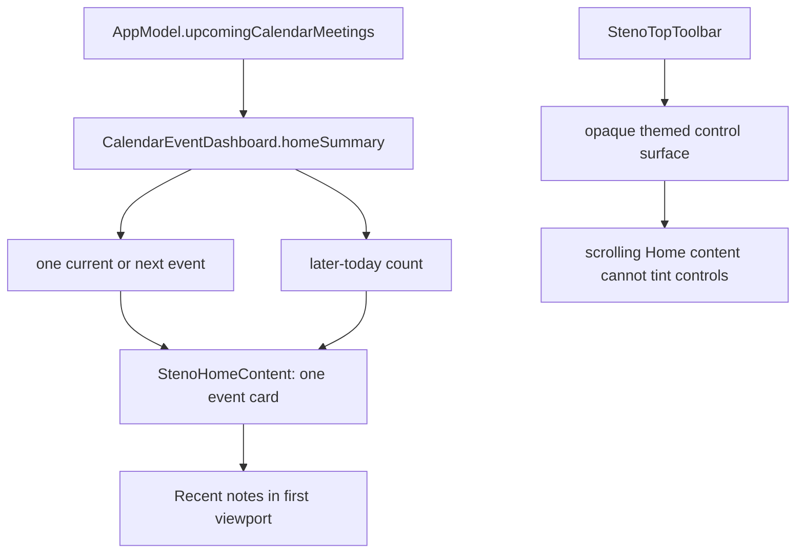

# feat: Focus the home calendar context

## Goal Capsule

Make the Home screen a notes-first workspace. It will show only the meeting that is immediately relevant from the current time, a compact count of later meetings today, and no tomorrow events. The date leads the page visually; `Upcoming` remains a secondary label with an icon-only refresh control. The persistent top-right controls must read as one opaque or correctly material-backed toolbar while content scrolls in either appearance mode.

## Problem Frame

`StenoHomeContent` currently renders every `CalendarEventDashboard.groups` result. That projection deliberately includes today and tomorrow, so multiple calendar cards push `Recent notes` below the first viewport. The date is a 13-point secondary label, while the generic `Upcoming` header carries equal or greater weight. Its full-text refresh button sits in the date row. Separately, `MainWindowView` overlays `StenoTopToolbar` over detail content with a thin outer background, but the toolbar’s individual controls are transparent; the control cluster can look detached and expose a scrolling card’s tint behind it.

## Scope Boundaries

### In scope

- A home-only calendar projection for events that have not ended today, yielding the current/next event plus the number of later events today.
- Home layout and copy for populated, no-more-today, loading, and calendar-not-connected states.
- A stronger date treatment, secondary `Upcoming` heading, and icon-only refresh action at that heading’s trailing edge.
- A coherent, contrast-safe top-toolbar surface that blocks visual bleed-through in light and dark appearance while the Home detail scrolls.
- Focused unit coverage for the projection and manual/app verification instructions covering scroll and appearance states.

### Non-goals

- Do not alter the fetched/cache window, Google Calendar connection flow, menu-bar calendar list, meeting detection, recording actions, or calendar event deep links.
- Do not add a calendar agenda, expose tomorrow on Home, change note ordering, or redesign other detail screens.
- Do not change global appearance preferences or app window ownership.

## Findings and Constraints

- `Cadence/UI/MainWindowView.swift` owns both Home composition and the persistent `StenoTopToolbar`; Home is the only target surface.
- `Cadence/Services/CalendarEventCacheStore.swift` owns `CalendarEventDashboard.groups`, which remains appropriate for the menu-bar agenda and must not be changed to Home semantics.
- `Cadence/App/AppModel.swift` fetches/caches through the end of tomorrow and uses the same event collection for meeting detection. The new Home projection must be a read-only presentation helper over that collection.
- `CadenceTests/CadenceTests.swift` already has deterministic dashboard tests using injected `now` and `Calendar`; extend that seam rather than attempting brittle SwiftUI layout tests.
- The standard `./script/build_and_run.sh --verify` preflight is currently blocked locally by an Xcode simulator-framework plugin mismatch. The implementation should still run the normal command and distinguish an environment failure from source failures.

## Key Technical Decisions

1. Add a distinct `CalendarEventDashboard` home-summary value type/helper rather than narrowing `groups`. The Home needs a current-time, today-only projection; the existing group helper intentionally serves today-and-tomorrow consumers.
2. Treat any event whose `endDate` is after `now` and whose `startDate` is before tomorrow as eligible. This preserves the current app’s treatment of an in-progress meeting as immediately relevant, then counts only events after the displayed event as “more today.”
3. Keep calendar interactions on the existing event card and callbacks. Only one card will be rendered, so Join + Record/Open Event behavior and accessibility identifiers remain stable.
4. Give `StenoTopToolbar` its own rounded background and border (using existing `FlowTheme` colors) rather than relying on the parent overlay background. This makes the cluster a single visual object and guarantees a non-transparent backing behind every control in light and dark mode.

## High-Level Technical Design

## Implementation Units

### U1. Add a deterministic Home calendar presentation projection

**Goal:** Provide a small, testable today-only summary for the Home view without changing fetch, cache, menu, or detection behavior.

**Dependencies:** None.

**Files:** `Cadence/Services/CalendarEventCacheStore.swift`; `CadenceTests/CadenceTests.swift`.

**Approach:**

1. Define a value type with an optional immediate event and a count of remaining meetings today.
2. Filter/sort with an injected current date and calendar; ignore ended events, tomorrow events, and later events.
3. Use the first eligible event as the displayed event and calculate the remaining count from subsequent eligible events.
4. Leave `groups` and `endOfTomorrow` unchanged.

**Patterns to follow:** `CalendarEventDashboard.groups(events:now:calendar:)` and its existing deterministic XCTest coverage.

**Test scenarios:**

- Given an in-progress event, two later events today, and a tomorrow event, the summary chooses the in-progress event, reports two remaining, and excludes tomorrow.
- Given only one future-today event, the summary returns it and a zero remaining count.
- Given only ended-today and tomorrow events, the summary has no immediate event and zero remaining count.
- Given unsorted input, the summary chooses chronologically earliest eligible event and counts later same-day events correctly.

**Verification:** Tests demonstrate the Home-specific semantics without regressing today-and-tomorrow grouping used elsewhere.

### U2. Render a compact notes-first Home calendar and cohesive toolbar surface

**Goal:** Fit Home’s calendar context ahead of Recent notes without turning Home into an agenda, and prevent the top control cluster from visually detaching during scroll.

**Dependencies:** U1.

**Files:** `Cadence/UI/MainWindowView.swift`.

**Approach:**

1. Promote the formatted date to the Home page title treatment and reduce `Upcoming` to a compact secondary heading.
2. Move the refresh action into that heading’s trailing edge; use only the refresh/status symbol with help text, an explicit accessibility label, disabled/busy state, and the existing identifier.
3. Render at most the projected immediate event. Beneath it, render concise singular/plural remaining-today copy; never render tomorrow or day-group labels. Keep meaningful no-more-today and loading messages, and preserve the sign-in card when disconnected.
4. Tighten the calendar block’s vertical spacing so the Recent notes header and at least the beginning of its content move into the initial view for the normal populated state.
5. Wrap the top-right controls in a single themed rounded surface with a border and retained accessible individual controls. Keep the parent backdrop compatible with the same surface so the cluster remains legible over all scrolling content and in both color schemes.

**Execution note:** Confirm the visual behavior in the actual app rather than relying on source inspection for translucent/scrolling composition.

**Patterns to follow:** `StenoUpcomingCard`, `StenoSectionHeader`, `FlowTheme`, existing toolbar accessibility identifiers, and the `MainWindowView` overlay ownership pattern.

**Test scenarios:**

- Manual: connected calendar with three same-day events shows one card, a count for the two remaining meetings, and no tomorrow content.
- Manual: no eligible event today communicates that there are no more meetings today while Recent notes still follows immediately.
- Manual: disconnected and initial-loading calendar states remain understandable and keyboard/VoiceOver reachable.
- Manual: in both light and dark appearance, scroll Home content beneath the top-right controls and verify the whole cluster has a deliberate uninterrupted backing with no card/calendar tint visible through it.
- Manual: verify icon-only refresh announces “Refresh calendar,” exposes its busy/disabled behavior, and remains at the Upcoming row’s right edge.

**Verification:** Initial Home viewport prioritizes the date, one current/next meeting, and Recent notes; all existing toolbar actions retain their identifiers and accessible labels.

## Ordered Work and Ownership

1. U1 — Terra implementation worker owns `CalendarEventCacheStore.swift` and the calendar-focused tests in `CadenceTests.swift`.
2. U2 — after U1 is available, Terra implementation worker owns only `MainWindowView.swift`; it must adapt to the new projection and preserve existing unrelated Home/toolbar behavior.
3. Root reviews the diffs, runs project checks, and performs visual/appearance/scroll verification as far as the local Xcode environment permits.

## Acceptance Criteria

- Home never displays tomorrow events or multiple calendar cards.
- The immediately relevant non-ended meeting today is displayed with existing event actions; later same-day meetings are expressed only as a compact count.
- Date is visually stronger than `Upcoming`; refresh is an icon-only action at the Upcoming row’s trailing edge, not the date row.
- Recent notes is visible in the initial normal populated Home view.
- Empty, loading, disconnected, VoiceOver, and busy refresh states are sensible.
- Top-right controls retain contrast and read as one backed toolbar surface in light/dark and during Home scrolling, without colored content bleeding through.
- `./script/build_and_run.sh --test` and `./script/build_and_run.sh --verify` pass, or any environment-only failure is captured with its unmodified diagnostic.

## Risks and Rollback

- A broad change to `groups` would accidentally change menu-bar content; the dedicated projection avoids that risk.
- “Next” can be ambiguous around an ongoing meeting; preserving existing `endDate > now` semantics keeps the Home useful during an active meeting.
- A fully opaque toolbar backing can look heavier than the existing treatment; use the existing theme tokens, a compact radius, and a subtle border, then inspect both modes.
- Roll back safely by reverting the dedicated helper, focused Home rendering, toolbar-surface wrapper, and accompanying tests; no persistent data or API contract changes occur.

## Validation Commands

- `./script/build_and_run.sh --test`
- `./script/build_and_run.sh --verify`

## Definition of Done

The focused Home redesign is implemented with deterministic projection tests, source review confirms no unrelated calendar consumers changed, normal project checks are attempted, and light/dark scrolling visual verification is recorded (or the local Xcode blocker is recorded precisely).
