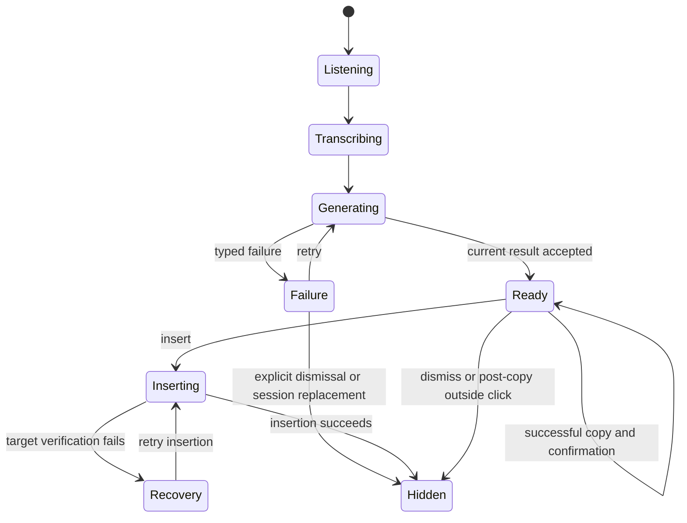
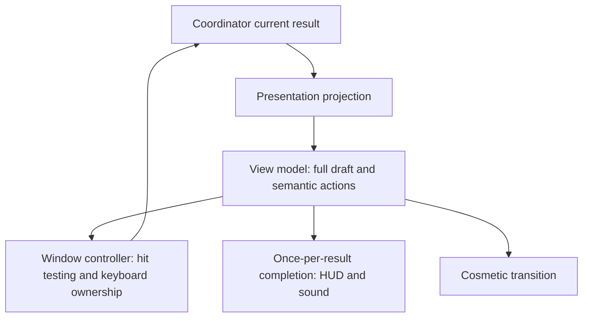

# Cadence Interaction Refinements - Plan

## Goal Capsule

- **Objective:** People can use a finished draft immediately, recover interrupted work without racing a timer, and understand and reuse their writing with less effort.
- **Means:** Refine the existing Compose presentation, Settings, and history components (KTD1–KTD5).
- **Authority:** The user's requested five fixes define scope. This Product Contract owns behavior; the Planning Contract owns implementation choices. Repository instructions and `docs/privacy.md` remain binding.
- **Execution profile:** Characterize lifecycle and keyboard behavior before changing it; use existing mocks and UI fixtures, then verify the installed application.
- **Stop conditions:** Stop for a newly discovered conflict with target safety, provider consent, or preservation of existing configuration. Report an unavailable installed-app validation gate as incomplete rather than treating unit tests as equivalent.
- **Tail ownership:** The implementer owns integration, regression checks, installed-build verification, and a precise completion report. This plan alone authorizes no implementation, release upload, or landing action.

---

## Product Contract

### Summary

Refine all five audited interactions: persistent recovery, immediate draft actionability, understandable app profiles, consolidated provider settings, and consistent history copying.

### Problem Frame

Cadence already provides recording feedback, Compose review, provider setup, app profiles, and recovery actions. The friction lies inside these existing features. A failure surface disappears after six seconds; completed results wait for staged animation; Settings repeats readiness information; profiles present raw instructions; and main-window history does not display the copy confirmation already available elsewhere.

The installed Release app's Settings and profile editor were inspected on September 5. Runtime failure, speech insertion, and transition latency were not reproduced. Those findings are grounded in the current source and remain installed-app verification obligations. The source baseline is commit `9374cbf` plus existing uncommitted work, especially in `AppModel`, Settings, main-window, permission, and HUD files.

### Requirements

**Recovery and completion**

- R1. A Compose failure with retained text or a recovery action remains visible until the user dismisses it, resolves it, or starts a replacement session through the existing session policy.
- R2. A visible failure must not intercept unrelated Copy or Return commands in another app. Recovery actions remain accessible by mouse and when the review surface owns keyboard focus.
- R3. A completed provider result exposes its full draft and valid actions together, with no intentional animation wait before interaction.
- R4. Existing pinned-target verification, immediate insertion focus handoff, typed error recovery, and successful-copy/outside-click behavior remain intact.

**Profiles and provider settings**

- R5. Built-in writing styles show a plain-language description and a clearly labeled illustrative before/after example; raw effective instructions remain accessible through Customize instructions.
- R6. Customized instructions remain visibly identified, and opening or collapsing their disclosure must not modify or save configuration.
- R7. Compose Settings presents one authoritative provider-readiness summary, with routine writing controls above secondary management actions.
- R8. Provider setup, enablement, disclosure, replacement, removal, and cancellation remain reachable with their existing consent and credential-lifecycle behavior.

**History**

- R9. Successful copying shows local confirmation at every main-window copy entry point; failed clipboard commits must not show success.
- R10. Compose history offers independent Open and Copy actions without nested interactive controls; ordinary dictation retains its convenient row-to-copy behavior.
- R11. Repeated copying refreshes the confirmation interval from the latest successful copy and cannot let an older timer clear newer feedback.

### Acceptance Examples

- AE1. Covers R1–R2. A provider failure retains dictation. After more than six seconds, recovery remains visible. Switching to a text editor and pressing Copy copies the editor's selection, not Cadence's retained text.
- AE2. Covers R3–R4. A long result returns while source text is animating. Full result text and actions become available together. Immediate Insert runs once and still verifies the original target.
- AE3. Covers R5–R6. An app with custom instructions opens in a visibly customized state. Expanding and closing Customize instructions, then cancelling, leaves its effective provider instructions unchanged.
- AE4. Covers R7–R8. At the existing narrow Settings size, a configured provider has one readiness summary. Its management disclosure exposes Replace and Remove, and cancellation of removal preserves the configuration.
- AE5. Covers R9–R11. Copy a Compose item twice within the feedback interval. The item stays on the current screen, copies final composed text, and its second confirmation is not cleared by the first timer.

### Scope Boundaries

The work is confined to these existing interactions. It does not add a new Compose workflow, provider, model request, persisted draft store, or meeting feature. Older plans remain historical documents; this plan supersedes only the conflicting presentation choices identified under Sources.

### Sources

- `docs/plans/2026-07-26-001-feat-scribe-notch-review-surface-plan.md`: R3 supersedes its requirement that actions wait for replacement animation. Retain its nonactivating surface and target-safety boundaries.
- `docs/plans/2026-07-26-scribe-copy-immediate-dismiss-regression-plan.md`: preserve successful Copy retaining review and the first outside click beginning dismissal immediately.
- `docs/plans/2026-07-26-scribe-errors-insertion-target-plan.md`: retain typed failures and hide/resign review before target restoration.
- `docs/plans/2026-07-26-app-prompt-profiles-settings-plan.md`: R5 revises default prompt presentation; override-versus-additive-guidance semantics remain authoritative.
- `docs/plans/2026-07-12-u10-settings-shell-execution-plan.md`: provider setup teardown and responsive Settings regression coverage.
- `docs/codebase-guide.md`, `AGENTS.md`, and `docs/privacy.md`: current architecture, build identity, and data boundaries. No `docs/solutions/` corpus or root strategy/glossary document was found.

---

## Planning Contract

### Assumptions

These bounded defaults make the plan executable; they are planning choices rather than separately approved product decisions.

- Keep recoverable failures expanded. A new collapsed attention indicator is deferred because it adds another state and reopening path.
- Keep the existing auto-dismiss behavior only for failures with neither retained text nor an actionable recovery path. Setup failures with a setup action count as actionable.
- Preserve normal ready-review shortcut behavior. Scope failure shortcuts to review focus rather than changing global shortcuts across the whole app.
- Use static examples of built-in behavior, labeled illustrative and not predictions for customized prompts. No sample generation request is introduced.
- Preserve the existing family-selection behavior: changing a family resets the pending editor text to that family's preset; only Save persists it. Make that pending replacement apparent for a customized profile.
- Consolidate content within the existing responsive Settings shell first. A global window-size redesign is deferred; narrow and wide layouts still require verification.
- Apply history feedback to Home rows, latest cards, earlier rows, and Compose detail controls. Keep the menu-bar confirmation behavior consistent with the same state owner.
- Installed-build comparison will use synthetic text in a safe local target. Existing user transcripts, provider credentials, and settings are not test fixtures.

### Key Technical Decisions

- KTD1. **Separate persistence of the surface from keyboard ownership.** Keep failure dismissal policy in `ScribeNotchModels` and keyboard/focus lifecycle in `ScribeNotchWindowController` (R1–R2). Failure shortcuts are local to a focus-owning review surface; passive visibility never registers global Copy/Return. Mouse recovery remains available. Existing session cleanup owns disposal.
- KTD2. **Publish semantic readiness before cosmetic animation.** `ScribeNotchViewModel` exposes complete text and action availability synchronously for the current reviewed result (R3). The projection, mouse hit testing, keyboard registration, HUD completion, and accessibility follow semantic state, not opacity or completion of a typewriter task. A short fade may run concurrently. Cancel obsolete typing and scope completion to the current result/session.
- KTD3. **Keep style education separate from prompt compilation.** Add a small presentation catalog alongside existing value models, keyed by `ScribeEnvironmentFamilyID`, with description and static example (R5–R6). `ApplicationPromptProjection` remains the effective-instructions authority. Retain `promptOverride` replacement semantics and legacy additive `customGuidance`; presentation does not rewrite stored prompts.
- KTD4. **Consolidate the existing provider management view.** Remove duplicated readiness from the Compose shortcut section and make `ScribeProviderManagementView` the status owner (R7–R8). Keep identity/status, enablement, and a Manage disclosure in the main row/card. Management houses existing disclosure and lifecycle actions. Setup-needed and attention states keep their recovery action prominent.
- KTD5. **Reuse the successful clipboard commit as the feedback authority.** Main-window views call `AppModel.copyTranscript` and consume its feedback state (R9–R11). Guard feedback reset with a cancellable task or generation token, including repeated copies of the same item. Compose rows use sibling Open and Copy buttons, never a button nested within a row button.

### High-Level Technical Design

The review lifecycle below applies R1–R4. Readiness is a state transition, not an animation milestone.

Failure/Recovery visibility and key ownership are independent. Losing review focus releases failure key handling without treating that as discard. Hidden, a new capture, or settings navigation cleans up the old surface's monitors through the existing lifecycle.

### Sequencing and Risks

U1 and U2 share the review lifecycle and should integrate sequentially. U3 is independent of that lifecycle. U4 and U5 share Settings and should integrate sequentially. U6 follows all five behavior units.

The main risks are stale animation callbacks restoring old content, retained global hotkeys capturing another app's commands, accidental prompt changes during UI simplification, and copy feedback appearing before clipboard success. The unit scenarios below target those seams. Preserve uncommitted user work; do not replace whole files from an older checkout. Keep new runtime work outside the already-large AppModel except for coordination and its owned feedback lifecycle.

---

## Implementation Units

### U1. Keep recovery available without capturing other apps' keys

**Goal:** Fulfill R1–R2 while retaining R4's dismissal and focus behavior.

**Dependencies:** None.

**Files:** `Cadence/Models/ScribeNotchModels.swift`, `Cadence/Services/ScribeNotchWindowController.swift`, `Cadence/UI/ScribeNotchView.swift`, `Cadence/App/AppModel.swift`; tests in `CadenceTests/ScribeNotchPresentationTests.swift`, `CadenceTests/ScribeCoordinatorTests.swift`, `CadenceUITests/AdaptiveScribeUITests.swift`.

**Approach:**

1. Replace the unconditional six-second failure rule with KTD1's retained-content/action policy.
2. Separate failure keyboard eligibility from visible/interactable state; release handlers on focus loss and existing teardown paths.
3. Keep explicit dismissal visually immediate while asynchronous cleanup finishes. Preserve typed retry/setup/permissions routes and existing confirmation behavior.

**Patterns to follow:** Current insertion-recovery persistence, injected review-keyboard monitor, immediate post-copy dismissal, coordinator-owned cancellation.

**Execution note:** Characterize timer and shortcut teardown before changing policy; update the tests that currently require all failures to dismiss after six seconds.

**Test scenarios:**

1. Covers AE1. Generation failure with literal text remains available after the old timeout; unrelated app Copy/Return work normally.
2. Setup failure with no transcript but a setup action persists; passive failure with neither text nor action retains its transient behavior.
3. Explicit dismissal tears down handlers once, with no delayed timer bringing the surface back.
4. Starting a new capture or navigating to provider/permission settings cannot leave stale keyboard handlers.
5. Covers R4. Successful Copy, inside click, first outside click, and insertion-recovery retry retain their existing outcomes.

**Verification:** Policy/controller tests pass and a real second app can copy selected synthetic text while a retained failure is visible.

### U2. Make finished drafts immediately actionable

**Goal:** Fulfill R3 without weakening R4.

**Dependencies:** U1, for integration through the same projection/controller seam.

**Files:** `Cadence/UI/ScribeNotchView.swift`, `Cadence/Models/ScribeNotchModels.swift`, `Cadence/Services/ScribeNotchWindowController.swift`, `Cadence/App/AppModel.swift`; tests in `CadenceTests/ScribeNotchPresentationTests.swift`, `CadenceTests/ScribeCoordinatorTests.swift`, `CadenceUITests/AdaptiveScribeUITests.swift`.

**Approach:**

1. Apply KTD2 across projection, view model, controller, and completion callback, replacing opacity-derived action eligibility.
2. Cancel source/result typing on result arrival. Keep any surface expansion/fade independent of input readiness.
3. Guard completion sound/HUD notification and actions against stale results and repeated state application.

**Patterns to follow:** Reduced-motion stable result handling, current coordinator insertion guards, immediate resign/order-out before insertion.

**Test scenarios:**

1. Covers AE2. Fast, slow, and long results all publish full text and valid actions without awaiting an animation timer.
2. An immediate click or Return inserts once; a changed target still rejects insertion and retains the draft.
3. Retry, discard, or new capture during an earlier source animation cannot restore old text, keys, or completion sound.
4. Reapplying the same ready result produces one completion notification; a subsequent result can notify once again.
5. Normal and Reduce Motion paths expose equivalent text/actions and maintain keyboard/mouse parity.

**Verification:** State tests prove no intentional readiness delay. An installed fixture and real synthetic-text flow demonstrate actions usable as soon as the completed result appears.

### U3. Unify main-window copy feedback and Compose actions

**Goal:** Fulfill R9–R11 across every main-window copy surface.

**Dependencies:** None.

**Files:** `Cadence/App/AppModel.swift`, `Cadence/UI/MainWindowView.swift`, `Cadence/UI/MenuContentView.swift` only if shared feedback integration requires it; tests in `CadenceTests/HUDServicesTests.swift`, proposed `CadenceTests/TranscriptCopyFeedbackTests.swift`, `CadenceUITests/AdaptiveScribeUITests.swift`.

**Approach:**

1. Apply KTD5 to Home recent rows, latest cards, Earlier rows, and Compose detail copy controls.
2. Expose separate accessible Compose Open/Copy actions, preserving ordinary dictation row copying.
3. Refresh the single feedback lifecycle on every successful commit and cancel obsolete reset work.

**Patterns to follow:** `TranscriptCopyCommit.perform`, existing menu-row `isCopied` rendering, Compose history navigation fixtures.

**Test scenarios:**

1. Covers AE5. Copy the same item twice inside the interval; the old reset cannot clear the newest confirmation.
2. Copy item A then B; only the current confirmation remains and A's timer cannot clear B.
3. A failed clipboard commit shows no success, using existing clipboard seams rather than duplicating platform logic.
4. Compose Copy copies composed text without opening detail; Open navigates without changing the clipboard.
5. Home/latest/Earlier/detail controls render confirmation and remain separately reachable by keyboard and accessibility.

**Verification:** Existing clipboard tests and new timing coverage pass; every main-window entry point and menu-bar confirmation is checked in the installed app.

### U4. Explain writing styles while preserving custom prompts

**Goal:** Fulfill R5–R6.

**Dependencies:** None.

**Files:** `Cadence/UI/SettingsView.swift`, proposed `Cadence/Models/WritingStylePresentation.swift`; existing projection/catalog under `Cadence/Models/ApplicationConfigurationModels.swift` and `Cadence/Services/ScribeGuidanceCatalog.swift` are reference authorities; tests in `CadenceTests/ApplicationConfigurationTests.swift`, proposed `CadenceTests/WritingStylePresentationTests.swift`, `CadenceUITests/AdaptiveScribeUITests.swift`.

**Approach:**

1. Introduce KTD3's presentation-only descriptions/examples for General, Messaging, and Coding.
2. Present built-in examples as illustrative; show a clear customized state when an override controls the result.
3. Replace the default raw prompt block with Customize instructions, retaining the effective preview/editor, validation, Restore preset, Save, and Cancel paths.

**Patterns to follow:** Existing app descriptor identity, `ApplicationPromptProjection`, validated guidance and draft-before-save editor behavior.

**Test scenarios:**

1. Each family has a description and labeled example, with no provider request needed.
2. Covers AE3. Opening/collapsing the disclosure and Cancel leave exact effective instructions unchanged.
3. Save and Restore preset preserve override semantics and legacy additive guidance.
4. Selecting another family visibly changes the pending preset; Cancel preserves saved custom text and Save commits only the chosen draft.
5. Invalid control characters or oversized guidance still block Save with a visible error; long instructions remain scrollable.

**Verification:** Effective prompt regression tests pass; a customized and an uncustomized profile are legible and editable in the installed app.

### U5. Consolidate Compose settings and provider management

**Goal:** Fulfill R7–R8.

**Dependencies:** U4, to integrate changes in the same Settings file.

**Files:** `Cadence/UI/SettingsView.swift`, `Cadence/UI/ScribeProviderManagementView.swift`; tests in `CadenceUITests/AdaptiveScribeUITests.swift` and existing `CadenceTests/ScribeProviderSetupModelTests.swift` as regression coverage.

**Approach:**

1. Apply KTD4 and remove repeated readiness wording from the shortcut section.
2. Keep shortcut, consolidated provider control, and app profiles in that order; place infrequent provider actions under Manage.
3. Preserve all provider readiness variants, setup cancellation, recipient disclosure, enablement, and removal confirmation.

**Patterns to follow:** Existing readiness projection and provider setup/removal methods; existing compact selector and wide rail, rather than another settings router.

**Test scenarios:**

1. Covers AE4. Ready state renders one status summary and a working Manage disclosure at narrow and wide widths.
2. Unconfigured, disabled, validating, invalid, temporarily unavailable, and deprecated states retain clear status and the appropriate action.
3. Navigation/window closure during setup clears ephemeral setup state and does not reopen the sheet.
4. Removal cancellation preserves configuration; opening management alone changes no provider state.
5. App profiles, disclosures, and bottom controls remain reachable at 420, 559, and 560-point content widths, with readable text and no clipped actions.

**Verification:** Settings UI coverage passes and installed narrow/wide/top/bottom states retain all existing operations with less repeated content.

### U6. Verify the integrated installed experience

**Goal:** Establish that R1–R11 work together in the actual app.

**Dependencies:** U1–U5.

**Files:** `Cadence/App/ScribeLaunchFixtures.swift` and `CadenceUITests/AdaptiveScribeUITests.swift` only where existing fixtures need deterministic coverage; `docs/codebase-guide.md` for final behavior documentation.

**Approach:** Use synthetic fixture data for deterministic failure/timing cases, then validate speech-to-review and safe text insertion with an identified installed build. Record build identity, revision, evidence, and any limitation. Update the guide's current behavior rather than rewriting historical plans.

**Test scenarios:**

1. Verify listening → transcribing → ready → insert, plus failed target → retained review, in a safe local editor.
2. Verify persistent failure with focus in a second app, retry, explicit dismiss, post-copy outside dismiss, and subsequent capture.
3. Verify long text, Reduce Motion, notched/non-notched geometry where available, keyboard traversal, and no simultaneous fallback/notch panels.
4. Recheck all history and Settings variants from U3–U5 after integration.

**Verification:** Meet the Verification Contract. Any unavailable hardware scenario is named, with deterministic geometry coverage and the remaining live check separated.

---

## Verification Contract

No tests, builds, or runtime experiments are executed during planning.

- Run focused existing XCTest/Swift Testing suites named by U1–U5 using mock engines/providers. Do not load WhisperKit or send real user text in unit tests.
- Run the repository's full Debug test gate, `./script/build_and_run.sh --test`, after integration. Keep the CI-equivalent Xcode build/test path in `AGENTS.md` passing.
- Run relevant `CadenceUITests/AdaptiveScribeUITests.swift` fixtures, extending them only for behavior that needs UI proof.
- Regenerate the project with XcodeGen only when `project.yml` changes; never hand-edit the project structure.
- Verify the installed app with the repository build/install/verify workflow. Identify Debug versus Release explicitly. A fixture or Debug pass does not establish production Release parity; the final report must name the tested build and any remaining Release validation.
- For distribution, follow `docs/release-checklist.md`. No Debug artifact is distributable, and this plan does not request an upload.
- R3's measurable gate is zero intentional animation wait between accepting the current result and semantic action availability. Record observed result-to-action latency in the installed app as supporting evidence; do not claim a network-latency improvement.
- For R1–R2, observe recovery beyond the former six-second boundary and successfully copy unrelated text in another app while the failure stays visible.
- Restore temporary test preferences and clipboard content. Keep credentials, transcripts, vocabulary, and app identity out of logs, analytics additions, screenshots shared externally, and test artifacts.

---

## Definition of Done

Every U-ID meets its stated verification and R1–R11 have evidence. Existing provider consent, pinned insertion target, history persistence, and copy/outside-dismiss behavior remain correct. Required tests and UI checks pass. The installed build is identified and validated, with any remaining Release or hardware limitation stated plainly. Documentation matches the new behavior, abandoned experimental code is removed, and unrelated working-tree changes remain intact.
