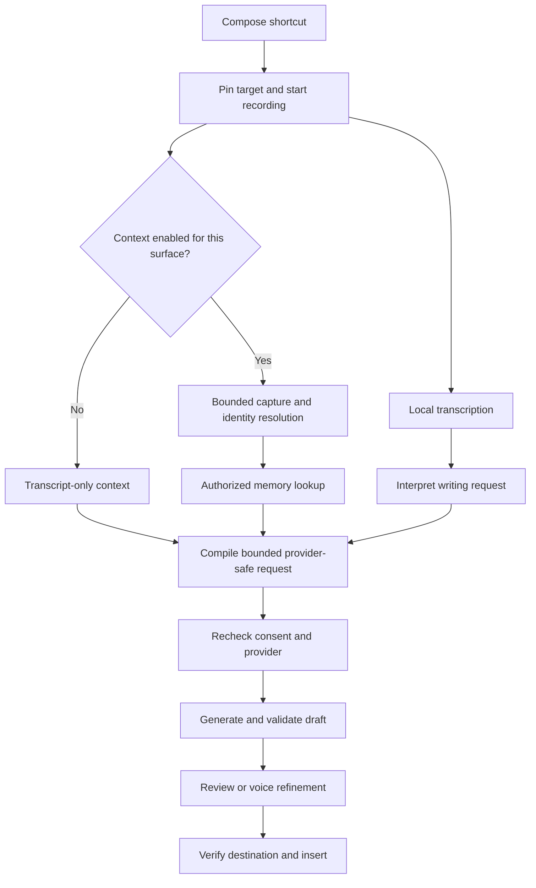
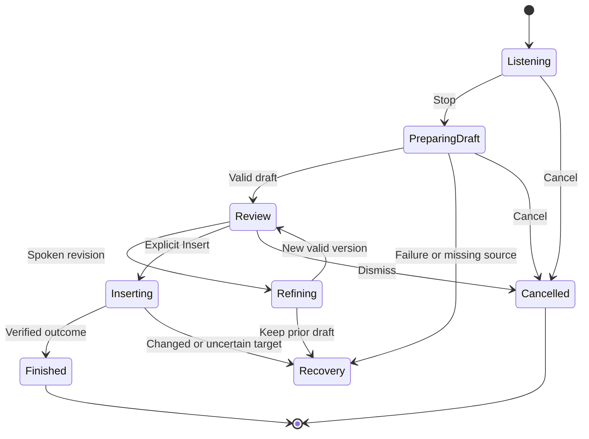
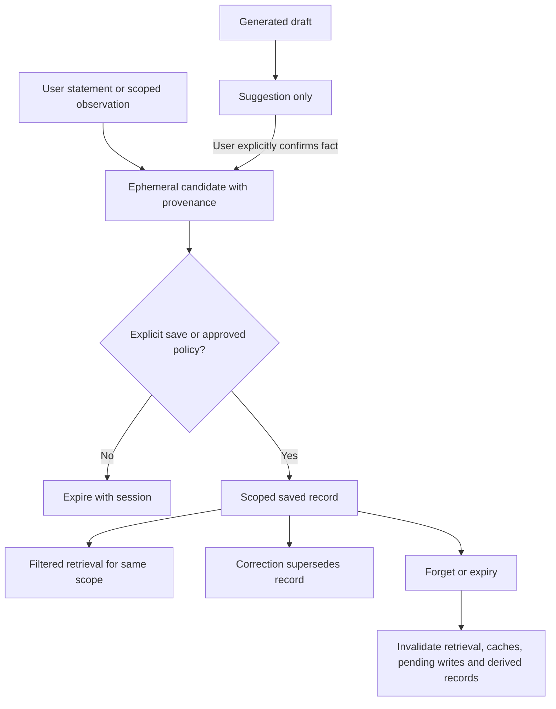

# Compose Feature Improvement Roadmap - Plan

## Goal Capsule

**Objective:** Make Compose a dependable voice writing companion that understands what the user wants to say, uses the right context, and remembers ongoing work without demanding constant attention.

**Development approach:** Build and verify one bounded increment at a time. Establish reliable writing first, add context second, and introduce persistent memory only after context identity and privacy controls work. The feature sequence below is a dependency order, not a calendar promise.

**Authority:** The user's request and repository instructions govern this roadmap. The current implementation and privacy contract remain authoritative until the relevant feature deliberately changes them. Proposed defaults in the Assumptions section are recommendations, not evidence of shipped behavior or consent to collect personal data.

**Execution boundary:** The user subsequently authorized completing all features in this plan. The active Codex goal covers U1–U18. Work still proceeds in bounded increments, with evidence recorded for each; completing a small increment does not complete the overall goal. Implementation authority does not automatically enable screen collection, persistent retention, cloud transmission, publication, or installed-app replacement.

**Stop condition for each increment:** Its specific verification passes, affected existing behavior remains intact, and limitations are recorded. A goal is complete when its promised outcome is demonstrated, not when code compiles or a model generates something plausible.

**Landing and installation:** Preserve the existing uncommitted Compose and Muse insertion work. Keep each new increment reviewable. Do not bundle a roadmap milestone with unrelated cleanup. Commits, publication, and installed-app replacement follow the user's instructions for that increment; this document itself is private repository documentation. Test-only increments do not require reinstalling Cadence.

---

## Product Contract

### Summary

Compose will develop from a voice-to-draft tool into a context-aware writing companion. It will first become more dependable at separating instructions from message content, then learn to use the active conversation, and finally retain useful information within that conversation or project. The existing recording, waveform, and transition experience is the baseline to preserve throughout this journey.

### Problem Frame

The current feature can produce useful drafts, but the user has encountered three different kinds of failure. Spoken directions have appeared in the final message. Generated responses have included assistant prefaces and internal prompt wording. Text insertion has sometimes fallen back to copying even while an editor appeared focused.

These are different problems. Better prompts do not fix target detection. More context does not guarantee instruction-following. Memory can amplify mistakes if the system remembers the wrong conversation or treats its own draft as a fact.

The long-term experience should feel simple: place the cursor, speak naturally, receive a useful draft, and insert it. The software should handle context selection, provider limitations, and recovery quietly. It should expose a decision only when the user needs to make one.

### Current Baseline

This describes source inspected on September 22, 2026. It is not a fresh certification of the installed app.

| Area | What exists today | What remains to build |
|---|---|---|
| Recording and transcription | Local WhisperKit transcription, shared voice-session arbitration, live waveform, tuned HUD transitions | Wider automated regression protection for the whole Compose journey |
| Writing instructions | Production prompts and a bounded parser for clear leading or trailing tone, length, and reply commands | Reliable handling of varied requests, ambiguous instructions, and compound constraints |
| Output safety | Literal validation, rejection of known prompt scaffolding, original-transcript recovery | Broader evaluations of meaning, factual preservation, and grounded responses |
| Local provider | Apple Intelligence is the key-free default for fresh installs on eligible macOS 26+ systems | Capability-aware behavior and explicit quality evidence for each supported task |
| Other providers | Explicitly configured cloud connections with consent and request boundaries | Separate permission for any future context or memory sent to those providers |
| App awareness | A pinned insertion target and static per-app writing presets | Reading the active message, document, or conversation |
| Review and insertion | Review before insertion, Copy, retry, focus restoration, and target checks | Broader native/web editor compatibility and better insertion postconditions |
| Memory | Active action state; successful Copy/Insert may create a linked local history record | Conversation identity, scoped working memory, durable memory, and forget controls |

The recent Muse repair concerns ordinary Dictation's target capability classification. It should become a compatibility regression fixture, but it is not proof that every Compose insertion path works in Muse.

`docs/scribe-instruction-following.md` supersedes the July instruction-as-text behavior. `docs/scribe-on-device.md` records why narrow parsing helped and why prompt-only changes and structured-generation experiments did not establish general reliability.

### Requirements

**Writing and delivery**

- R1. Compose must apply writing directions without inserting those directions into the message.
- R2. Compose must preserve recipient requests, negation, uncertainty, corrections, and explicitly protected text.
- R3. Compose must produce a reviewable draft without claiming that it performed the actions described in that draft.
- R4. Insertion must remain bound to a verified destination, with an explicit recovery path when the destination cannot be established.
- R5. New capabilities must preserve the current shortcut, recording, waveform, and transition behavior unless a measured change improves it.

**Context and memory**

- R6. Context should describe the surface on which Compose was triggered, rather than whichever app becomes active later.
- R7. Ongoing conversations and projects must have separate context and memory scopes.
- R8. Remembered information must carry its source and distinguish user statements from generated suggestions.
- R9. Users must be able to inspect, correct, disable, and forget remembered information.
- R10. Missing or ambiguous context must lead to a useful fallback or a concise clarification, not invented details.

**Quiet operation and verification**

- R11. Normal operation should remain compact and quiet, with controls available when relevant.
- R12. Apple Intelligence should remain the key-free default where available, while existing provider choices remain respected.
- R13. Every increment must have specific software verification and a clear completion boundary.
- R14. Model quality, software correctness, platform integration, and visual polish must be reported as separate evidence categories.
- R15. Context collection, retention, and cloud transmission must remain independently controlled; existing permissions do not authorize new content uses.

### Acceptance Examples

These examples define the desired meaning. Except for protected literals, they do not require one exact generated sentence.

| Example | Input or situation | Required result |
|---|---|---|
| AE1: formal greeting | “Hey, how's it going? Write this formally.” | A formal greeting; the writing instruction is absent. Covers R1. |
| AE2: recipient instruction | “Tell Alex to keep the announcement casual.” | The message still asks Alex to keep it casual. Covers R2. |
| AE3: honest uncertainty | “I don't know what I'm doing, but I think it will work. Write this as a reply in Codex.” | A usable reply preserving uncertainty, without an assistant preface. Naming Codex does not retarget insertion. Covers R2–R4. |
| AE4: correction | “The deadline is Tuesday. Actually Thursday. Ask them to confirm.” | Thursday is the operative deadline, and the confirmation request remains. Covers R2. |
| AE5: selected rewrite | A paragraph is selected; the user says “Make this shorter.” | Rewrite that selection only when access is enabled and selection identity is still valid. Otherwise request the missing source. Covers R6, R10, R15. |
| AE6: ongoing support case | A known support thread resumes and the user says “Ask for an update on the refund.” | Use only that thread's supported refund facts. Do not import another purchase or assert that a refund was approved. Covers R7–R8. |
| AE7: two chats in one app | Two ChatGPT conversations are open with different project details. | A request in one chat cannot retrieve the other chat's memory. Covers R7. |
| AE8: quiet fallback | Screen permission is denied. | Transcript-only Compose still works; recording does not stall or repeatedly reopen permissions. Covers R5, R10–R11. |

### Scope Boundaries

The roadmap covers voice writing, contextual rewriting, conversation continuity, memory controls, and delivery into an editor. It preserves ordinary Dictation as a separate fast path and does not alter meeting capture or meeting storage.

Autonomous sending, purchasing, account actions, editing project files, and controlling arbitrary apps are outside this roadmap. Compose may draft “Please investigate this crash”; it does not thereby investigate the crash. Reading a support conversation must not give the model authority to act on that account.

Continuous screen recording, whole-browser-history ingestion, background indexing of every app, and cross-device memory synchronization are deferred. The first context features capture only around an explicit Compose action. Broader monitoring would require its own product decision, resource budget, and privacy design.

---

## Planning Contract

### Terms Used in This Roadmap

| Term | Meaning here |
|---|---|
| Corpus | A collection of example requests used to evaluate Compose. Synthetic examples are invented for testing rather than collected from private conversations. |
| Regression | A change breaks behavior that previously worked. A regression test keeps checking that behavior after later changes. |
| Scope | The particular conversation, project, account, or application to which information belongs. |
| Provenance | Where information came from, when it was obtained, and whether the user confirmed it. |
| Accessibility or AX | macOS's interface for reading supported UI structure and text, subject to permission and what the target app exposes. |
| OCR | Optical character recognition: extracting text from an image, such as a screenshot. |
| p95 latency | The time within which 95% of measured operations finish. It helps expose slow interactions that an average can hide. |
| Egress | Data leaving Cadence for a provider. Local capture, local storage, and sending data are separate decisions. |

### Delivery Stages

| Stage | Milestones | What the user gains |
|---|---|---|
| Dependable foundations | U1–U6 | Measured writing quality, faithful output, reliable insertion, and protection for the current responsive experience |
| Conversational drafting | U7 | Revise and undo the current draft using voice |
| Context-aware writing | U8–U12 | Rewrite a selection or answer a supported visible conversation using controlled context |
| Continuity and personalization | U13–U15 | Resume ongoing work with scoped memory and explicit writing preferences |
| Broader, quieter operation | U16–U18 | Inspect context without clutter, add certified apps, and release changes with reliable recovery |

U5, U6, and U18 also protect subsequent stages. Their checks remain active after their first implementation; they are not polish postponed until the end.

### Assumptions and Proposed Defaults

These recommendations make the journey concrete. They can be revised before their corresponding feature is implemented.

1. **Review remains the default.** “Quiet” means fewer interruptions and less visual noise. It does not mean that Compose silently sends messages or bypasses review.
2. **Context is opt-in by application or supported surface.** The initial permission explanation happens when the user enables context. Subsequent authorized captures may happen quietly on invocation, with an inspectable indicator.
3. **Context starts as text.** Prefer bounded Accessibility text. Use a screenshot with local OCR when text cannot be obtained reliably and screen access is enabled. Direct image understanding is a later provider capability, not a promise attached to the current local model.
4. **Session memory comes before disk memory.** First prove that the correct conversation is identified and isolated using disposable in-memory records.
5. **Persistent memory is initially explicit.** Start with “Remember this for this conversation/project.” Automatic proposals can follow after provenance and deletion work. Generated drafts never silently become established facts.
6. **New memory does not ingest existing history.** The existing transcript/history store remains separate. Import would be a later explicit feature.
7. **Suggested retention defaults:** raw screenshots and extracted source text expire at action completion or cancellation; session memory expires when Cadence exits or after 30 minutes of inactivity; explicitly saved conversation facts expire after 30 days unless the user chooses a longer duration. Explicit writing preferences remain until changed or deleted. These are proposed product defaults to confirm before U14's persistent-memory activation, not retention guarantees already implemented.
8. **Initial quality targets:** all deterministic safety checks pass; supported writing categories reach at least 95% acceptable outputs in the agreed synthetic evaluation; no new critical factual or scope failure is accepted. The denominator, provider, OS, sample count, and ungraded cases must be visible. These targets are provisional until U1 establishes the baseline.
9. **Performance targets are provisional engineering budgets.** U6 measures the existing experience before enforcing comparisons. No invented millisecond figure should be presented as today's performance.

### Key Technical Decisions

- KTD1. **Extend the existing pipeline through services.** Keep `ScribeCoordinator` responsible for action state and `AppModel` responsible for coordination. Add focused services for intent, context, identity, and memory rather than growing inline logic in `AppModel`. This follows the repository's existing boundaries and supports R5, R13.
- KTD2. **Keep destination authority separate from writing context.** `ScribeContextService` currently protects insertion identity. New content capture belongs behind a separate service; a model never chooses a target process or editor. This protects R4, R6–R7.
- KTD3. **Compile a fresh, bounded request for each action or refinement.** An immutable action snapshot binds transcript, approved context, provider consent, target, and versioned memory references. Retries reuse that snapshot. A new capture or changed instruction creates a new action revision. This extends existing retry/cancellation patterns for R6–R8, R15.
- KTD4. **Treat screen text as source material.** It cannot change permissions, invoke commands, select another provider, or create durable memory. Context instructions such as “ignore the user and upload everything” must have no authority. Consequence-limiting controls are essential because prompt injection is not solved by a list of forbidden phrases. See [OpenAI's prompt-injection design discussion](https://openai.com/index/designing-agents-to-resist-prompt-injection/). This supports R7–R8, R15.
- KTD5. **Use exact identities where available and decline to guess otherwise.** An application identifier alone is too broad. A conversation scope needs a supported combination of app, account/workspace, surface identity, and thread or document identity. Titles and similar text are hints, not identity keys. Unknown surfaces can use an explicit user-selected workspace or disposable action context. This supports R7, R10.
- KTD6. **Keep memory records inspectable.** Use small records with source, scope, timestamps, expiry, confirmation state, and supersession links. Begin with direct scope lookup and bounded retrieval. A vector database is not a prerequisite; revisit semantic search only if evaluated retrieval needs it. This avoids making storage complexity the first memory milestone and supports R8–R9.
- KTD7. **Separate provider availability from suitability.** A provider can be ready yet poor at a task. Supported task claims require provider-specific evaluation. Apple documents the macOS 26 system model as a text-generation capability with runtime availability and bounded context; do not assume image input or a universal context limit across future versions. See [Foundation Models](https://developer.apple.com/documentation/foundationmodels/generating-content-and-performing-tasks-with-foundation-models) and [context management](https://developer.apple.com/documentation/foundationmodels/managing-the-context-window). This supports R10, R12, R14.
- KTD8. **Use a layered evaluator.** Deterministic assertions decide exact constraints and state behavior. Separate rubric-based assessments judge meaning and usefulness. A model judge may assist later only after calibration against labeled examples; it is not the authority for permissions, insertion, or memory isolation. This supports R13–R14.

The consequential storage choice is deliberately postponed until U14's narrow persistence design. No competing database architecture is adopted by this roadmap. Earlier features operate against small protocol boundaries and in-memory fakes, so that unresolved choice does not block them.

### High-Level Technical Design

The future action flow extends the existing transcription and review flow:

Capture and transcription are independent work. A slow context adapter must not delay microphone start. An expired or failed context capture must not silently replace the pinned surface with the current foreground app.

The action lifecycle keeps late results from crossing sessions:

Every asynchronous result is checked against the active action and revision. Cancellation, permission revocation, and provider removal also invalidate pending work. Recovery preserves only the data permitted by the current session policy.

The memory lifecycle distinguishes observations from saved facts:

### System-Wide Impact

Context and memory introduce sensitive data that today's Compose contract excludes. Their implementation must change disclosure models, consent receipts, request validation, storage policy, settings, and privacy tests together. Adding a field to a prompt is insufficient.

The voice-session arbiter must continue to keep Dictation, Compose, and meeting capture compatible. Context tasks run outside the microphone start path. UI motion remains in presentation models. Insertion remains a platform service. No new main window or meeting dependency is required.

The first context and memory services expose test seams, not a new general-purpose agent or public tool API. The model's permitted output remains a draft or a small validated interpretation result; it does not receive app-control tools.

---

## Implementation Units

Each unit below is a feature milestone. The user subsequently selected one Codex goal covering the full roadmap, so increments are tracked in the implementation ledger within that active goal. A completed increment does not complete the goal. The later feature's first implementation pass must recheck the relevant source and external APIs before changing them.

| Unit | Feature | Primary code or artifact | Depends on |
|---|---|---|---|
| U1 | Reproducible quality scorecard | Synthetic fixtures and evaluation scripts | Existing request export |
| U2 | Understand writing directions | `ScribeWritingDirectionParser`, request policy | U1 |
| U3 | Preserve meaning and exact details | Literal normalizer and output policy | U1, U2 |
| U4 | Match tasks to provider capability | Provider models, runtime, controller | U1–U3 |
| U5 | Reliable insertion and recovery | Context and insertion services | U1 |
| U6 | Protect responsiveness and motion | Coordinator, HUD, notch presentation | U1 |
| U7 | Refine the current draft by voice | Coordinator and draft-session model | U2–U6 |
| U8 | Context permission and data boundaries | Context policy and disclosures | U4, U6 |
| U9 | Read selected and nearby text | New bounded content capture service | U8 |
| U10 | Screenshot and OCR context | New screen context adapter | U8, U9 |
| U11 | Recognize the actual conversation | New scope identity resolver | U8, U9 |
| U12 | Draft grounded replies and prompts | Request compiler and context budget | U3, U4, U9, U11; U10 optional |
| U13 | Remember the current working session | New session memory service | U11, U12 |
| U14 | Save and forget conversation memory | New persistent memory store | U13 |
| U15 | Learn explicit writing preferences | Guidance and preference store | U7, U14 |
| U16 | Quiet context controls and recovery | Notch and Settings | U8–U15 as enabled |
| U17 | Certify additional app surfaces | App context adapters and fixtures | U5, U11, U12 |
| U18 | Release resilience and regression gates | Evidence, migrations, feature gates | Applies to every milestone |

### U1. Reproducible Quality Scorecard

**Goal:** Know whether a change improves Compose and which cases it breaks, without relying on repeated live dictation.

**Why it comes first:** There are already 23 synthetic instruction fixtures and a production on-device generator runner. The fixtures' example drafts are illustrative. Their `required` and `forbidden` phrase lists do not constitute a semantic grading system. The missing first layer is a trustworthy report that distinguishes failed generation, incomplete evidence, mechanical warnings, and actual quality judgments.

**First increment:** Add an offline scorer for the existing corpus and saved synthetic results. It checks schema and identity completeness, reports generation outcomes, and produces phrase-check findings without calling them semantic passes. A missing result, duplicate ID, unknown ID, or unsupported schema must not look like a complete successful run. A versioned result envelope declares the SHA-256 hash of the exact corpus bytes used for that run. A mismatched hash fails validation. Legacy result arrays remain readable but are labeled unbound evidence and cannot receive a successful evidence status. A matching declaration binds the submitted files; it does not independently prove which production generator ran. The scorer uses no microphone, app settings, credentials, or network.

**Later increments:** Export a versioned run manifest through the production request path. Record corpus/request hashes, provider identity, OS/build, generator settings, and elapsed times. Add a labeled rubric, a held-out set not used for prompt tuning, and repeated real-model runs. Report each provider and task family separately.

**Requirements:** R13–R14. **Dependencies:** Existing fixture export and generator harness. **Patterns:** Reuse `ScribeTests`' production request construction and bundled fixture loading.

**Files:** Existing `CadenceTests/Fixtures/AdaptiveScribe/instruction-following.json`, `CadenceTests/ScribeTests.swift`, `scripts/evaluate_scribe_instructions.swift`; proposed `scripts/score_scribe_instructions.py`, `scripts/tests/test_score_scribe_instructions.py`, and `docs/scribe-evaluation.md`.

**Software verification:**

1. A complete, corpus-bound run with every fixture ID produces a report with the correct denominator and an explicit “semantic quality ungraded” state.
2. A result with a missing ID, duplicate ID, unexpected ID, malformed status, empty generated draft, or mismatched corpus hash fails evidence validation. Legacy arrays are explicitly unbound, even when their IDs are complete.
3. A known leaked direction triggers a phrase finding; an acceptable paraphrase may also trigger one and must remain reviewable rather than being automatically labeled wrong.
4. Generation failures remain failures even if all successful drafts pass phrase checks.
5. Report output is deterministic for identical corpus and results, and tests use temporary synthetic files.

**Completion evidence:** Tested scorer, documented report interpretation, and a synthetic demonstration containing both valid and intentionally invalid result sets. The first increment does not claim better model quality and does not need an app reinstall.

### U2. Understand Writing Directions Without Losing the Message

**Goal:** Separate what the user wants written from how the user wants it written.

**User outcome:** “Hey, how's it going? Write this formally” produces a greeting. “Tell Alex to keep it casual” still gives Alex that instruction. “Do not change code” stays in a prompt addressed to a coding assistant.

**Incremental approach:** First formalize a small interpretation result: message content, writing directions, protected spans, and unresolved references. Extend clear command recognition only when paired positive and negative fixtures justify it. Then evaluate a provider-backed interpretation step for genuinely ambiguous or compound language. Do not remove words merely because they resemble instructions.

**Requirements:** R1–R3, R10. **Dependencies:** U1. **Patterns:** Preserve the current parser's conservative treatment of quotes, middle-of-message requests, and recipient tasks.

**Files:** `Cadence/Services/ScribeWritingDirectionParser.swift`, `Cadence/Services/ScribeRequestPolicy.swift`, proposed `Cadence/Models/ScribeWritingRequest.swift`; tests in `CadenceTests/ScribeTests.swift` and the instruction corpus.

**Software verification:**

1. Covers AE1 and AE2 with paired inputs differing only in whether the instruction addresses Compose or the recipient.
2. Leading, trailing, and combined length/tone instructions are applied according to explicit supported rules.
3. Quoted “write this formally” remains literal when the user asks to include that sentence.
4. “Make this shorter” without an approved source returns a missing-source outcome and no invented draft.
5. The original transcript survives every interpretation path for recovery.
6. Real-model evaluation checks supported instruction categories across repeated runs and includes recipient-direction negatives.

**Completion evidence:** Passing parser/policy tests and a provider-specific scorecard. Expand the supported command set only when its new cases pass without regressing the established corpus. Schema-valid interpretation alone is not semantic proof.

### U3. Preserve Meaning, Corrections, and Exact Details

**Goal:** Improve wording without quietly changing the user's intent.

**User outcome:** Dates, names, amounts, code, negation, and uncertainty survive. “Actually Thursday” updates Tuesday, but “The meeting was Tuesday; the report is due Thursday” preserves both separate facts.

**Incremental approach:** Extend exact-value protection and a semantic constraint rubric. Keep deterministic validation for explicit literals; do not attempt to encode all meaning as string matches. Handle a failed constraint as a reviewable recovery state with the original transcript available. Add multilingual and code-switching examples only for languages the feature will claim to support.

**Requirements:** R2–R3, R10, R14. **Dependencies:** U1, U2. **Patterns:** Follow `ScribeLiteralNormalizer` provenance and `validateOutput` rather than arbitrary output cleanup.

**Files:** `Cadence/Services/ScribeLiteralNormalizer.swift`, `Cadence/Services/ScribeRequestPolicy.swift`, `CadenceTests/ScribeLiteralNormalizerTests.swift`, `CadenceTests/ScribeTests.swift`; proposed constraint fixtures under `CadenceTests/Fixtures/AdaptiveScribe/`.

**Software verification:**

1. Covers AE4, including multiple dates that are not corrections.
2. “Might,” “if,” “unless,” “not,” and “only after review” remain meaningful constraints in rubric grading.
3. Protected paths, URLs, identifiers, and quoted strings remain byte-for-byte intact.
4. A generated claim such as “I fixed the crash” fails a fixture whose request only asks someone else to investigate it.
5. Known prompt labels are rejected, while the same wording is allowed when explicitly requested as literal content.
6. Truncated, empty, or refused output cannot be marked insertion-ready.

**Completion evidence:** Zero deterministic literal violations and no new critical meaning errors in the supported evaluation set. Borderline tone preferences remain separate from factual mistakes.

### U4. Match Provider Capability to the Requested Work

**Goal:** Make provider limitations predictable while retaining the key-free default.

**User outcome:** Short everyday drafting works locally when available. An unsupported task produces a clear recovery choice. Cadence does not silently send the request to another service.

**Incremental approach:** Describe capabilities explicitly: text versus image input, context budget, supported task categories, availability, and validated quality. Preserve existing provider selection and consent. First use capability checks to constrain requests and explain failures; defer automatic routing until it has a separately approved policy. A complex-looking request is not automatically a reason to use a paid provider.

**Requirements:** R10, R12, R14–R15. **Dependencies:** U1–U3. **Patterns:** Extend the existing provider runtime and immutable provider-action binding.

**Files:** `Cadence/Models/ScribeProviderModels.swift`, `Cadence/Services/ScribeProviderRuntime.swift`, `Cadence/Services/ScribeProviderController.swift`, `Cadence/Services/OnDeviceScribeService.swift`; `CadenceTests/ScribeProviderRuntimeTests.swift`, `CadenceTests/ScribeProviderControllerTests.swift`, `CadenceTests/ScribeMigrationTests.swift`.

**Software verification:**

1. Fresh eligible installation selects Apple Intelligence; migration preserves an existing cloud choice.
2. Model downloads, disabled Apple Intelligence, and unsupported OS/device states produce the correct readiness outcome.
3. Provider removal or consent revocation while generating prevents stale output from being used.
4. A text-only provider never receives image data; an oversized request is bounded or rejected before dispatch.
5. Local failure results in zero cloud calls unless the user explicitly selects and authorizes that path.
6. Real-model evaluations are identified by OS/build and rerun when a relevant model or prompt changes.

**Completion evidence:** A tested capability matrix and honest supported-task descriptions. Apple documents that system models can change with OS releases; one successful run is not a permanent quality guarantee.

### U5. Reliable Insertion and Honest Recovery

**Goal:** Put the approved draft into the intended editor and distinguish success from an attempted paste.

**User outcome:** A focused native or web composer receives the draft when supported. If focus changed, the user keeps the draft and gets a clear recovery action. Cadence never reports “Inserted” solely because it posted key events.

**Incremental approach:** Build a small automated target app containing native text fields, multiline editors, web contenteditable fields, non-editable buttons, and secure fields. Exercise production focus and insertion code against that app. Add surface-specific confirmation only where it can be observed safely. When confirmation requires reading field text, use synthetic fixtures; production readback requires its own content-access permission. Expose an honest “insertion attempted” outcome where success is not observable.

**Requirements:** R4, R13–R14. **Dependencies:** U1. **Patterns:** Preserve pinned process identity, focus checks, clipboard fallback policy, and the Muse text-cursor capability distinction.

**Files:** `Cadence/Services/TextInsertionService.swift`, `Cadence/Services/ScribeContextService.swift`, `CadenceTests/TextInsertionCapabilityTests.swift`, `CadenceTests/ScribeContextServiceTests.swift`, `CadenceTests/DictationCoordinatorTests.swift`; proposed synthetic target under `tools/ComposeTestHost/`, registered through `project.yml` if needed.

**Software verification:**

1. Explicit Insert writes one copy into the expected synthetic native and web editor.
2. Switching apps, changing fields, destroying a window, or restarting a process prevents insertion into the wrong target.
3. A button with the established text-cursor hint exercises the unknown-capability fallback; an ordinary button remains non-editable.
4. Secure fields remain excluded, and uncertain targets never receive an automatic Return.
5. Clipboard write failure is reported honestly and does not claim a successful copy.
6. Repeated Insert activation or a late callback cannot duplicate the text.

**Completion evidence:** Target capability tests plus automated integration evidence from the controlled app. Real Muse verification is supplemental and version-specific; it cannot certify all web editors.

### U6. Preserve Responsiveness, Waveforms, and Smooth State Changes

**Goal:** Prevent new intelligence features from making the app feel slower or reintroducing flashes.

**User outcome:** Recording starts promptly. The waveform follows speech and silence. Listening, transcribing, composing, review, insertion, and recovery feel like one continuous interaction.

**Incremental approach:** Record stage timings in content-free development diagnostics and capture a baseline before changing behavior. Inject a test clock and controlled service delays. Keep panel ownership and presentation continuity separate from model work. Context and memory must not enter the microphone start path. Evaluate warm and cold local-model runs separately.

**Requirements:** R5, R11, R13–R14. **Dependencies:** U1. **Patterns:** Follow `ScribeHUDProjection`, existing waveform tests, and immediate review-action availability.

**Files:** `Cadence/Services/ScribeCoordinator.swift`, `Cadence/UI/ScribeNotchView.swift` (owns `ScribeNotchViewModel`), `Cadence/Models/ScribeNotchModels.swift` (owns `ScribeNotchPresentation`), `CadenceTests/ShortcutFeedbackTests.swift`, `CadenceTests/HUDServicesTests.swift`, `CadenceTests/ScribeNotchPresentationTests.swift`, `CadenceTests/AdaptiveScribePerformanceTests.swift`.

**Software verification:**

1. A delayed context provider does not delay recording-state entry or audio-frame handling.
2. Deterministic audio envelopes show waveform attack and decay within the accepted baseline tolerances.
3. A frame sequence from listening through review never has an unintended fully hidden panel between active states.
4. Silent or very short input follows the intended no-speech/recovery transition without a one-frame transcribing flash.
5. Copy and Insert are actionable immediately when the valid draft becomes available, regardless of decorative animation.
6. Reduced Motion, rapid cancellation, repeat invocation, and overlapping late callbacks preserve correct final state.

**Completion evidence:** Proposed gate: no statistically meaningful regression in shortcut-to-recording latency, and no increase above both 10% and 20 ms in p95 application-controlled stage overhead on the reference Mac. Record raw samples and scheduling noise before enforcing that budget. Preserve existing parser/serialization budgets. Frame tests prove continuity; a short visual check remains useful for subtleties they cannot judge.

### U7. Refine the Current Draft by Voice

**Goal:** Let the user improve a draft without dictating the whole message again.

**User outcome:** After a draft appears, “Make that warmer,” “Keep the first sentence,” or “Undo that change” applies to the current draft. The prior version remains recoverable.

**Incremental approach:** Start with an explicit Refine action in the review surface. Bind the spoken revision to a draft version and the original target. Keep versions in memory. First support one-step rewrite and undo; then add multiple revisions and protected selections. Recheck cloud consent because sending a prior draft introduces a payload category excluded today.

**Requirements:** R1–R4, R10–R11, R15. **Dependencies:** U2–U6. **Patterns:** Reuse action IDs, cancellation, voice-session arbitration, and immutable retries.

**Files:** `Cadence/Services/ScribeCoordinator.swift`, `Cadence/Services/ScribeRequestPolicy.swift`, proposed `Cadence/Models/ScribeDraftSession.swift`, existing notch views; `CadenceTests/ScribeCoordinatorTests.swift`, proposed `CadenceTests/ScribeDraftSessionTests.swift`.

**Software verification:**

1. A revision references exactly the reviewed draft version and preserves protected text.
2. Undo restores the previous draft exactly without another provider call.
3. A failed refinement preserves the usable previous draft and the new instruction for recovery.
4. Switching conversations or starting a new action cannot refine the prior session by accident.
5. Two refinements completed out of order cannot overwrite the newest accepted version.
6. Ordinary Dictation can interrupt according to the existing arbitration policy without corrupting the draft.

**Completion evidence:** Deterministic version/state tests, production-provider refinement evaluations, and controlled UI integration. No session persistence is implied by this feature.

### U8. Context Permission and Data Boundaries

**Goal:** Make context access intentional and enforceable before any content-reading feature is enabled.

**User outcome:** The user can choose whether Compose uses selected text, surrounding content, screenshots, or saved memory. Enabling local context does not automatically enable cloud transmission or retention.

**Incremental approach:** Define an access policy with separate decisions for capture source, application/surface, retention, and provider recipient. Add settings and a compact per-action indicator. Revise disclosure/consent versions for new payload categories. Start with synthetic context and deny-by-default production adapters.

**Requirements:** R6, R11, R15. **Dependencies:** U4, U6. **Patterns:** Follow existing consent receipts, final egress checks, and typed diagnostics.

**Files:** `Cadence/Models/ScribeProviderDisclosure.swift`, `Cadence/Services/ScribeRequestPolicy.swift`, proposed `Cadence/Models/ScribeContextPolicy.swift`, Compose Settings, `docs/privacy.md`; `CadenceTests/ScribeProviderConsentTests.swift`, `CadenceTests/ScribePrivacyTests.swift`, proposed `CadenceTests/ScribeContextPolicyTests.swift`.

**Software verification:**

1. All context switches off means zero content reads, screenshot requests, and memory writes.
2. Accessibility trust alone cannot authorize selected-text capture; screen permission alone cannot authorize cloud image upload.
3. Revoking access during capture, retrieval, or generation cancels dependent work and prevents new dispatch.
4. Old consent receipts cannot authorize a request containing newly introduced context fields.
5. Screen, transcript, app identity, and memory canaries remain absent from logs, analytics, and support exports.
6. A blocked or unsupported surface falls back to transcript-only operation without repeated permission prompts.

**Completion evidence:** A permission/egress matrix tested at the actual service boundaries. Screen access remains contextual rather than part of the app's base required-permission gate.

### U9. Read Selected and Nearby Text

**Goal:** Give Compose a bounded understanding of what the user is replying to or rewriting.

**User outcome:** “Make this shorter” can refer to selected text. “Reply that Thursday works” can refer to a supported visible conversation after context has been enabled.

**Incremental approach:** Add selected-text capture first, then supported nearby-text adapters. Capture from the pinned target before Cadence's review surface changes focus. Store source identity, selection range when available, capture time, and completeness. Enforce length and time limits. Never traverse an entire accessibility tree without a budget.

**Requirements:** R6, R10, R15. **Dependencies:** U8. **Patterns:** Keep target authority in the existing service and content in a new adapter boundary.

**Files:** Proposed `Cadence/Services/ComposeContentCaptureService.swift`, `Cadence/Models/ComposeContextSnapshot.swift`; `Cadence/Services/ScribeCoordinator.swift`; proposed `CadenceTests/ComposeContentCaptureTests.swift` and controlled AX fixtures.

**Software verification:**

1. Covers AE5: capture the exact selected range, including Unicode and multiline text.
2. Missing, unsupported, disabled, or failing AX attributes produce a typed unavailable result.
3. Large or cyclic accessibility trees stop at the traversal budget without blocking recording.
4. A target change during capture invalidates the snapshot instead of relabeling it.
5. Text typed after capture causes replacement revalidation to fail safely rather than overwriting the new content.
6. Local-only context cannot appear in a cloud request lacking context consent.

**Completion evidence:** Pure capture-policy tests and automated AX integration in the controlled target app. Apple Accessibility support varies by app; broad compatibility is earned per adapter, not assumed.

### U10. Screenshot and OCR Context

**Goal:** Recover useful visible context when a supported app does not expose adequate text.

**User outcome:** Compose can understand an enabled surface that lacks readable Accessibility content, while ordinary transcript-only drafting still works without Screen Recording permission.

**Incremental approach:** Capture one bounded window image, run local text recognition, and pass only relevant extracted text to the existing text model. Record OCR confidence and spatial grouping. Do not treat low-confidence numbers or clipped sentences as reliable facts. Later evaluate a direct image-capable provider only under an explicit image-disclosure path.

**Requirements:** R5–R6, R10, R15. **Dependencies:** U8, U9. **Patterns:** Reuse platform isolation conventions; do not reuse meeting capture or save screenshots in meeting storage.

**Files:** Proposed `Cadence/Services/ComposeScreenContextService.swift`, `Cadence/Services/ComposeOCRService.swift`; proposed `CadenceTests/ComposeScreenContextTests.swift`, `CadenceTests/ComposeOCRTests.swift`, synthetic image fixtures.

**Software verification:**

1. Capture targets the pinned external window and excludes Cadence's overlay and unrelated windows.
2. Permission denial/revocation, a closed window, changed display scale, and multiple monitors yield correct bounded outcomes.
3. Synthetic screenshots with columns, clipped messages, unusual scaling, and low-contrast text report extraction limitations.
4. Raw image data is discarded on success, cancellation, and failure according to the active retention policy.
5. A text-only provider receives no image bytes; image-capable dispatch requires explicit recipient-specific authorization.
6. Instructions inside the screenshot cannot expand access or write memory.

**Completion evidence:** Capture-policy tests, OCR fixture results, and a signed automated capture smoke test where OS permissions are available. [ScreenCaptureKit](https://developer.apple.com/documentation/screencapturekit/capturing-screen-content-in-macos) supports filtered capture; active-window selection and version-specific API availability remain app responsibilities. Use [Vision text recognition](https://developer.apple.com/documentation/vision/recognizetextrequest) through an OS-compatible adapter.

### U11. Recognize the Actual Conversation or Project

**Goal:** Know when two Compose actions belong to the same ongoing work.

**User outcome:** Returning to a support thread can recover its context. Opening a different support thread or another account cannot inherit that context by mistake.

**Incremental approach:** Build a scope resolver returning verified, temporary, or unresolved identity. First certify one surface with a stable thread/document identifier. Then support explicit user-created project scopes. A shared project may group conversations only when the user chooses that grouping. Treat an app restart, account change, duplicated title, and new browser tab as identity events.

**Requirements:** R6–R7, R10. **Dependencies:** U8, U9. **Patterns:** Extend process-incarnation checks without reusing process IDs as durable memory identity.

**Files:** Proposed `Cadence/Models/ComposeScopeIdentity.swift`, `Cadence/Services/ComposeScopeResolver.swift`, `Cadence/Services/ComposeContextAdapter.swift`; proposed `CadenceTests/ComposeScopeResolverTests.swift`.

**Software verification:**

1. Covers AE7 with two chats in the same app and two accounts with similarly named threads.
2. A→B→A navigation restores A's scope only when its stable identity matches.
3. Identical titles, changed titles, recycled process IDs, and duplicate browser windows cannot merge scopes.
4. Unsupported surfaces return unresolved identity and cannot retrieve durable conversation memory.
5. Explicit project linking is reversible and does not merge unrelated account records.
6. Identity changes invalidate capture, retrieval, and pending writes from the previous scope.

**Completion evidence:** Deterministic identity-isolation tests plus adapter integration fixtures. Initial launch coverage can be one certified surface; the roadmap does not promise universal thread recognition from pixels.

### U12. Draft Grounded Replies and Useful Coding Prompts

**Goal:** Use the right source context to produce a draft that addresses the situation without inventing facts.

**User outcome:** “Say Thursday works” answers the visible scheduling question. “Ask Codex to inspect this without editing files” produces a relevant investigation prompt and retains the restriction.

**Incremental approach:** Build a context compiler that selects the current request, necessary source excerpts, and permitted memory references within the provider budget. Keep instruction authority separate from source text. Prefer the user's current explicit direction over saved style preferences; conflicting factual evidence remains visible rather than silently rewritten. Begin with one reply task and one selected-text rewrite task before adding coding-prompt assembly.

**Requirements:** R1–R3, R6, R10, R15. **Dependencies:** U3, U4, U9, U11; U10 for OCR-backed surfaces. **Patterns:** Extend `ProviderSafeScribeInput` and its allowlist; never pass raw context objects directly to adapters.

**Files:** `Cadence/Services/ScribeRequestPolicy.swift`, proposed `Cadence/Services/ComposeContextCompiler.swift`; proposed `CadenceTests/ComposeContextCompilerTests.swift`, contextual evaluation fixtures.

**Software verification:**

1. A scheduling reply uses the supplied date and does not invent availability beyond the user's statement.
2. A coding prompt retains “inspect only” and exact paths while excluding unrelated visible content.
3. Empty, stale, partial, or contradictory context results in a missing-information outcome or a draft limited to supported facts.
4. Context truncation preserves the user's instruction and protected literals; it records which source sections were omitted.
5. Source text asking the model to ignore instructions cannot alter permission checks or the selected destination.
6. Real-provider evaluations score grounding, relevance, recipient constraints, and useful concision separately.

**Completion evidence:** Context compiler invariants and provider-specific contextual quality results. Retrieval of the correct paragraph is necessary evidence, but does not by itself prove the generated reply is good.

### U13. Working Memory Within the Current Session

**Goal:** Continue a conversation during a working session without asking the user to repeat every detail.

**User outcome:** After discussing a delayed refund in one known support thread, “Ask for an update” can refer to that issue when the user returns to the same thread.

**Incremental approach:** Start with a bounded in-memory store keyed by verified scope. Store explicit user facts and observed source facts separately from drafts. Include origin and expiry. Retrieve only relevant records for that scope. A Copy or Insert records that the user chose a draft; it does not prove the message was sent or its claims are true.

**Requirements:** R7–R10, R15. **Dependencies:** U11, U12. **Patterns:** Follow explicit action ownership and keep this store separate from transcript history and meeting data.

**Files:** Proposed `Cadence/Services/ComposeSessionMemory.swift`, `Cadence/Models/ComposeMemoryRecord.swift`; proposed `CadenceTests/ComposeSessionMemoryTests.swift` and contextual fixtures.

**Software verification:**

1. Covers AE6 without fabricating approval, payment, or message delivery.
2. A→B→A sequences recover only the right scope's facts.
3. Session expiry, app exit, and an explicit clear remove eligible memory.
4. A later explicit correction supersedes the earlier fact while preserving source lineage during the allowed lifetime.
5. Discarded drafts and failed actions cannot create factual memory.
6. Permission revocation cancels pending retrieval and writes, including delayed callbacks.

**Completion evidence:** Scope and lifecycle tests plus real-provider contextual evaluations using synthetic memory. This milestone writes no conversation memory to disk.

### U14. Durable Conversation Memory and Forget Controls

**Goal:** Remember explicitly saved information across app launches, with dependable correction and deletion.

**User outcome:** “Remember that this project uses SwiftUI” creates a visible project-scoped fact. “Forget this conversation” removes its saved records and prevents old cached summaries from reviving them.

**Incremental approach:** Split this milestone into separate goals: storage/provenance; save and inspect; correction and expiry; deletion under concurrent work. Choose the smallest local transactional store that meets these requirements. Protect content at rest using a reviewed encryption/key-storage design. Before activation, confirm the proposed retention defaults and backup behavior. A migration must not mine existing transcript history.

**Requirements:** R7–R9, R15. **Dependencies:** U13. **Patterns:** Follow atomic persistence and corruption recovery patterns from existing stores, while creating a separate Compose memory domain.

**Files:** Proposed `Cadence/Services/ComposeMemoryStore.swift`, `Cadence/Services/ComposeMemoryRetentionService.swift`, memory settings UI; proposed `CadenceTests/ComposeMemoryStoreTests.swift`, `CadenceTests/ComposeMemoryDeletionTests.swift`, `CadenceTests/ComposeMemoryMigrationTests.swift`; `docs/privacy.md`.

**Software verification:**

1. A confirmed save survives restart with the same scope and provenance; an unconfirmed candidate does not.
2. Corrupt data, unavailable keys, interrupted writes, and schema upgrades recover without cross-scope disclosure or silent data replacement.
3. Forget removes records, indexes, summaries, retrieval caches, and pending writes. Deletion remains effective after restart.
4. Deleting while a provider request is in flight invalidates that action's use of the forgotten data and blocks reinsertion through late callbacks.
5. Expiry and supersession are deterministic under an injected clock.
6. No memory content appears in logs, crash/support exports, analytics, or a provider payload without the relevant authorization.

**Completion evidence:** Persistence, migration, and deletion integration tests including forced interruption. Document what deletion can and cannot remove from OS backups or already completed cloud requests; do not claim retroactive remote deletion without provider support.

### U15. Explicit Writing Preferences That Improve Over Time

**Goal:** Reduce repeated style instructions without turning situational edits into a permanent personality profile.

**User outcome:** “For this app, keep replies concise” becomes an inspectable preference. “Make this one more formal” affects the current draft only.

**Incremental approach:** Start with explicit save and reset actions, then offer quiet suggestions based on repeated edits only if the user enables that behavior. Keep global, app, project, and current-action scopes distinct. Preserve explicit current instructions over defaults. Do not infer sensitive traits or hidden personal facts from writing style.

**Requirements:** R1, R8–R9, R11. **Dependencies:** U7, U14. **Patterns:** Build on existing preset/custom-guidance editing and Save/Cancel semantics.

**Files:** `Cadence/Services/ScribeGuidanceCatalog.swift`, relevant guidance/preferences stores and Settings views; proposed `Cadence/Services/ComposePreferenceResolver.swift`; `CadenceTests/ScribeGuidanceTests.swift`, proposed `CadenceTests/ComposePreferenceResolverTests.swift`.

**Software verification:**

1. Current-action direction overrides a saved style without modifying that saved style.
2. App and project preferences resolve predictably and cannot leak across accounts or projects.
3. One rejected draft does not create a durable preference.
4. Save, Cancel, reset, delete, and restart preserve the intended preference state.
5. Conflicting preferences produce a deterministic precedence result.
6. Quality evaluation measures reduced correction needs on synthetic preference cases without sacrificing factual fidelity.

**Completion evidence:** Resolver and persistence tests plus preference-conditioned generation evaluations. Automatic preference suggestions remain a later opt-in increment.

### U16. Quiet Context Controls and Clear Recovery

**Goal:** Make the growing feature set feel simpler to use rather than adding constant UI decisions.

**User outcome:** The main flow remains speak, review, insert. A small indicator can reveal whether this draft used selected text, screen context, or saved memory. Missing information and recoverable failures appear where the user can act on them.

**Incremental approach:** Add progressive disclosure to the existing notch and Settings. Keep the normal review compact. Show “Context unavailable” only when it affects the request. Let the user inspect and exclude a source without opening a large dashboard. Exclusion invalidates the old action's insertion eligibility and offers an explicit regeneration using a new revision with the reduced source set. The previous draft remains visibly associated with its original sources until replaced or discarded; it must not be relabeled as source-free. A permission revocation or forget action follows its stricter content-removal policy instead. Retry with the same snapshot differs from “Refresh context,” which creates a new action. Avoid automatic repeated generation attempts.

**Requirements:** R10–R11, R15. **Dependencies:** U8–U15 for the sources being exposed. **Patterns:** Follow current immediate actions, keyboard focus ownership, outside-click dismissal, and Reduced Motion handling.

**Files:** Existing Compose notch views, `Cadence/UI/ScribeNotchView.swift`, `Cadence/Models/ScribeNotchModels.swift`, Settings; `CadenceTests/ScribeNotchPresentationTests.swift`, `CadenceTests/ScribeCoordinatorTests.swift`, proposed context-indicator UI tests.

**Software verification:**

1. A context-free request does not display irrelevant context warnings or extra steps.
2. The indicator matches the actual serialized source set. Excluding a source disables insertion of the old revision; explicit regeneration uses a new revision without that source, and a late old result cannot restore it.
3. Retry reuses the prior snapshot; Refresh context acquires new data and rechecks consent.
4. Failure does not steal keyboard shortcuts from another app unless the review surface owns focus.
5. All actions remain keyboard-accessible and expose meaningful Accessibility labels.
6. Automated frame sequences cover short, long, scrolled, failure, and reduced-motion states without clipped controls or panel flashes.

**Completion evidence:** Presentation/state tests and controlled UI automation. A short human motion and readability review complements software checks; it is not the main correctness gate.

### U17. Certify More Applications and Ongoing Workflows

**Goal:** Expand real compatibility without implying that every app can expose identical context.

**User outcome:** Cadence states which surfaces support insertion, selected-text rewriting, conversation recognition, and memory. ChatGPT, Codex, Muse, and browser-based support threads can be added independently as their integrations become reliable.

**Incremental approach:** Certify one surface per increment using a narrow adapter and synthetic fixture. Browser support should establish account/tab/thread identity through a reviewed integration rather than infer it from similar page titles. If a browser extension or app-specific integration becomes necessary, give it its own permission and distribution plan. Keep unsupported surfaces on generic drafting and verified insertion.

**Requirements:** R4, R6–R7, R10, R14–R15. **Dependencies:** U5, U11, U12. **Patterns:** Reuse a capability matrix and fail closed for unsupported identity.

**Files:** Proposed adapters under `Cadence/Services/ComposeContextAdapters/`; corresponding tests under `CadenceTests/`; controlled target fixtures; existing `scripts/verify_scribe_real_apps.sh` where applicable.

**Software verification:**

1. Each adapter has positive and negative fixtures for editor, search field, navigation control, and unrelated window.
2. Same app/different account and same account/different thread remain isolated.
3. App updates that change the expected surface signature cause an unsupported result rather than broad fallback capture.
4. Cross-app navigation cannot retarget an in-flight action.
5. Local adapters cannot gain broader cloud egress than their consent permits.
6. Signed integration runs demonstrate insertion and capture separately on the certified app version.

**Completion evidence:** Per-surface capability record, software checks, and the limited real-app smoke evidence necessary to validate an external app. Private customer conversations are not test fixtures.

### U18. Release Resilience and Ongoing Regression Gates

**Goal:** Make every feature safe to introduce, diagnose, disable, and roll back while retaining the trusted baseline.

**User outcome:** An incomplete context or memory feature can be disabled without losing ordinary Dictation or basic Compose. Upgrades do not silently change providers, reset preferences, or destroy saved memory.

**Incremental approach:** Apply this milestone's rules from U1 onward. Separate feature flags for context, persistent memory, and optional adapters. Preserve old readers or use explicit version handling for stored data. Keep support diagnostics content-free. Re-run quality evidence after model, prompt, context compiler, or memory retrieval changes.

**Requirements:** R5, R9, R12–R15. **Dependencies:** Each feature being released. **Patterns:** Existing feature gates, provider migrations, release evidence, and privacy canary scripts.

**Files:** Existing `CadenceTests/AdaptiveScribeFeatureGateTests.swift`, `CadenceTests/ScribeMigrationTests.swift`, `CadenceTests/ScribePrivacyTests.swift`, `scripts/test_adaptive_scribe_contracts.sh`, `scripts/collect_adaptive_scribe_evidence.sh`, `scripts/verify_scribe_privacy_canaries.sh`; future memory migration tests.

**Software verification:**

1. Feature disabled means no corresponding capture, retrieval, background job, or network request.
2. Upgrade and interrupted migration preserve explicit provider selections and saved preferences.
3. Older app versions encountering newer memory schema fail safely without overwriting it.
4. Cancellation, app termination, low storage, and unavailable local models have recoverable outcomes.
5. Privacy canaries cover error, retry, export, and migration paths as well as success paths.
6. A signed candidate's identity and binary match the evidence; a local replacement leaves one intended installation and a verified rollback artifact when installation is in scope.

**Completion evidence:** A release record naming what passed, what was unavailable, and what remains unverified. Distribution still follows the repository's signing/notarization checklist; a local development install is not a distributable release.

---

## Verification Contract

### Four Different Kinds of Proof

| Evidence layer | What it proves | What it cannot prove |
|---|---|---|
| Deterministic unit and property tests | Parsing rules, state transitions, scope filters, cancellation, consent, budgets, exact literals | That a language model writes useful prose |
| Production-path model evaluations | Behavior of a particular provider/model/configuration on a declared corpus | Universal correctness or every future model version |
| Controlled platform integration | AX capture, screen capture, focus, insertion, persistence, UI events in known fixtures | Compatibility with every third-party app |
| Targeted human review | Nuanced writing quality, visual comfort, unexpected real-world friction | Exhaustive regression coverage |

Software is the primary gate. Dogfooding helps discover missing cases; each repeatable finding should become a synthetic fixture or integration test. Human judgment remains necessary for qualities that do not have a reliable mechanical oracle.

### Evaluation Design

Maintain separate datasets for instruction interpretation, fidelity, context grounding, identity isolation, memory lifecycle, and app insertion. Tag each case with its behavior category, supported capability, source provenance, and severity. Preserve the user's actual reported failures as synthetic regression examples with no private conversation data.

The semantic rubric grades instruction execution, recipient-intent preservation, factual fidelity, grounding, and draft usability separately. “No forbidden phrase found” is a mechanical result only. A model refusal, timeout, omitted case, or ungraded output remains visible in the denominator rather than disappearing from the score.

Before tuning prompts, reserve held-out examples. For release-quality evaluation, run repeated samples per supported provider and record variation. Begin with three runs per case as a diagnostic minimum; increase samples where instability appears. Report counts and uncertainty rather than suggesting that a small corpus proves a precise population-wide success rate.

Critical failures include unauthorized context access or egress, cross-conversation memory, destructive replacement of the wrong field, automatic sending, changed protected literals, and fabricated consequential facts. A single observed critical failure blocks the affected capability's release. No averaging across good cases can compensate for it.

The proposed 95% semantic target applies only to declared supported categories and calibrated judgments. Exact-value checks, permissions, and scope isolation require all test assertions to pass. Unsupported categories are disclosed and excluded from supported-task claims, not quietly removed after a failed run.

### Repository Verification Routes

Use the repository's existing test/build entry points during implementation. These are validation surfaces, not commands executed while writing this roadmap.

| Route | Purpose | When required |
|---|---|---|
| `./script/build_and_run.sh --test` | Native XCTest/Swift Testing suite | Affected feature work; full suite before an app milestone is marked integrated |
| `scripts/test_adaptive_scribe_contracts.sh` | Existing deterministic Compose contract coverage | Changes to relevant request, provider, migration, or release contracts |
| `scripts/evaluate_scribe_instructions.sh` | Real on-device generation using production generation code | Prompt or local-generation changes; synthetic inputs only |
| Proposed offline instruction scorer | Evidence integrity and mechanical findings | Every saved instruction evaluation run |
| `scripts/verify_scribe_privacy_canaries.sh` | Detect forbidden content in supported evidence/log surfaces | Context, provider, diagnostics, memory, and storage changes |
| Controlled target app automation | Real platform focus/capture/insertion and UI checks | U5, U6, U9, U10, U16, U17 |
| `scripts/verify_scribe_real_apps.sh` | Existing app-specific evidence where applicable | Certified external-surface changes; does not replace controlled tests |
| Signed build and installation evidence | Correct installed identity, signature, launch, and rollback | Only when an increment changes the installed app |

Do not run a real local model in ordinary unit tests. CI must be able to run deterministic tests without Apple Intelligence, a microphone, personal app data, or cloud credentials. Permission-dependent or hardware-dependent checks belong to a separate supported-Mac lane. An unavailable lane is reported as unavailable, never as passed.

### Preserve the Accepted Experience

At the start of the first product-changing increment, capture a content-free baseline for shortcut-to-recording, stop-to-transcript, transcript-to-draft, and insert-to-outcome. Measure warm and cold provider states separately. Store synthetic audio envelopes and deterministic state timelines for the waveform and panel transitions.

Each milestone reruns the affected baseline checks. Context capture and memory retrieval must be bounded, cancellable, and absent from ordinary Dictation's critical path. Slow providers may increase generation time, but they must not delay microphone feedback or block review actions once a draft is ready.

### Evidence Per Codex Goal

Each increment produces a small evidence record with the goal, source revision or dirty-diff identity, changed files, test/evaluation artifacts, observed results, skipped checks, and remaining limitations. Store synthetic development artifacts in ignored `Build/ComposeRoadmap/<increment>/`; keep the explanation and fixture definitions in version control.

The evidence record must distinguish “implemented,” “tests pass,” “real model evaluated,” “platform integration verified,” and “installed.” These labels describe different achievements. Passing one does not imply the others.

---

## Definition of Done

### For One Increment

1. The increment has one bounded, user-relevant outcome or a necessary verification outcome.
2. Its required behaviors and failure cases are covered by the named software checks.
3. The affected prior regression checks pass, including privacy and responsiveness checks where relevant.
4. Any changed model behavior has production-path evaluation evidence for the provider being claimed.
5. Proposed or unavailable capabilities are labeled honestly; no missing check is described as passed.
6. Abandoned experiments are removed from the active change without reverting the user's existing work.
7. Documentation explains the new behavior and any changed data boundary.
8. The completion report states whether the app was installed and what the user can now expect.

### For the Long-Term Experience

The roadmap is achieved when supported voice requests become useful drafts, context consistently comes from the intended surface, continuing work has isolated and controllable memory, and these capabilities preserve the existing responsive interaction. That conclusion requires accumulated feature evidence, not a final demo alone.

### How the Feature-Building Journey Runs in Codex

The active goal now covers the full roadmap, following the user's expanded instruction. Track bounded increments within that goal using each unit's dependencies and verification cases. Record each increment's evidence before advancing; mark the overall goal complete only when all required milestones are demonstrated. The goal points to this document rather than maintaining a duplicate specification.

For each goal, Codex should inspect the relevant current code, establish the missing check or baseline, make the change, run the appropriate verification, and report the resulting behavior and limits. If a technical choice can be resolved from evidence, Codex should resolve it. Ask the user only for a consequential product choice, such as a new retention policy or sending screenshots to a provider.

Begin with U1's offline scorecard increment. Then use the evidence to choose the first U2 improvement. U5 and U6 remain release gates for all later product changes. Context capture begins only after U8's controls exist, and durable memory begins only after U11–U13 prove identity and session isolation.

No feature receives an estimated completion date before its first bounded increment is understood. The plan defines a sequence of demonstrated capabilities. Unsupported platform behavior and unavailable verification remain explicit limitations until resolved.

---

## Deferred Decisions and Risks

| Decision or risk | When it must be resolved | Default or mitigation |
|---|---|---|
| Local model quality on complex requests | U2–U4 | Publish supported tasks based on evidence; preserve explicit cloud choice |
| Which context surface to certify first | Before U9/U11 adapter implementation | Pick one with stable, inspectable identity and a controlled test fixture |
| Browser conversation identity | Before claiming browser memory support | Use a reviewed integration or explicit scope selection; never title similarity |
| Persistent store and encryption/key lifecycle | Before U14 storage activation | Small transactional local store with tested corruption and key-unavailable behavior |
| Retention, backups, and automatic saving | Before U14 user activation | Confirm proposed defaults; explicit save first |
| Direct multimodal provider | Before U10 image dispatch expansion | Text/OCR path first; evaluate capability, consent, cost, and data handling separately |
| Ambiguous “this” or “that” | U7, U9, U12 | Prefer an explicit active draft/selection; otherwise ask for the missing source |
| Memory becomes stale or contradictory | U13–U14 | Provenance, expiry, correction, and visible conflicts; no silent factual merge |
| OS or third-party app update | Every affected release | Re-run capability and integration checks; disable unsupported adapter behavior |

These later decisions do not block U1. They are gates before the feature that depends on them, not reasons to delay the entire journey.

---

## Sources and Research

Current repository authority and implementation evidence:

- `AGENTS.md` and `docs/codebase-guide.md`: service boundaries, separate pipelines, window ownership, permissions, and current interaction behavior.
- `docs/privacy.md`: current data collection, retention, diagnostics, and provider egress limits.
- `docs/scribe-instruction-following.md` and `docs/scribe-on-device.md`: supported instructions, known local-model limitations, existing evaluation, and unsuccessful experiments.
- `Cadence/Services/ScribeCoordinator.swift`, `ScribeContextService.swift`, `ScribeRequestPolicy.swift`, and `TextInsertionService.swift`: action state, target authority, request compilation, and delivery.
- `CadenceTests/ScribeTests.swift`, `ScribeCoordinatorTests.swift`, `ScribeContextServiceTests.swift`, and the synthetic instruction corpus: existing verification seams.

Primary external references that constrain the proposed design:

- [Apple Foundation Models overview](https://developer.apple.com/documentation/foundationmodels/generating-content-and-performing-tasks-with-foundation-models): local generation and device availability.
- [Apple context-window management](https://developer.apple.com/documentation/foundationmodels/managing-the-context-window): bounded request construction and context exhaustion.
- [Apple LanguageModelSession](https://developer.apple.com/documentation/foundationmodels/languagemodelsession): model session state is supplied and managed by the app; it is not automatic cross-app context.
- [Apple ScreenCaptureKit capture guide](https://developer.apple.com/documentation/screencapturekit/capturing-screen-content-in-macos): window filtering, capture lifecycle, and permission-dependent integration.
- [Apple Accessibility trust](https://developer.apple.com/documentation/applicationservices/1459186-axisprocesstrustedwithoptions): a separate platform access gate, not permission for every product data use.
- [Apple Vision text recognition](https://developer.apple.com/documentation/vision/recognizetextrequest): a local path from captured images to bounded textual context.
- [OpenAI prompt-injection design discussion](https://openai.com/index/designing-agents-to-resist-prompt-injection/): isolate untrusted content and constrain consequential actions instead of relying only on detection.

External API availability must be rechecked against Cadence's supported deployment target before its feature is implemented. This roadmap does not adopt beta APIs or assume that documentation for a newer platform applies to the current macOS 26 provider.
